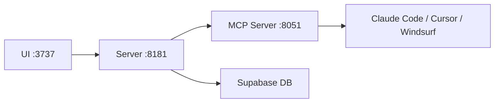

## Overview

AI coding tools are getting more powerful by the day, but systematically managing and injecting project context remains a hard problem. Cole Medin's Archon tackles this with an MCP server pattern that turns your knowledge base into a first-class citizen for AI assistants.

<!--more-->

## What Is Archon?

[Archon](https://github.com/coleam00/Archon) is a **command center for AI coding assistants**. With over 13,700 GitHub stars, it connects to tools like Claude Code, Cursor, and Windsurf via the MCP (Model Context Protocol) and provides them with a **custom knowledge base and task management system**.

From the user's side, it's a clean web UI for managing knowledge and tasks. From the AI assistant's side, it's an MCP server that exposes that same knowledge and those same tasks as structured context.

## Architecture



Archon is composed of three microservices:

- **Server** (Python): Core API and business logic — handles web crawling, PDF uploads, and RAG (Retrieval-Augmented Generation) search
- **MCP Server**: The protocol interface that AI coding assistants connect to
- **UI** (TypeScript): Web interface for managing the knowledge base, projects, and tasks

The whole stack spins up with a single `docker compose` command, using Supabase as the backend database.

## Key Features

- **Document management**: Build a knowledge base by crawling websites or uploading PDFs and documents
- **Smart search**: Advanced RAG strategies to surface relevant content
- **Task management**: Project and task tracking integrated directly with the knowledge base
- **Real-time updates**: Content added to the knowledge base is immediately available to AI assistants

## Tech Stack

| Area | Technology |
|------|------|
| Backend | Python (2.3M+ LOC) |
| Frontend | TypeScript (1.8M+ LOC) |
| Database | Supabase (PostgreSQL + PLpgSQL) |
| Infra | Docker, Make |
| LLM | OpenAI, Gemini, Ollama, OpenRouter |

Recent addition of OpenRouter embedding support means you can swap models freely without vendor lock-in.

## Setup

```bash
git clone -b stable https://github.com/coleam00/archon.git
cd archon
cp .env.example .env
# Add your Supabase credentials to .env
docker compose up --build -d
```

After setup, visit `http://localhost:3737` and follow the onboarding flow to configure your API keys.

## Resources

- [The OFFICIAL Archon Guide (23 min)](https://www.youtube.com/watch?v=DMXyDpnzNpY) — Installation through real-world workflows
- [GitHub Discussions](https://github.com/coleam00/Archon/discussions) — Community
- [Archon Kanban Board](https://github.com/users/coleam00/projects/1) — Development roadmap

## Insights

The MCP server pattern that Archon demonstrates points toward where AI coding tooling is headed. Beyond just generating code, the key challenge is **systematically managing project context and knowledge, then injecting it into AI systems**. "Context Engineering" is becoming an increasingly important discipline, and Archon is a practical, working implementation of that idea.
