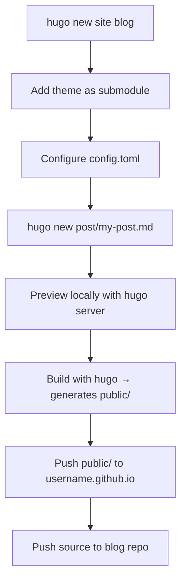

## Overview

I did a thorough comparison of Hugo blog themes while planning a blog refresh, settling on GitHub Pages as the deployment target. PaperMod and Stack got the most attention, but I surveyed over eight themes in total and mapped out the full setup workflow for Hugo + GitHub Pages.

<!--more-->

## Hugo Theme Comparison

I explored a range of themes at [themes.gohugo.io](https://themes.gohugo.io/).

### PaperMod — The Most Popular Choice

[hugo-PaperMod](https://github.com/adityatelange/hugo-PaperMod) | 13,100+ stars | 3,300+ forks

PaperMod is the most popular theme in the Hugo ecosystem. It bills itself as "Fast, Clean, Responsive" and runs on pure Hugo features — no webpack or Node.js dependencies.

**Key features:**
- Three layout modes: Regular, Home-Info, and Profile
- Client-side search powered by Fuse.js
- Multilingual support and SEO optimization
- Automatic light/dark theme switching
- Code block copy button, auto-generated table of contents
- Breadcrumb navigation

**Notable recent changes:**
- `llms.txt` support added — an emerging standard that lets LLMs efficiently index blog content
- Theme detection logic refactored into `head.html` for faster script execution

[Live demo](https://adityatelange.github.io/hugo-PaperMod/) | [Installation guide](https://github.com/adityatelange/hugo-PaperMod/wiki/Installation)

### Stack — Card-Style Blogger Theme

[hugo-theme-stack](https://github.com/CaiJimmy/hugo-theme-stack) | 6,200+ stars | 1,900+ forks

Stack is a **card-style layout** theme built specifically for bloggers. It's the right choice when you want a visually rich blog.

**Notable recent changes:**
- Markdown Alert support (GitHub-style `> [!NOTE]`, `> [!WARNING]`, etc.)
- Generic taxonomy widget refactored for better extensibility
- Custom canonical URL configuration added
- Expanded i18n support

[Live demo](https://demo.stack.cai.im/) | [Documentation](https://stack.cai.im)

### Theme Comparison Summary

| Theme | Stars | Character | Best For |
|------|------|------|-------------|
| **PaperMod** | 13.1K | Minimal, fast, SEO-optimized | Tech blogs, portfolios |
| **Stack** | 6.2K | Card UI, visually rich | General blogs, photo blogs |
| **Coder** | - | Extremely minimal | Developer portfolios |
| **Book** | - | Docs with sidebar | Technical documentation sites |
| **Docsy** | - | Google-backed, large-scale | Corporate technical docs |
| **Terminal** | - | Retro terminal style | Developer blogs with personality |
| **Blox-Tailwind** | - | Tailwind CSS-based | Modern design blogs |
| **Compose** | - | Clean, multi-purpose | General-purpose blogs |

## Hugo + GitHub Pages Setup Guide

I used [Integerous's guide](https://github.com/Integerous/Integerous.github.io) as a reference for the setup workflow.

### Why Hugo?

```
Jekyll  — Ruby-based, most popular, good Korean docs, slow builds
Hexo    — Node.js-based, strong Chinese community, slow development activity
Hugo    — Go-based, fastest builds, well-documented, fewer Korean references
```

Hugo wins on build speed with no runtime dependencies, and its documentation is excellent.

### The Build Flow



### Key Points

**1. Two repositories**
- `blog` — Hugo source files
- `username.github.io` — the built static site for deployment

**2. Always use git submodules for themes**
```bash
# Submodule is recommended over cloning
git submodule add https://github.com/theme/repo.git themes/theme-name
```
This makes it easy to pull theme updates and you won't lose the theme if your environment changes. Best practice is to fork the theme repo first, then add your fork as the submodule.

**3. Automate deployment with deploy.sh**
A single shell script handles build → commit/push `public/` → commit/push source.

**4. Utterances for comments**
A comment system built on the GitHub Issues API. Readers can comment using their GitHub account — no separate server required.

## Quick Links

- [Hugo Themes Gallery](https://themes.gohugo.io/)
- [PaperMod Wiki](https://github.com/adityatelange/hugo-PaperMod/wiki)
- [Stack Documentation](https://stack.cai.im)
- [Homebrew](https://brew.sh/) — macOS package manager (`brew install hugo`)
- [VS Code Homebrew Cask](https://formulae.brew.sh/cask/visual-studio-code#default)

## Insights

When choosing a Hugo theme, the most important factor isn't "does it look great right now" — it's **"is the community active, and is the project being maintained?"** PaperMod's `llms.txt` support is a good example: active projects evolve with the times. The submodule pattern for managing themes isn't Hugo-specific either — it's a broadly applicable approach for safely integrating external dependencies into any project.
