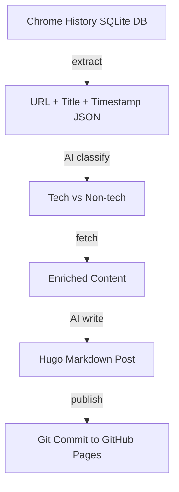

## Overview

Every day I browse through countless technical docs and GitHub repos, but that exploration disappears the moment I close the tab. log-blog is a Python CLI tool that reads Chrome browsing history and automatically converts it into Hugo-compatible blog posts.

<!--more-->

## What Is log-blog?

[ice-ice-bear/log-blog](https://github.com/ice-ice-bear/log-blog) automates the "explore → organize → share" cycle. It extracts data from Chrome's SQLite history database, fetches content from each URL using Playwright, converts it to Hugo-compatible markdown, and commits the result to the blog repository.

## Pipeline Structure



### Step 1: Extract

```bash
log-blog extract --json --hours 24
```

Reads the recent N hours of visit history from Chrome's SQLite history DB. Outputs URL, title, visit count, and last visit time as JSON.

### Step 2: Classify

Integrated with the Claude Code skill system, AI classifies each URL as tech or non-tech, then groups them into YouTube, GitHub, and Docs/Web categories.

### Step 3: Fetch

```bash
log-blog fetch --json "URL1" "URL2" "URL3"
```

Content is collected using a strategy appropriate to the URL type:

| URL Type | What's Collected |
|----------|----------|
| **YouTube** | Full transcript text (Korean preferred) |
| **GitHub repo** | Description, stars, language, README, recent commits |
| **GitHub PR** | Title, state, body, diff stats, comments |
| **GitHub issue** | Title, state, labels, body, comments |
| **Web page** | Full text, heading structure, code blocks |

### Step 4: Write & Publish

AI writes a technical blog post from the collected content, then the `publish` command commits it to the blog repository.

```bash
log-blog publish post.md        # Local commit only
log-blog publish post.md --push # Commit + push
```

## Tech Stack

```
src/log_blog/
  cli.py             # CLI entry point (extract, fetch, publish)
  config.py          # YAML config loader
  history_reader.py  # Chrome SQLite history reader
  content_fetcher.py # Playwright-based content extractor
  post_generator.py  # Hugo markdown post generator
  publisher.py       # Git commit/push
```

- **Python 3.12+** — primary language
- **Playwright** — browser automation for dynamic page content
- **SQLite** — direct access to Chrome's history DB
- **Claude Code Skill** — AI classification, summarization, and writing

## Configuration

```yaml
chrome:
  profiles: ["Default"]
  history_db_base: "~/Library/Application Support/Google/Chrome"

time_range_hours: 24

blog:
  repo_path: "~/Documents/github/ice-ice-bear.github.io"
  content_dir: "content/posts"
  language: "auto"

playwright:
  headless: true
  timeout_ms: 15000
  max_concurrent: 5
```

## Quick Links

- [mindai/mega-code PR #26](https://bitbucket.org/mindai/mega-code/pull-requests/26) — add_behavioral_validation (Upskill)
- [mindai/megaupskill](https://bitbucket.org/mindai/megaupskill/src/main/) — MegaUpskill project

## Insights

The core value of log-blog is **"turning exploration itself into content."** The technical browsing that happens every day in a browser is already a learning process — but without capturing it, it vanishes. This tool automatically captures and structures that process. In fact, this very post was produced by that pipeline — Chrome history extraction → AI classification → content fetch → AI writing → blog deployment.
