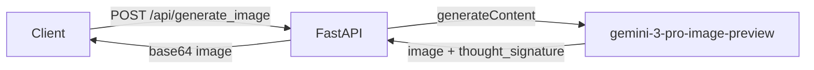
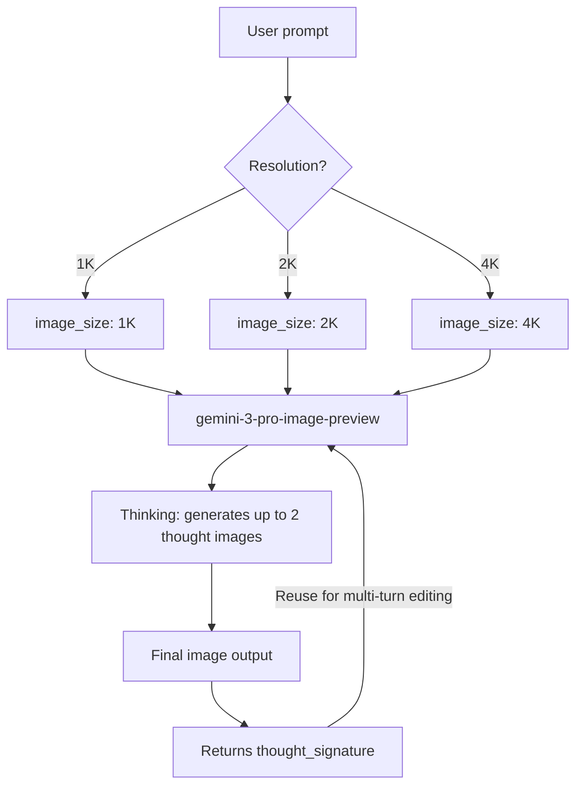

## Overview

Two topics got serious attention today. First: I built an image generation API on `gemini-3-pro-image-preview` and had questions — resolution pricing tiers, Thought Signatures, new parameters — so I went through the Gemini 3 official docs to get answers. Second: I explored Mermaid.js as an architecture documentation tool and put together a syntax reference for the main diagram types.

<!--more-->

## Gemini 3 Model Family and Pricing

Gemini 3 is still in preview, but it's usable in production. Here are the specs by model:

| Model ID | Context (In/Out) | Pricing (Input/Output) |
|---|---|---|
| `gemini-3.1-pro-preview` | 1M / 64k | $2 / $12 (under 200k tokens) |
| `gemini-3-pro-preview` | 1M / 64k | $2 / $12 (under 200k tokens) |
| `gemini-3-flash-preview` | 1M / 64k | $0.50 / $3 |
| `gemini-3-pro-image-preview` | 65k / 32k | $2 (text input) / $0.134 (per output image) |

For the image model, **$0.134 per output image** is the baseline, but cost scales with resolution. 1K is the default; 4K costs more. Refer to the separate pricing page for resolution-by-resolution details.

## Nano Banana Pro — Gemini 3's Native Image Generation

Google officially uses the codename "Nano Banana" for Gemini's native image generation capability. There are two variants:

- **Nano Banana**: `gemini-2.5-flash-image` — speed and efficiency focused, suited for high-volume processing
- **Nano Banana Pro**: `gemini-3-pro-image-preview` — production-quality assets, Thinking-based high quality

What sets Gemini 3 Pro Image apart from the older Imagen is that **reasoning (Thinking) is integrated into the image generation process**. With a complex prompt, the model internally generates up to two "thought images" to verify composition and logic before producing the final image. These intermediate images are not billed.

### New Capabilities

**1. Up to 14 reference images**

`gemini-3-pro-image-preview` accepts up to 14 reference images:
- High-resolution object images: up to 6
- Character consistency: up to 5

This enables generating varied scenes while maintaining visual consistency for a specific product or character.

**2. Resolution control — 1K / 2K / 4K**

Default output is 1K. Specify `image_size` in `generation_config` to go higher. Important: **uppercase K is required** — `1k` will return an error.

```python
generation_config = {
    "image_size": "2K"  # "1K", "2K", "4K" supported. Lowercase not accepted!
}
```

**3. Google Search Grounding**

Connect the `google_search` tool to generate images based on real-time information — weather forecast charts, stock price graphs, infographics from recent news. Note: image-based search results are not passed to the generation model and are excluded from responses.

### Wrapping the API with FastAPI

I tested a **Hybrid Image Search API** running at `localhost:8000` today via its Swagger UI. It's a FastAPI server using `gemini-3-pro-image-preview` as the backend, with `/api/generate_image` as the core endpoint. It receives an image prompt, calls the Gemini API, and returns the result.



The response schema in Swagger UI includes a `thought_signature` field. For multi-turn editing sessions, you need to include this value in subsequent requests.

## Thought Signatures — The Key to Multi-Turn Editing

When you first start using the image generation API, **Thought Signatures** are the most confusing part. Understanding them makes it clear why multi-turn (conversational) image editing works the way it does.

A Thought Signature is an encrypted string representing the model's internal reasoning process. When the model generates an image, the response includes a `thought_signature` field — and **you must send that value back with your next request**. This is how the model remembers the composition and logic of the previous image when editing it.

```
Image generation request → response includes thought_signature
→ "Change the background to a sunset" + thought_signature sent together
→ Model edits while maintaining compositional context
```

**Strict validation** is enforced for image generation/editing — omit the signature and you get a 400 error. The official Python/Node/Java SDKs handle this automatically when you pass chat history through. You only need to manage it manually when using raw REST without an SDK.

### Migration Notes from Gemini 2.5

If you're using an existing Gemini 2.5 conversation trace or injecting custom function calls, you won't have a valid signature. You can work around this with a dummy value:

```json
"thoughtSignature": "context_engineering_is_the_way to_go"
```

## New API Parameters in Gemini 3

**`thinking_level`** — Controls reasoning depth

| Level | Description |
|---|---|
| `minimal` | Flash only. Minimum thinking, minimum latency |
| `low` | Follows simple instructions; suitable for high-throughput apps |
| `medium` | Balanced reasoning |
| `high` | Default. Maximum reasoning; responses may be slower |

Using `thinking_level` and the legacy `thinking_budget` parameter together causes a 400 error.

**`media_resolution`** — Controls multimodal vision processing precision

For image analysis, `media_resolution_high` (1120 tokens/image) is recommended. For PDFs, use `media_resolution_medium` (560 tokens). This gives you explicit control over the cost/quality tradeoff.

**Temperature warning**: Gemini 3 is optimized for the default value of 1.0. If you have existing code that sets a low temperature for deterministic output, **remove it**. Low temperatures can cause loops and performance degradation.

## LLM Token and Cost Calculators

When estimating image generation costs, you need to account for both text tokens and per-image output costs. Useful tools:

- [token-calculator.net](https://token-calculator.net/) — Token count and cost estimation for GPT, Claude, Gemini, and others. Updated through 2026 models.
- [OpenAI Tokenizer](https://platform.openai.com/tokenizer) — Official OpenAI tokenizer. Visualizes exactly how text gets split into tokens.

For Gemini 3 Pro Image at $0.134 per output image (with additional cost for higher resolutions), production environments with high-volume image generation should look at the Batch API — it offers higher rate limits in exchange for up to 24-hour delays.

## Mermaid.js — Diagrams from Text

[Mermaid.js](https://mermaid.js.org/) is a JavaScript library for defining diagrams in a Markdown-like text syntax. GitHub, GitLab, Notion, and this blog (Hugo) can all render SVG diagrams from a single code block. The core advantage: keep architecture documentation in the codebase, versioned alongside the code — no separate drawing tool needed.

Usage is simple: write your diagram definition inside a ` ```mermaid ` code block.

### Flowchart — The Most Versatile Diagram

Use for flow diagrams, decision trees, and system architecture. Declare direction on the first line.

```
graph TD        %% Top → Down
graph LR        %% Left → Right
graph BT        %% Bottom → Top
graph RL        %% Right → Left
```

**Node shapes**

```
A[Rectangle]
B(Rounded corners)
C([Stadium])
D[[Subroutine]]
E[(Cylinder / DB)]
F((Circle))
G{Diamond / Decision}
H{{Hexagon}}
I[/Parallelogram/]
J[\Reverse parallelogram\]
```

**Edge types**

```
A --> B          %% Arrow
A --- B          %% Line only
A -.- B          %% Dotted line
A ==> B          %% Thick arrow
A -->|label| B   %% Labeled arrow
A --o B          %% Circle end
A --x B          %% X end
```

**Subgraphs**

```
graph LR
    subgraph Backend
        API --> DB
    end
    subgraph Frontend
        UI --> API
    end
```

Example — Gemini image generation flow:



### Sequence Diagram — Service Communication Flow

Use for API call sequences, authentication flows, and inter-service message flows in microservices.

**Basic syntax**

```
sequenceDiagram
    participant A as Client
    participant B as Server
    participant C as DB

    A->>B: Request (solid arrow)
    B-->>A: Response (dashed arrow)
    A-)B: Async (open arrow)
```

**10 arrow types**

| Syntax | Meaning |
|---|---|
| `->` | Solid line, no arrowhead |
| `-->` | Dashed line, no arrowhead |
| `->>` | Solid line, with arrowhead |
| `-->>` | Dashed line, with arrowhead |
| `<<->>` | Solid line, bidirectional |
| `-x` | Solid line, X end (async) |
| `-)` | Solid line, open arrowhead (async) |

**Activation boxes**

```
sequenceDiagram
    A->>+B: Start request
    B-->>-A: Response (shows B's active period)
```

**Loop, alt, and par**

```
loop Retry 3 times
    A->>B: Request
end

alt Success
    B-->>A: 200 OK
else Failure
    B-->>A: 500 Error
end

par Parallel
    A->>B: Task 1
and
    A->>C: Task 2
end
```

**Notes and background highlighting**

```
Note right of A: Token validation here
Note over A,B: Note spanning two participants
rect rgb(200, 220, 255)
    A->>B: Highlighted section
end
```

### Class Diagram — OOP Design Documentation

Represents class structures, inheritance relationships, and interfaces.

**Class definition and members**

```
classDiagram
    class Animal {
        +String name
        -int age
        #String species
        +speak() String
        +move()* void       %% abstract
        +clone()$ Animal    %% static
    }
```

Member visibility: `+` public, `-` private, `#` protected, `~` package
Classifiers: `*` abstract, `$` static

**Generic types**

```
class Stack~T~ {
    +push(item: T)
    +pop() T
    +peek() T
}
```

**Relationship types**

| Syntax | Relationship | Notes |
|---|---|---|
| `A <\|-- B` | Inheritance | B inherits from A |
| `A *-- B` | Composition | B is part of A |
| `A o-- B` | Aggregation | B belongs to A |
| `A --> B` | Association | A uses B |
| `A ..> B` | Dependency | A depends on B |
| `A ..\|> B` | Realization | A implements B's interface |

**Cardinality**

```
classDiagram
    Customer "1" --> "0..*" Order : places
    Order "1" *-- "1..*" OrderItem : contains
```

### ER Diagram — Database Schema

Entity-relationship diagrams for documenting database design.

**Basic syntax**

```
erDiagram
    CUSTOMER ||--o{ ORDER : places
    ORDER ||--|{ LINE-ITEM : contains
    CUSTOMER {
        string name PK
        string email UK
        int age
    }
    ORDER {
        int id PK
        date created_at
        int customer_id FK
    }
```

**Cardinality notation**

| Left | Right | Meaning |
|---|---|---|
| `\|o` | `o\|` | Zero or one |
| `\|\|` | `\|\|` | Exactly one |
| `}o` | `o{` | Zero or more |
| `}\|` | `\|{` | One or more |

Identifying relationships use solid lines (`--`); non-identifying use dashed lines (`..`).

### Tips

- `%%` is a comment in all diagram types
- `direction TB/LR` changes direction in most diagram types
- Node IDs cannot contain spaces — use `[Text]` for labels
- Complex diagrams: use [Mermaid Live Editor](https://mermaid.live) for real-time preview

## Quick Links

- [Gemini API — Nano Banana Image Generation](https://ai.google.dev/gemini-api/docs/image-generation) — Official image generation guide with prompting strategies and code examples
- [Gemini 3 Developer Guide](https://ai.google.dev/gemini-api/docs/gemini-3) — Full Gemini 3 API guide (pricing, parameters, migration)
- [Token Calculator](https://token-calculator.net/) — LLM token count and cost estimator
- [OpenAI Tokenizer](https://platform.openai.com/tokenizer) — Tokenizer visualization tool
- [Mermaid.js](https://mermaid.js.org/) — Official docs (Flowchart, Sequence, Class, ER syntax reference)
- [Mermaid Live Editor](https://mermaid.live) — Real-time browser preview

## Insights

Today's two topics share a common thread: **expressing complex things in text**. Gemini 3 Pro Image generates images from text prompts, then serializes the editing session's context back to text via the Thought Signature mechanism. Mermaid.js expresses visual concepts — architecture, data flow — in text syntax so they can be version-controlled alongside code. As the FastAPI server wrapping Gemini image generation grows more complex, Mermaid's Flowchart and Sequence diagrams become a practical way to reduce the communication overhead. Each diagram type has a clear use case: Flowchart for process flows, Sequence for API communication, ER for data models — the skill is knowing which to reach for.
