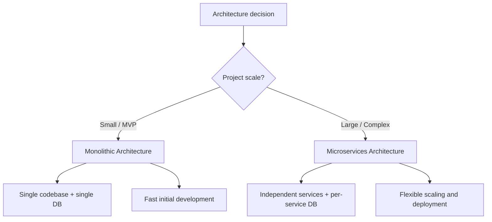
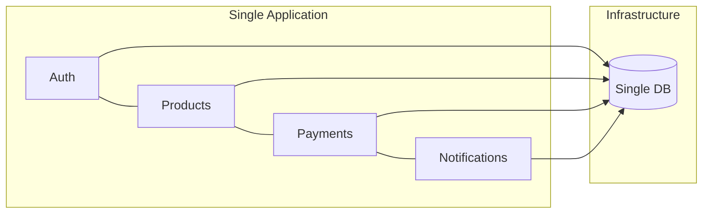
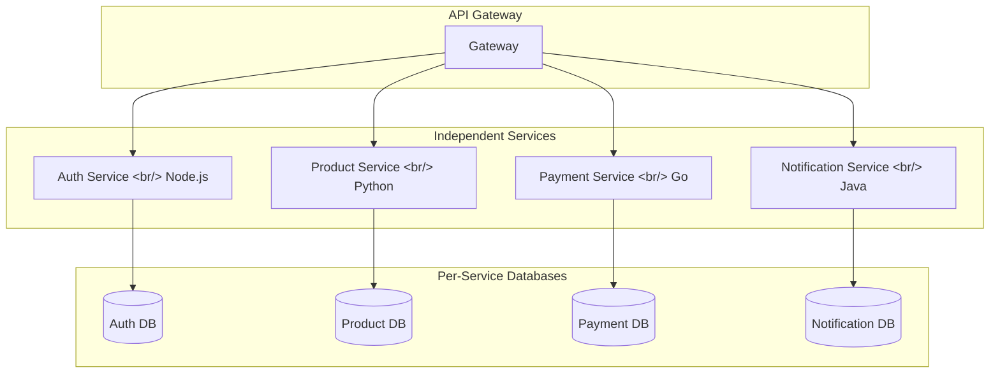

## Overview

Architectural decisions can make or break a project. Monolithic Architecture (MA) and Microservices Architecture (MSA) each have distinct tradeoffs — and the right question isn't "which is better?" but **"which fits the current situation?"**

<!--more-->

## Monolithic Architecture

Monolithic architecture places all business logic in a **single, unified codebase**. Authentication, payments, notifications — every feature lives inside one application.

### Advantages

| Advantage | Description |
|------|------|
| **Fast development** | Simple codebase and easy integration means faster initial development |
| **Easy maintenance** | Applying changes in a single codebase is straightforward |
| **Low infrastructure cost** | A single application means low operational complexity |
| **Easy debugging** | All code in one place makes tracing problems straightforward |
| **No network latency** | Service communication happens through function calls — no network overhead |
| **Unified tech stack** | The whole team uses the same technology, making onboarding easier |

### Disadvantages

| Disadvantage | Description |
|------|------|
| **No partial scaling** | Can't scale a specific feature — must scale the whole application |
| **Full redeployment required** | Even small changes require redeploying the entire app |
| **Tech stack lock-in** | Adopting new technologies is difficult |
| **Growing complexity** | Codebase becomes unwieldy as the project grows |
| **Team conflicts** | Merge conflicts are frequent when everyone works in the same code |

**Best suited for**: Small projects, fast MVP development, when complex business logic isn't needed, systems with infrequent changes

> The advantages of monolithic architecture are most apparent at small scale. As the project grows, those same advantages tend to flip into disadvantages.

## Microservices Architecture

Microservices architecture splits the application into **multiple small, independent services**. Each service owns a specific business function and communicates via APIs. It's an architecture designed to match the organizational structure of large development teams.

### Advantages

- **Independent deployment**: Each service can be developed, tested, and deployed individually
- **Technology diversity**: Choose the optimal tech stack per service
- **Selective scaling**: Scale only the services under high demand — e.g., if the news service has 1 user and the webtoon service has 100 million, scale only the webtoon service
- **Fault isolation**: A failure in one service doesn't bring down the entire system
- **Easier maintenance**: Changes to one service have minimal impact on others

### Disadvantages

- **Operational complexity**: Requires service discovery, centralized logging, distributed tracing
- **Data consistency**: Distributed transactions are hard to implement correctly
- **Testing difficulty**: Integration tests and E2E tests become significantly more complex
- **System-wide comprehension**: Understanding the full system requires more effort
- **Migration cost**: Transitioning from monolithic to MSA takes considerable time and resources
- **Network latency**: Inter-service communication introduces latency

**Best suited for**: Large and complex systems, teams organized around independent services, systems that need flexible scaling

## Side-by-Side Comparison

| Dimension | Monolithic | Microservices |
|------|----------|----------------|
| **Structure** | Single codebase, strong feature coupling | Independent services + API communication, distributed system |
| **Deployment** | Full redeployment | Per-service independent deployment |
| **Tech stack** | Unified across all teams | Per-service choice |
| **Scaling** | Scale everything or nothing | Scale individual services |
| **Latency** | None (in-process function calls) | Network latency between services |
| **Debugging** | Easy to trace in a single codebase | Requires distributed tracing tools |
| **Team structure** | Well-suited for small teams | Suited for independent team organizations |

## Quick Links

- [Monolithic vs MSA Comparison (Korean)](https://memodayoungee.tistory.com/155) — Detailed breakdown of tradeoffs
- [Martin Fowler: Microservices](https://martinfowler.com/articles/microservices.html) — The definitive conceptual definition of MSA

## Insights

The most common mistake in architecture decisions is "MSA is modern, so we should use MSA." Applying microservices to a small project adds unnecessary complexity — service communication, distributed transactions, logging infrastructure — without any real benefit. Conversely, sticking with a monolith as a system scales to millions of users means you can't scale a single feature without scaling everything else, which is massively inefficient. The key is **choosing what fits your team size and project complexity right now**. Many successful projects start monolithic and migrate to microservices when the need actually arises — the gradual approach works.
