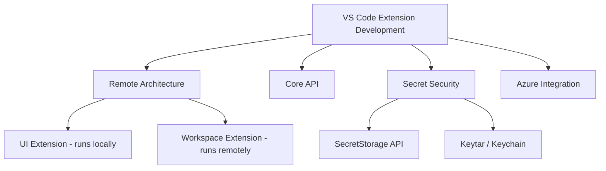

## Overview

Building a VS Code extension that only works locally isn't enough anymore. Extensions need to function correctly in Remote Development and GitHub Codespaces environments, and the security of secrets they handle — tokens, API keys — needs to be designed in from the start. This post covers VS Code extension remote architecture, core APIs, secret security risks, and Azure integration patterns.

<!--more-->



## VS Code Remote Extension Architecture

### UI Extension vs Workspace Extension

VS Code distinguishes between two kinds of extensions in remote development scenarios:

| Type | Runs On | Role | Examples |
|------|-----------|------|------|
| **UI Extension** | Local machine | Contributes to VS Code UI (themes, keymaps, snippets) | Color Theme, Vim keybinding |
| **Workspace Extension** | Remote machine | File access, tool execution, language servers | Python, ESLint, GitLens |

VS Code analyzes `package.json` to automatically install extensions in the right location. If auto-detection fails, specify `extensionKind` explicitly:

```json
{
  "extensionKind": ["workspace"]
}
```

Use the `Developer: Show Running Extensions` command to see where each extension is actually running.

### Key Issues in Remote Environments

**1. Secret storage**

Remote environments don't have access to the local Keychain. VS Code's `SecretStorage` API handles this correctly regardless of whether the extension is running locally or remotely.

**2. Webview resource paths**

When referencing local resources in a Webview, always use `asWebviewUri()`. File paths differ in remote environments — hardcoding paths will cause resource loading failures.

**3. localhost forwarding**

Accessing localhost ports on the remote machine requires VS Code's port forwarding feature. When Webview needs to use localhost:
- **Option 1**: Transform the URI with `asExternalUri`
- **Option 2**: Configure port mappings with the `portMapping` option

**4. Extension-to-extension communication**

Extensions running in remote and local contexts cannot directly call each other's APIs. Use VS Code's `commands` API to communicate instead:

```json
{
  "api": "none"
}
```

Adding this to `package.json` disables API export and forces command-based communication.

### Debugging Environments

Four environments are available for testing remote extensions:
1. **GitHub Codespaces** — Cloud-based development environment
2. **Dev Containers** — Custom Docker containers
3. **SSH** — Remote server connection
4. **WSL** — Windows Subsystem for Linux

To test an unpublished extension, generate a VSIX file with `vsce package` and install it manually.

## VS Code API Core Namespaces

The [VS Code API Reference](https://code.visualstudio.com/api/references/vscode-api) documents the full API available for extensions. Key namespaces:

| Namespace | Role |
|-------------|------|
| `vscode.authentication` | Authentication session management |
| `vscode.commands` | Command registration and execution |
| `vscode.window` | Editor, terminal, and notification UI |
| `vscode.workspace` | File system, settings, workspace management |
| `vscode.languages` | Language features (completion, diagnostics, symbols) |
| `vscode.debug` | Debugger integration |
| `vscode.env` | Environment info (clipboard, URI opening) |
| `vscode.chat` | AI/Chat feature integration |

### Common Patterns in Extension Development

**CancellationToken**: Long-running operations should always accept a `CancellationToken` to support cancellation.

**Disposable**: Implement the `Disposable` interface for resource cleanup and register with `context.subscriptions.push()`.

**EventEmitter**: Use `EventEmitter<T>` to publish custom events.

## VS Code Secret Security — The Hidden Risks

According to [Cycode's security analysis](https://cycode.com/blog/exposing-vscode-secrets/), VS Code extension secret management carries security risks worth understanding.

### How VS Code Stores Secrets

VS Code uses the OS-native Keychain/Keyring:
- **macOS**: Keychain
- **Windows**: Credential Manager
- **Linux**: libsecret (GNOME Keyring, etc.)

Extensions access this storage via `context.secrets` (the SecretStorage API).

### Security Risks

**1. Extraction via the Electron process**

VS Code is Electron-based. Certain flags create a path to access secrets:

```bash
ELECTRON_RUN_AS_NODE=1 "${electronPath}" \
  --ms-enable-electron-run-as-node "${vscodeDecryptScriptPath}" ${machineId}
```

**2. Exposure through malicious extensions**

Installed extensions have access to the SecretStorage API. Installing an unverified extension creates a risk of exposing stored tokens.

### Security Best Practices

- **Always use the SecretStorage API** — never store secrets in environment variables or config files
- **Minimize extension permissions** — request only the scopes you need
- **Install only verified extensions** — check publisher verification in the Marketplace
- **Rotate tokens regularly** — refresh long-lived tokens periodically

## Azure Resources Extension — Authentication Integration Pattern

The [Azure Resources extension](https://code.visualstudio.com/docs/azure/resourcesextension) manages Azure resources from within VS Code. It serves as a useful reference for authentication patterns in extension development.

### Authentication Flow

1. Click "Sign in to Azure..." in the Azure Resources view
2. VS Code's built-in Microsoft authentication provider handles the auth
3. Tenants requiring MFA authenticate separately in the Accounts & Tenants view
4. Multiple Azure accounts can be active simultaneously

### Key Settings

- `azureResourceGroups.selectedSubscriptions` — Filter which subscriptions are displayed
- `Microsoft-sovereign-cloud.environment` — Automatically configured for sovereign cloud access (government Azure, etc.)

This pattern is a solid reference for implementing external service authentication in your own extensions.

## Quick Links

- [VS Code Remote Extensions Guide](https://code.visualstudio.com/api/advanced-topics/remote-extensions) — Complete guide to remote development extensions
- [VS Code API Reference](https://code.visualstudio.com/api/references/vscode-api) — Full API reference
- [Cycode: VS Code Secret Security](https://cycode.com/blog/exposing-vscode-secrets/) — Secret extraction risk analysis
- [Azure Resources Extension](https://code.visualstudio.com/docs/azure/resourcesextension) — Azure integration guide

## Insights

VS Code extension development is no longer about building a plugin that works locally. With Remote Development and Codespaces now standard, extensions must be designed as **distributed components that work regardless of execution environment**. Understanding the UI Extension vs Workspace Extension split is the first step. For secret management, starting with the SecretStorage API is the only right answer — security can't be bolted on later. And as Cycode's analysis demonstrates, being aware of the secret extraction paths in Electron-based apps is essential knowledge for anyone building extensions that handle credentials.
