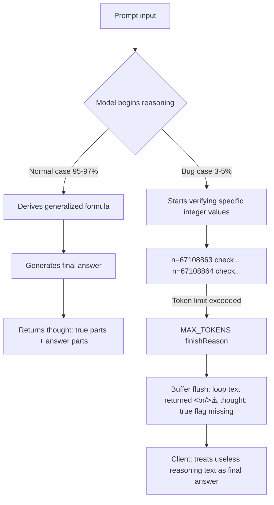

## Overview

If you're running `gemini-3-flash-preview` in production, a reported bug warrants adding defensive code immediately. When sending 100+ concurrent requests, the model enters an infinite reasoning loop at a rate of 3–5%, consuming all available `maxOutputTokens` and returning its internal reasoning as the final response. These two failures happen simultaneously. A previous post covered Gemini 3's Thought Signatures and the `thinking_level` parameter — this bug is exactly a stop-condition failure in that Thinking mechanism.

<!--more-->

> Background: Gemini 3 image generation API, Thought Signatures, `thinking_level`, `media_resolution` → [2026-02-20 post](https://ice-ice-bear.github.io/posts/2026-02-20-tech-log/)

## Bug Details: What's Actually Happening

### Trigger Conditions

The bug appears with **problems requiring step-by-step proof** — bitwise operations, mathematical verification, logic puzzles. Example prompt type: "Bitwise Toggle algorithm."

When the model doesn't derive the answer directly and starts verifying specific integer values, it fails to converge:

```
Checking n = 67108863... correct
Checking n = 67108864... correct
Checking n = 134217727... correct
Checking n = 134217728... (continues)
```

A loop that verifies sequentially doubling values runs endlessly until it hits the token limit.

### Two Simultaneous API Response Failures

```json
{
  "response": {
    "usageMetadata": {
      "totalTokenCount": 16233,
      "thoughtsTokenCount": 15356,   // ← 94.6% of all tokens consumed by internal reasoning
      "candidatesTokenCount": 640
    },
    "candidates": [{
      "content": {
        "parts": [
          {
            "text": "**Algorithm for Bitwise Toggle**\n\nOkay, here's my line of thinking...",
            "thought": true     // ← Normal internal reasoning (should be hidden)
          },
          {
            // ⚠️ BUG: This is an internal reasoning loop but thought: true flag is missing
            "text": "Wait, let's check n = 67108863... Correct. Wait, let's check n = 67108864...",
            "thoughtSignature": "....."
            // thought: true missing → parser treats this as the final response
          }
        ]
      },
      "finishReason": "MAX_TOKENS"   // ← Not a clean finish; forced termination by token limit
    }]
  }
}
```

**Failure 1 — Token exhaustion**: Of 16,233 total tokens, 15,356 (94.6%) are consumed by `thoughtsTokenCount`. Only 640 tokens remain for the actual response, and no valid answer is generated.

**Failure 2 — Internal logic leak**: When `finishReason: MAX_TOKENS` forces termination, the current buffer is flushed. The problem: the loop text parts lack the `"thought": true` flag. The SDK parser treats them as final user-facing responses and returns them.



## Impact

- **Model**: `gemini-3-flash-preview` (confirmed)
- **Reproduction rate**: 3–5% with 100+ concurrent requests
- **Token settings**: Occurs with both `maxOutputTokens` 16k and 32k
- **Execution mode**: Affects both Batch mode and regular API calls

## Defensive Code You Can Add Now

Client-side defenses until an official fix is available:

### 1. Check finishReason

```python
response = model.generate_content(prompt)

for candidate in response.candidates:
    if candidate.finish_reason == "MAX_TOKENS":
        # Invalid response — retry or raise an error
        raise ValueError("Response was truncated due to token limit")
```

### 2. Check thoughtsTokenCount Ratio

```python
usage = response.usage_metadata
thoughts_ratio = usage.thoughts_token_count / usage.total_token_count

if thoughts_ratio > 0.9:
    # Over 90% of tokens consumed by reasoning → likely infinite loop
    logger.warning(f"Possible reasoning loop detected: {thoughts_ratio:.1%} tokens in thoughts")
    raise ValueError("Model entered a reasoning loop")
```

### 3. Check the thought Flag

```python
for part in response.candidates[0].content.parts:
    # Parts with thoughtSignature but no thought: true are suspicious
    if hasattr(part, 'thought_signature') and not getattr(part, 'thought', False):
        logger.error("Leaked reasoning detected in response parts")
        # Remove this part from the response or retry the whole request
```

### 4. Adjust thinking_level

Setting the `thinking_level` parameter (covered in the previous post) to `"low"` or `"medium"` reduces occurrence frequency — but also reduces reasoning quality:

```python
generation_config = {
    "thinking_config": {
        "thinking_budget": 4096,  # Directly cap the token budget instead of using thinking_level
    }
}
```

## Why Flash Preview?

Gemini 3 Flash was optimized for speed and cost efficiency, with a lighter reasoning process than Pro. Its stop-condition safety net appears weaker. The vulnerability surfaces with problem types like bitwise operations or mathematical proofs where the model feels compelled to "verify every case to be sure."

**Practical recommendations** for production use of `gemini-3-flash-preview`:
- Route logic/math problems to `gemini-3-pro-preview` when possible
- When using Flash, always include `finishReason + thoughtsTokenCount` defensive checks
- Add a response validation layer for high-volume batch processing

## Quick Links

- [Google AI Developers Forum — Original bug report](https://discuss.ai.google.dev/t/gemini-3-flash-preview-infinite-reasoning-loop-causing-max-token-exhaustion-raw-logic-leak/114528)
- [Gemini 3 Developer Guide — thinking_level parameter](https://ai.google.dev/gemini-api/docs/gemini-3)

## Insights

This bug illustrates that stronger reasoning capabilities introduce new categories of failure. Pre-Thinking models just gave wrong answers. Thinking models have a strong drive to "find the right answer" — and when they can't converge, they loop infinitely. When deploying reasoning models in production, a separate **response validation layer** is safer than simply lowering `maxOutputTokens`. Treat any response with `finishReason: MAX_TOKENS` as suspect until proven otherwise.
