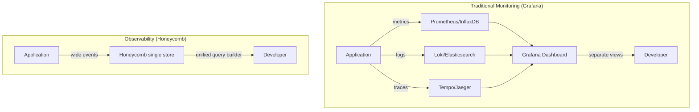
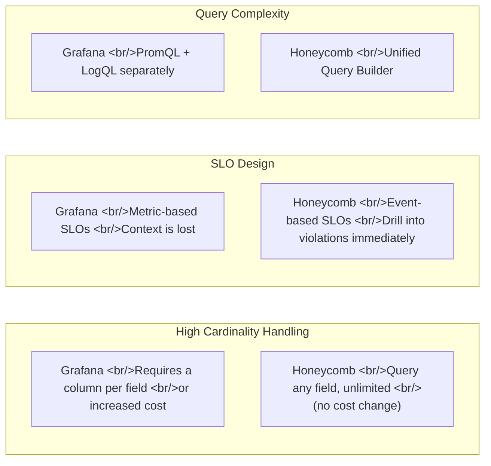
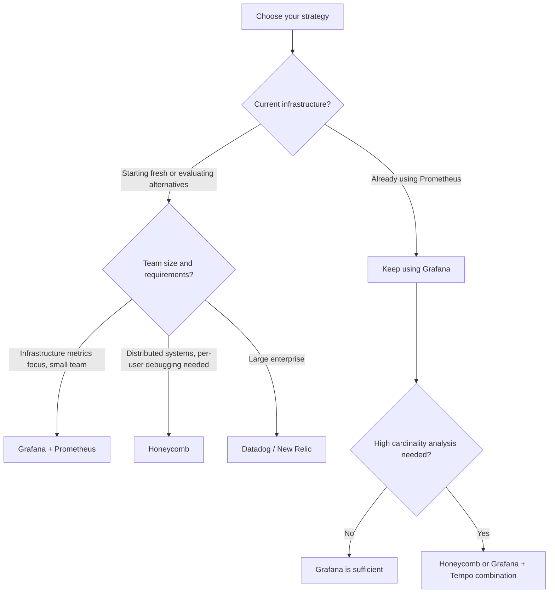

## Overview

While exploring DevOps engineer positions and looking at WhaTap Labs (a leading Korean APM vendor) job postings, I went deep on the observability tooling ecosystem. Comparing Honeycomb and Grafana reveals more than just "which tool is better" — it exposes a fundamental difference between **monitoring and observability as two distinct paradigms**. This post breaks down that difference through data models, query approaches, and SLO design.

<!--more-->



## The Paradigm Difference: It's All About the Data Model

### Monitoring (Grafana's Approach)

Traditional monitoring was designed to answer **predefined questions**. You decide in advance which metrics matter and aggregate them as time series.

- **Metrics**: CPU usage, P99 response time, error rate — numbers aggregated as time series
- **Logs**: Individual event text — stored separately in Loki or Elasticsearch
- **Traces**: Distributed request tracking — stored separately in Tempo or Jaeger

Each signal type lives in a **separate store**. To figure out "we had an error — which user triggered it and on which server?" you have to jump between three tabs, manually align time ranges, and piece together the correlation yourself.

Grafana's strength is **visualization flexibility**. Connect any data source and build dashboards. If you're already using Prometheus, MySQL, and CloudWatch, Grafana serves as a unified viewer.

### Observability (Honeycomb's Approach)

The core concept in observability is **Wide Events**. When a request is processed, every relevant piece of context is captured as a single event:

```json
{
  "timestamp": "2026-02-25T10:30:00Z",
  "service": "payment-api",
  "user_id": "u_12345",
  "tenant_id": "enterprise_co",
  "request_path": "/api/charge",
  "duration_ms": 2340,
  "db_query_count": 12,
  "cache_hit": false,
  "region": "ap-northeast-2",
  "k8s_pod": "payment-6c8b7d9-xk2p4",
  "feature_flag": "new_checkout_flow",
  "error": null
}
```

This single event contains metrics (`duration_ms`), log context (`error`), and trace context (`k8s_pod`, `region`). Honeycomb analyzes all of this **in a single store with a single query builder**.

## Feature Comparison



### The High Cardinality Problem

Cardinality is the number of unique values a field can hold. `user_id` is a high-cardinality field — it can have millions of unique values.

- **Grafana (Prometheus)**: Each unique value creates a separate time series. Grouping by `user_id` produces millions of time series, causing storage explosion. Avoiding this requires pre-aggregation or careful indexing strategy. Analyzing "the slow request pattern for a specific user" after the fact is difficult.

- **Honeycomb**: Just put `user_id` in the Wide Event. Event-based storage has no cardinality constraints. After a problem occurs, filter by `user_id = "u_12345"` and immediately query all events for that user.

### SLO Comparison

A poorly designed SLO fires alerts but leaves you with no idea what to actually fix.

| Criterion | Grafana | Honeycomb |
|---|---|---|
| Data source | Aggregated metrics | Raw events |
| Violation context | None (just a number) | Drill directly into violating events |
| Alert accuracy | False positives possible | Higher precision via event basis |
| "Why did it violate?" | Manual cross-reference of logs/traces | Immediate analysis in the same UI |

Example: P99 response time SLO violation
- Grafana: Alert → metric dashboard → search logs in Loki → analyze traces in Tempo (3 tabs)
- Honeycomb: Alert → list of violating events → spot `feature_flag = "new_checkout_flow"` pattern (1 UI)

### Pricing Model

| Item | Grafana Cloud | Honeycomb |
|---|---|---|
| Base unit | Bytes + series count + users | Event count |
| High cardinality | Additional cost | Included |
| Query cost | Extra above threshold | Included |
| Predictability | Low (multiple variables) | High (per-event) |

Grafana is cheaper when: you're already using Prometheus, your metric count is low, and you don't need deep ad-hoc analysis.

Honeycomb is cheaper when: you need high-cardinality analysis, or the engineering cost of integrating multiple signals (metrics/logs/traces) is significant.

## When to Use Which



**Grafana is the right fit when:**
- Already running a Prometheus/Loki stack
- Infrastructure metric dashboards are the primary use case
- Cost sensitivity is high and traffic is predictable
- Open-source self-hosting is a requirement

**Honeycomb is the right fit when:**
- You need to quickly answer "which requests are slow and why" in a microservices/distributed system
- High-cardinality attributes (user_id, tenant_id, feature_flag) are central to your analysis workflow
- Your SRE team is focused on DORA metrics and SLO management

## Korean Market Context: WhaTap Labs and APM

Looking at their job postings today revealed something interesting — WhaTap Labs is a Korean-built APM (Application Performance Monitoring) company. They're positioned as a domestic alternative to global tools like Honeycomb and Datadog, with agent-based auto-instrumentation, Korean language support, and on-premises deployment options as key differentiators.

Many Korean companies hiring DevOps/Observability engineers (Coinone, Yanolja, etc.) use combinations of Grafana and internal tooling. Globally, the shift toward a "developer-centric observability" paradigm like Honeycomb is accelerating. This space looks increasingly interesting from a career perspective.

## Quick Links

- [Honeycomb vs Grafana — Honeycomb's official comparison](https://www.honeycomb.io/why-honeycomb/comparisons/grafana)
- [Gartner Peer Insights — Grafana vs Honeycomb](https://www.gartner.com/reviews/market/observability-platforms/compare/grafana-labs-vs-honeycomb)
- [WhaTap Labs DevOps Job Posting](https://www.wanted.co.kr/wd/40159)

## Insights

The difference between monitoring and observability comes down to whether you know the question in advance. Traditional monitoring alerts you when a predefined metric crosses a threshold — it's strong against known failure modes. Observability enables **exploring questions you didn't define upfront**, like "why is this specific user's request slow?" As systems grow more complex and unknown failure modes multiply, the value of the observability paradigm compounds. If you're already on Grafana, Loki + Tempo + Grafana can approximate observability — but with data living in separate stores, the query UX limitations are unavoidable.
