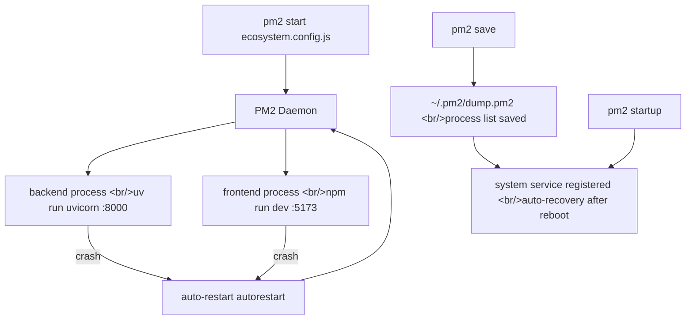
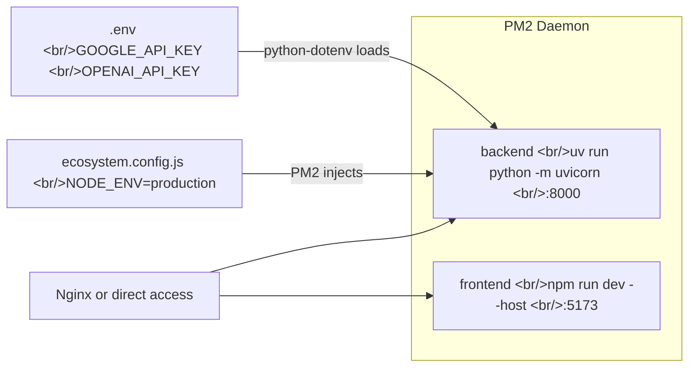

## Overview

When running a FastAPI backend alongside a Vite frontend on EC2, approaches like `nohup python ... &` leave you flying blind — if the process dies you won't know, a reboot wipes everything, and log management is painful. PM2 (Process Manager 2) originated in the Node.js world but works as a **production process manager for any language**. This post covers PM2 basics, the real-world pattern of managing Python (uvicorn) and Node.js (Vite) with a single `ecosystem.config.js`, and how to fix dotenv conflicts.

<!--more-->



## PM2 Command Cheat Sheet

```bash
# Install globally
npm install pm2 -g

# Start a single process
pm2 start app.js
pm2 start server.py --interpreter python3  # Python

# List processes
pm2 list

# Detailed info
pm2 show <name>

# Live logs
pm2 logs            # all processes
pm2 logs backend    # specific process only
pm2 logs --lines 200  # last 200 lines

# Restart / stop / delete
pm2 restart <name>
pm2 stop <name>
pm2 delete <name>   # remove from list entirely

# Resource monitor (CPU/memory live)
pm2 monit

# Save current process list → restore after reboot
pm2 save
```

The difference between `pm2 stop` and `pm2 delete`: `stop` keeps the entry in the list while `delete` removes it entirely. Use `stop` if you plan to restart it later, `delete` to clean it up completely.

## ecosystem.config.js — Managing Multiple Processes as One

Once you have a growing list of flags like `pm2 start app.js --name backend --watch --max-memory-restart 1G ...`, managing becomes hard. Use `ecosystem.config.js` to declare all configuration as code.

```bash
# Auto-generate a sample file
pm2 ecosystem
```

Edit the generated file to fit your project:

```javascript
module.exports = {
  apps: [
    {
      name: 'my-api',
      script: 'server.js',
      instances: 1,
      autorestart: true,   // auto-restart on crash
      watch: false,        // restart on file changes (true for dev only)
      max_memory_restart: '1G',
      env: {               // default environment variables
        NODE_ENV: 'development',
        PORT: 3000
      },
      env_production: {    // applied with --env production
        NODE_ENV: 'production',
        PORT: 8080
      }
    }
  ]
};
```

To use different variables per environment, add an `env_<name>` key and select it with the `--env` flag at startup:

```bash
pm2 start ecosystem.config.js              # uses env
pm2 start ecosystem.config.js --env production  # uses env_production
```

## The dotenv (.env) and PM2 Conflict

**The most common PM2 gotcha**: everything works fine with `node server.js` locally, but PM2 complains about missing environment variables.

The cause is simple. `dotenv` reads `.env` and injects into `process.env` when the process starts. But PM2 runs as an independent daemon (background service), so **the current shell's environment variables are not automatically inherited**.

Two solutions:

**Option 1 — Declare directly in ecosystem.config.js (recommended)**

```javascript
env: {
  NODE_ENV: 'production',
  DATABASE_URL: 'postgresql://...',
  API_KEY: 'your-key-here'
}
```

Downside: if `ecosystem.config.js` is committed to git, secrets are exposed. Either add it to `.gitignore`, or split secrets into a separate file and `require('./secrets')`.

**Option 2 — Load dotenv directly in application code**

In Python, `python-dotenv` reads `.env` at app startup regardless of PM2:

```python
# main.py
from dotenv import load_dotenv
load_dotenv()  # works under PM2 too
```

Same for Node.js:
```javascript
require('dotenv').config();  // at the top of your entry point, works with PM2
```

## Running Non-Node.js Processes — interpreter: "none"

PM2 defaults to running `.js` files with Node.js. To run Python, Go, shell scripts, or other runtimes, you have two options:

**Option 1 — Specify the interpreter explicitly**

```javascript
{
  name: 'flask-api',
  script: 'app.py',
  interpreter: 'python3'
}
```

**Option 2 — interpreter: "none" + specify the binary directly in script (recommended)**

```javascript
{
  name: 'backend',
  script: 'uvicorn',        // or absolute path: '/usr/local/bin/uvicorn'
  args: 'main:app --host 0.0.0.0 --port 8000',
  interpreter: 'none'       // runs the binary directly, no Node.js wrapper
}
```

`interpreter: "none"` is more flexible. Put any executable — `uv`, `gunicorn`, `go`, shell scripts — in `script` and pass arguments via `args`.

## Real-World Example: Hybrid Image Search Demo

Here is the `ecosystem.config.js` from a project currently in production (`hybrid-image-search-demo`), managing a FastAPI backend (Python + uv) and a Vite frontend (Node.js) together:

```javascript
module.exports = {
  apps: [
    {
      name: "backend",
      cwd: "./",              // run from repo root — critical for Python module resolution
      script: "uv",           // run uv (Python package manager) directly
      args: "run python -m uvicorn backend.src.main:app --host 0.0.0.0 --port 8000",
      interpreter: "none",    // uv is not Node.js — required
      env: {
        NODE_ENV: "production",
        // GOOGLE_API_KEY, OPENAI_API_KEY are loaded from .env via python-dotenv
      }
    },
    {
      name: "frontend",
      cwd: "./frontend",      // npm commands must run where package.json lives
      script: "npm",
      args: "run dev -- --host",  // '--host' tells Vite to bind 0.0.0.0 (allow external access)
      interpreter: "none",
    }
  ]
};
```

Key points in this configuration:

1. **`cwd: "./"`** — the backend must run from the repo root so that dotted module paths like `backend.src.main` resolve correctly. Omitting `cwd` or setting it to `./backend` will cause `ModuleNotFoundError`.

2. **`args: "run dev -- --host"`** — when passing extra arguments to an npm script, separate them with `--`. `--host` is forwarded to Vite, not npm.

3. **Secrets stay in `.env` + python-dotenv** — `GOOGLE_API_KEY` and `OPENAI_API_KEY` are not in the ecosystem file. The FastAPI app reads `.env` directly at startup.



## Auto-Recovery After Server Reboot

PM2's process list disappears when the server restarts. Register it permanently in two steps:

```bash
# Step 1: Save the current running process list
pm2 save
# → written to ~/.pm2/dump.pm2

# Step 2: Register PM2 as a system service (auto-start on reboot)
pm2 startup
# This prints the command you need to run:
# [PM2] To setup the Startup Script, copy/paste the following command:
# sudo env PATH=$PATH:/usr/bin /usr/lib/node_modules/pm2/bin/pm2 startup systemd -u ubuntu --hp /home/ubuntu

# Run the printed sudo command as-is
sudo env PATH=$PATH:/usr/bin ...
```

`pm2 startup` auto-detects the init system (systemd, SysV, etc.). On AWS EC2 Ubuntu it generates a systemd service file.

## Watch Out: Fixed Script Path Per Service Name

PM2 locks a script path to a service name the first time it is registered. A `main` service started from `/home/project1/server.js` will keep running `/home/project1/server.js` even if you start it again from `/home/project2/` using the same name.

```bash
# Check the currently bound path
pm2 show main  # look at the 'script path' field

# Fix: delete the old service and re-register
pm2 delete main
cd /home/project2/
pm2 start server.js --name main
```

Using `ecosystem.config.js` avoids this problem naturally — `cwd` and `script` are declared explicitly.

## Quick Reference — Common Patterns

```bash
# Start / restart / stop with ecosystem
pm2 start ecosystem.config.js
pm2 restart ecosystem.config.js
pm2 stop ecosystem.config.js

# Single app
pm2 restart backend
pm2 logs frontend --lines 100

# Status at a glance
pm2 list

# Full clean restart
pm2 delete all && pm2 start ecosystem.config.js && pm2 save
```

## Quick Links

- [PM2 Official Docs — ecosystem.config.js](https://pm2.keymetrics.io/docs/usage/application-declaration/)
- [PM2 ecosystem.config.js environment variables (Korean)](https://bloodstrawberry.tistory.com/1333)
- [PM2 background run / stop / restart (Korean)](https://itadventure.tistory.com/432)

## Insights

The biggest confusion when starting with PM2 is "it's a Node.js tool — why use it for Python?" With `interpreter: "none"`, PM2 becomes a pure **process watchdog** — it detects crashes and restarts any process regardless of language. In practice, when running a Python backend alongside a Node.js frontend like this project, having a single `pm2 logs` command that aggregates both streams is a significant operational convenience. The dotenv vs. PM2 conflict stems from a difference in "process execution context" — once you understand that, similar issues like environment variables disappearing in Docker containers become easy to diagnose with the same mental model.
