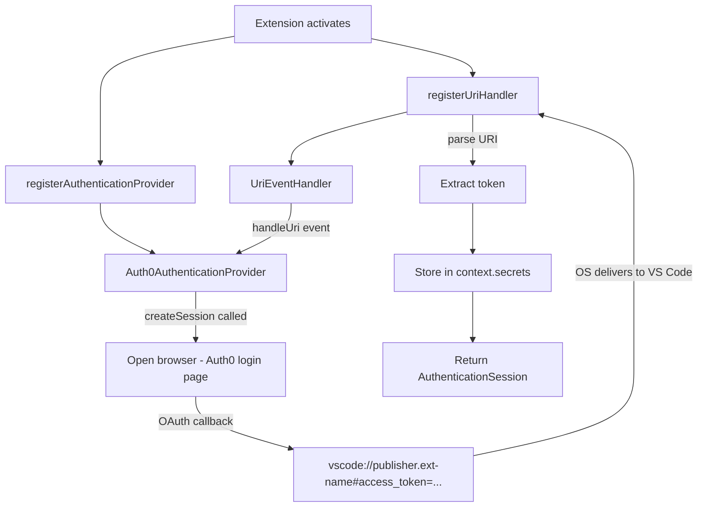
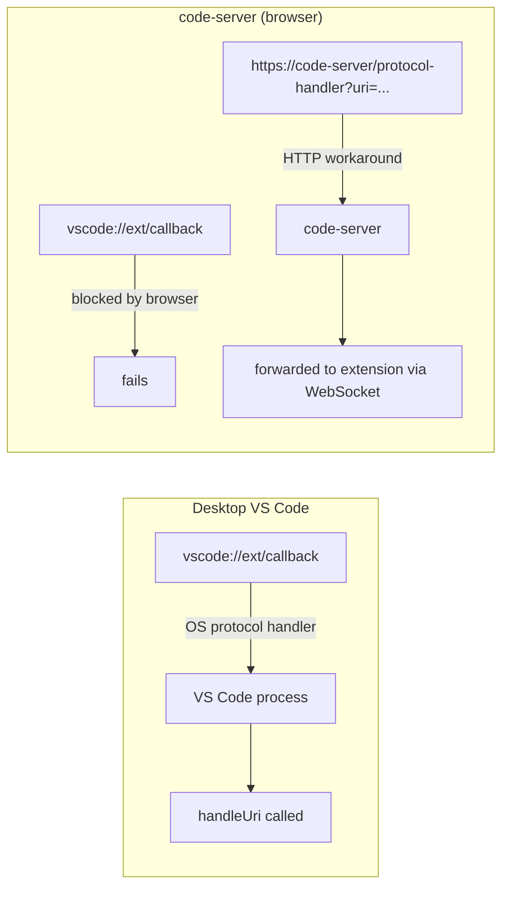

## Overview

When a VS Code extension needs to sign in to an external OAuth service (GitHub, Auth0, etc.), the flow involves opening a browser and receiving a callback. A regular web app uses a local server at something like `http://localhost:3000/callback` as the redirect URI, but a VS Code extension can receive the callback directly via the `vscode://publisher.extension-name` protocol — no local port needed. This post covers how to combine `registerUriHandler` and the `AuthenticationProvider` API to implement the OAuth flow, the protocol limitations in code-server (browser-based VS Code), and how Remote Tunnels handles OAuth.

<!--more-->



## registerUriHandler — The Entry Point for External Callbacks

`vscode.window.registerUriHandler()` registers an OS-level URI handler so that when an external source opens a `vscode://` link, the extension receives that URI. If multiple VS Code windows are open, the foreground window handles it.

The implementation is straightforward — implement the `UriHandler` interface and propagate events via an `EventEmitter`:

```typescript
class UriEventHandler extends EventEmitter<Uri> implements UriHandler {
  public handleUri(uri: Uri) {
    this.fire(uri);  // deliver URI to subscribers
  }
}

// Inside activate() in extension.ts:
const uriHandler = new UriEventHandler();
context.subscriptions.push(
  vscode.window.registerUriHandler(uriHandler)
);
```

The URL format for incoming URIs is:

```
vscode://<publisher>.<extension-name>[/path][?query=value][#fragment=value]
```

Examples: `vscode://mycompany.my-ext?code=abc123` or `vscode://mycompany.my-ext#access_token=xyz`

One important distinction: Auth0 sends tokens in the **URI fragment (`#`)** for implicit flow, while Azure AD uses the **query string (`?`)**. Which side you parse depends on your OAuth provider.

## The AuthenticationProvider Interface

Since VS Code 1.54, `authentication.registerAuthenticationProvider()` lets you register a custom authentication provider. This makes the provider appear in VS Code's Account menu and allows other extensions to request sessions via `vscode.authentication.getSession()`.

Interface to implement:

```typescript
export class Auth0AuthenticationProvider implements AuthenticationProvider, Disposable {
  private _sessionChangeEmitter = new EventEmitter<...>();

  // Event VS Code subscribes to for session changes
  get onDidChangeSessions() {
    return this._sessionChangeEmitter.event;
  }

  // Return stored sessions (read from secrets store)
  async getSessions(scopes?: string[]): Promise<readonly AuthenticationSession[]> {
    const stored = await this.context.secrets.get(SESSIONS_KEY);
    return stored ? JSON.parse(stored) : [];
  }

  // Sign in → obtain token → create session
  async createSession(scopes: string[]): Promise<AuthenticationSession> {
    const token = await this.login(scopes);
    const userinfo = await this.getUserInfo(token);
    const session: AuthenticationSession = {
      id: uuid(),
      accessToken: token,
      account: { label: userinfo.name, id: userinfo.email },
      scopes: []
    };
    await this.context.secrets.store(SESSIONS_KEY, JSON.stringify([session]));
    this._sessionChangeEmitter.fire({ added: [session], removed: [], changed: [] });
    return session;
  }

  // Sign out
  async removeSession(sessionId: string): Promise<void> {
    const sessions = JSON.parse(await this.context.secrets.get(SESSIONS_KEY) || '[]');
    const idx = sessions.findIndex((s: AuthenticationSession) => s.id === sessionId);
    const [removed] = sessions.splice(idx, 1);
    await this.context.secrets.store(SESSIONS_KEY, JSON.stringify(sessions));
    this._sessionChangeEmitter.fire({ added: [], removed: [removed], changed: [] });
  }
}
```

`context.secrets` stores data encrypted in VS Code's built-in secret store (macOS Keychain, Windows Credential Manager, Linux libsecret). This is why tokens should never be stored in plain text via `globalState`.

## OAuth Login Flow in Detail

The `login()` method called inside `createSession` is where the actual OAuth flow happens:

```typescript
private async login(scopes: string[]) {
  return await window.withProgress({ location: ProgressLocation.Notification, ... }, async () => {
    const stateId = uuid();  // state parameter for CSRF protection
    this._pendingStates.push(stateId);

    // Build the OAuth authorization URL
    const params = new URLSearchParams({
      response_type: 'token',
      client_id: CLIENT_ID,
      redirect_uri: `vscode://${PUBLISHER}.${EXT_NAME}`,
      state: stateId,
      scope: scopes.join(' ')
    });
    await env.openExternal(Uri.parse(`https://auth0.com/authorize?${params}`));

    // Wait until the URI handler receives the callback (60s timeout)
    return await Promise.race([
      promiseFromEvent(this._uriHandler.event, this.handleUri(scopes)).promise,
      new Promise((_, reject) => setTimeout(() => reject('Timeout'), 60000))
    ]);
  });
}

private handleUri = (scopes) => async (uri, resolve, reject) => {
  const fragment = new URLSearchParams(uri.fragment);  // Auth0 uses fragment
  const token = fragment.get('access_token');
  const state = fragment.get('state');

  if (!this._pendingStates.includes(state)) {
    reject(new Error('Invalid state'));  // CSRF defense
    return;
  }
  resolve(token);
};
```

The use of `Promise.race()` is elegant — it handles whichever arrives first among three outcomes: a successful URI callback, a 60-second timeout, or a user cancellation token.

## Consumer Code

Using the registered provider from within the same extension or another extension:

```typescript
// Fetch existing session, or prompt login if none exists (createIfNone: true)
const session = await vscode.authentication.getSession('auth0', ['openid', 'profile'], {
  createIfNone: true
});

if (session) {
  vscode.window.showInformationMessage(`Welcome, ${session.account.label}!`);
  // Use session.accessToken for API calls
}
```

## Protocol Limitations in code-server

There is an important real-world constraint here. code-server is an open-source project (76k stars) that runs VS Code in the browser — and the `vscode://` protocol **does not work in browsers**.

Browser security policy restricts which schemes `navigator.registerProtocolHandler()` can register, and `vscode://` is not on the allowed list. A code-server maintainer noted:

> "I do not think browsers allow handling vscode:// anyway, at best we could do `web+vscode://` or `web+code-server://`."

The proposed workaround:

```
https://code-server-url/protocol-handler?uri=vscode://my-plugin/path
```

code-server itself handles the `/protocol-handler` route and forwards the URI to the connected client extension. This approach has the added benefit of showing no notification/confirmation popup, making for a cleaner UX.

If installed as a PWA, partial support is also possible via `protocol_handlers` in `manifest.json` (requires `https://` scheme).



## Remote Tunnels' OAuth Mechanism

VS Code Remote Tunnels provides access to a remote machine without SSH. It uses GitHub OAuth internally to authenticate the tunnel service:

1. Run `code tunnel` → VS Code Server is installed on the remote machine
2. Connects to Microsoft Azure-based dev tunnels service
3. Generates a `vscode.dev/tunnel/<machine_name>` URL
4. When a client accesses that URL, they get redirected through `github.com/login/oauth/authorize...`

Tunnel security uses AES-256-CTR end-to-end encryption, and VS Code only makes outbound connections — no listening ports, no firewall rules needed.

## Practical Guide: Which Approach to Choose?

| Scenario | Recommended approach |
|---|---|
| Desktop VS Code + external OAuth | `registerUriHandler` + `AuthenticationProvider` |
| code-server + OAuth | `/protocol-handler` route workaround or localhost server |
| Accessing internal remote environments | Remote Tunnels (only requires a GitHub account) |
| Managing multiple GitHub accounts | GitShift extension (`mikeeeyy04.gitshift`) |

If building a production `AuthenticationProvider`, two more things are needed:
- Store only the refresh token and renew access tokens each time (security)
- Detect refresh token expiry → auto-remove session → prompt re-login

## Quick Links

- [Elio Struyf — Creating an Authentication Provider for VS Code](https://www.eliostruyf.com/create-authentication-provider-visual-studio-code/)
- [Elio Struyf — Callback from external sources to VS Code extensions](https://www.eliostruyf.com/callback-extension-vscode/)
- [VS Code API — UriHandler reference](https://code.visualstudio.com/api/references/vscode-api#UriHandler)
- [VS Code — Remote Tunnels official docs](https://code.visualstudio.com/docs/remote/tunnels)
- [coder/code-server — registerUriHandler issue discussion](https://github.com/coder/code-server/discussions/3891)
- [RFC 6750 — OAuth 2.0 Bearer Token](https://datatracker.ietf.org/doc/html/rfc6750)

## Insights

Digging into OAuth for VS Code extensions reinforced how much **platform boundaries** matter. The `vscode://` protocol works flawlessly on native desktop, but the moment you cross into the browser boundary, OS-level protocol handling is blocked. The `/protocol-handler` workaround that code-server proposes is clever — it pushes the problem down to the HTTP layer to sidestep the browser restriction. Meanwhile, seeing how Remote Tunnels elegantly solves the same OAuth problem under a single `vscode.dev` domain shows what's possible when a platform designer centralizes the OAuth redirect upfront. The `context.secrets` store exposed by the `AuthenticationProvider` API looks simple on the surface, but it's a well-designed abstraction over platform-specific Keychain and Credential Manager implementations.
