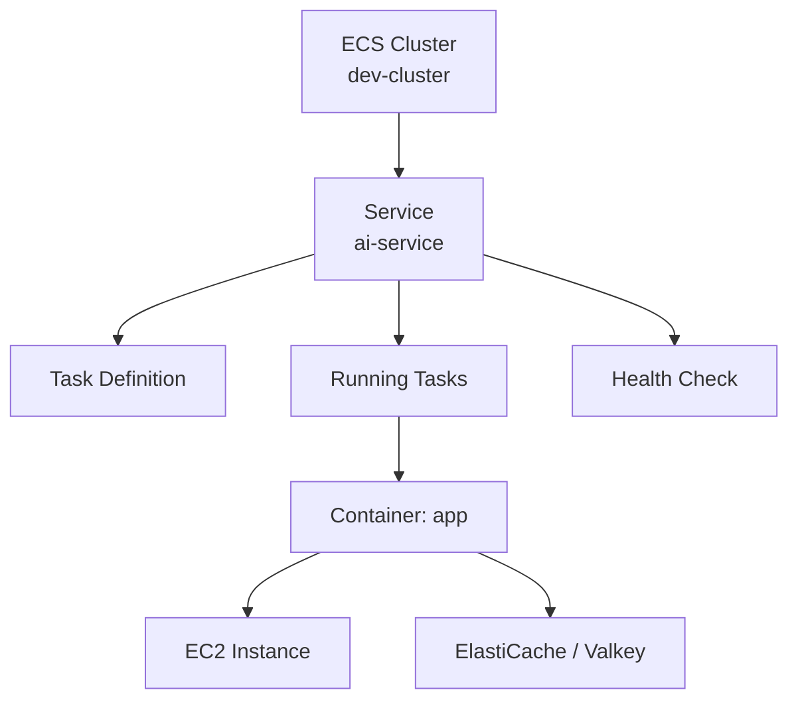
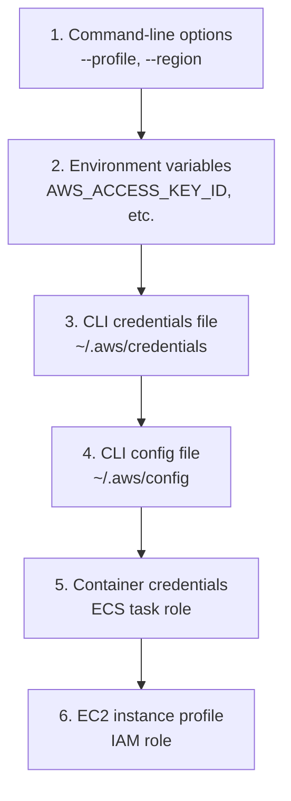

## Overview

A day spent managing the dev environment infrastructure for an AI service. The work covered ECS service updates, EC2 instance checks, ElastiCache (Valkey) monitoring, IAM access key creation, and configuring AWS CLI credentials locally.

## ECS Service Management

In the dev ECS cluster, I checked task status, health checks, and performed a service update for the AI service. Items reviewed in the ECS console:

- **Service tasks**: Container status and logs for running tasks
- **Health and metrics**: Service health check results, CPU/memory metrics
- **Service update**: Rolling deployment after updating the task definition

ECS Express Mode was also reviewed — a mode for quickly deploying simple services.

## EC2 Instances and ElastiCache

Checked the status of EC2 instances running in the dev environment. On the ElastiCache side, I monitored a Valkey (Redis-compatible in-memory data store) cluster. Valkey is an open-source Redis fork that AWS officially supports as a managed in-memory cache engine.

## IAM Access Key Creation and CLI Setup

Generated a new access key from the Security credentials tab of the development IAM user. Then followed the [AWS CLI configuration docs](https://docs.aws.amazon.com/cli/latest/userguide/cli-chap-configure.html) and ran `aws configure` to set up the local environment.

AWS CLI credential lookup order:

`aws configure` prompts for four values:
- AWS Access Key ID
- AWS Secret Access Key
- Default region name (e.g. `ap-northeast-2`)
- Default output format (json, yaml, text, table)

The results are stored in `~/.aws/credentials` (credentials) and `~/.aws/config` (region, output format). To set up multiple profiles, use `aws configure --profile <profile-name>`.

## Insights

Today's AWS work was routine DevOps, but a few things stand out. ECS service updates done manually through the console are fine for one-offs, but for repeated tasks a CI/CD pipeline or Terraform automation is the right answer. The flow from IAM access key generation to CLI setup is something you go through every time you set up a new development environment — having a precise understanding of credential precedence makes debugging environment variable vs. file config conflicts much faster. Choosing Valkey (the Redis fork) as a managed ElastiCache engine is a practical response to the Redis license change.
