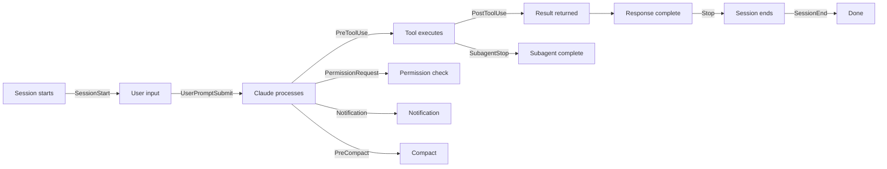

## Overview

Claude Code works by having an LLM "choose" which tools to call and when. But some operations shouldn't be a choice — they must **always** happen: formatting after file saves, command logging, blocking modifications to production files. [Claude Code Hooks](https://code.claude.com/docs/hooks-guide) is a lifecycle shell command system that addresses exactly this need.

## Hook Event Types

Claude Code provides 10 hook events that fire at various points in the workflow:



| Event | Timing | Control |
|---|---|---|
| `PreToolUse` | Before tool call | Can block |
| `PostToolUse` | After tool call | Provide feedback |
| `PermissionRequest` | Permission dialog | Allow / deny |
| `UserPromptSubmit` | On prompt submit | Pre-process |
| `Notification` | On notification | Custom alert |
| `Stop` | On response complete | Post-process |
| `SubagentStop` | On subagent complete | Post-process |
| `PreCompact` | Before compact | Pre-process |
| `SessionStart` | Session start / resume | Initialize |
| `SessionEnd` | Session end | Cleanup |

## Practical Example: Bash Command Logging

The most basic hook — log every shell command to a file. Attach a `Bash` matcher to the `PreToolUse` event and parse the tool input with `jq`:

```json
{
  "hooks": {
    "PreToolUse": [
      {
        "matcher": "Bash",
        "hooks": [
          {
            "command": "jq -r '\"\\(.tool_input.command) - \\(.tool_input.description // \"No description\")\"' >> ~/.claude/bash-command-log.txt"
          }
        ]
      }
    ]
  }
}
```

Access the configuration via the `/hooks` slash command, and choose whether to save it to User settings (global) or Project settings (per-project).

## Usage Patterns

**Auto-formatting**: Run formatters from `PostToolUse` based on file extension. Automatically apply prettier for `.ts` files, gofmt for `.go`, black for `.py` — ensuring code Claude generates always follows the project's style.

**File protection**: In `PreToolUse`, block writes to specific path patterns (e.g. `production/`, `.env`). Prevents the LLM from accidentally touching production configuration.

**Custom notifications**: Connect `Notification` events to system alerts, Slack webhooks, or sound playback. Get notified in whatever way you prefer when Claude is waiting for input or when a task completes.

**Code quality feedback**: Return lint results to Claude via `PostToolUse` and Claude will automatically incorporate the fixes. This is enforcement at the code level, not through prompt instructions.

## Security Considerations

Hooks run automatically inside the agent loop with the credentials of the current environment. This is powerful — and dangerous. Malicious hook code could read environment variables and exfiltrate them, delete files, or execute arbitrary commands. Always review hook implementations before registering them, and include `.claude/settings.json` changes in code review for project-level hooks.

## Insights

The core value of hooks is **turning suggestions into code**. You can write "always run prettier" in a prompt, but the LLM will occasionally forget. Register it as a hook and it runs 100% of the time. This is the pattern for compensating for LLM-based development tools' fundamental limitation — non-deterministic behavior — with deterministic shell commands. Master three hook points — `PreToolUse` for blocking, `PostToolUse` for post-processing, `Stop` for cleanup — and you can align Claude Code's behavior precisely with your project's requirements.
