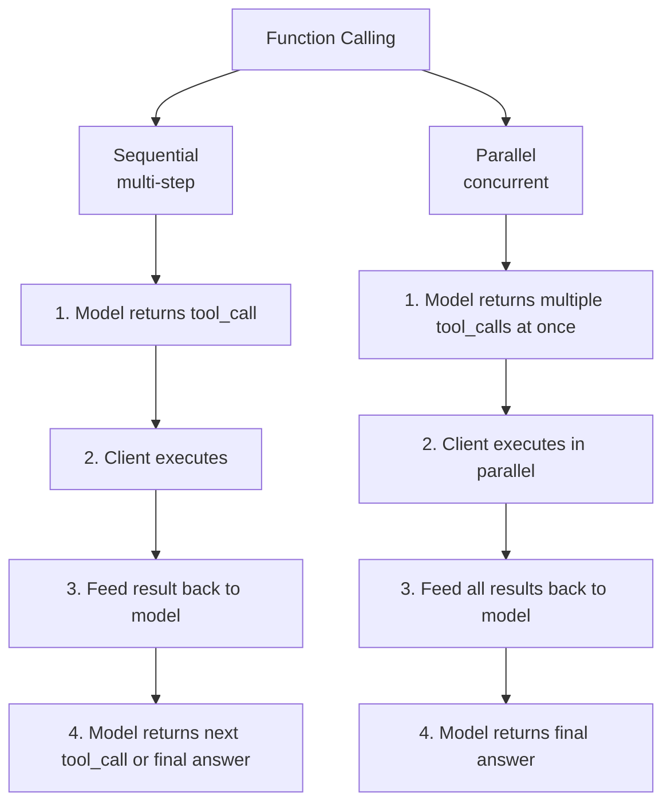
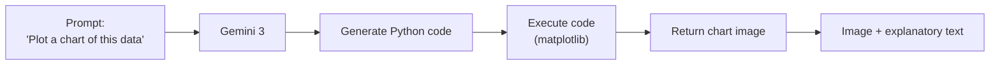

## Overview

A previous post covered Gemini 3's model lineup, pricing, Thought Signatures, `thinking_level`/`media_resolution` parameters, image generation (Nano Banana Pro), and the Flash Preview bug. This post tackles the remaining sections of the [Gemini 3 Developer Guide](https://ai.google.dev/gemini-api/docs/gemini-3): **Function Calling strict validation**, **Structured Outputs with tools**, **Code Execution with images**, **Multimodal function responses**, and the **OpenAI-compatible API**.

> Previous posts: [Gemini 3 Image Generation API + Mermaid.js](https://ice-ice-bear.github.io/posts/2026-02-20-tech-log/), [Gemini 3 Flash Preview Infinite Loop Bug](https://ice-ice-bear.github.io/posts/2026-02-25-gemini-3-flash-infinite-loop-bug/)

## Gemini 3.1 Pro Preview Announcement

Gemini 3.1 Pro is now available in preview. It brings improvements in performance, behavior, and intelligence over Gemini 3 Pro, with model ID `gemini-3.1-pro-preview`. Pricing and context window (1M/64k) are the same as 3 Pro. Try it for free in Google AI Studio.

## Function Calling — Strict Validation

Gemini 3 introduces strict validation for Function Calling. Earlier models applied loose schema validation for tool calls, but now **image generation/editing** and **Function Calling** modes enforce strict validation that includes Thought Signatures.

Two calling patterns are supported:

**Sequential (multi-step)**: The model calls one tool at a time, receives the result, then decides on the next call. Best suited for agentic workflows where each step depends on the previous result.

**Parallel**: The model returns multiple independent tool calls at once. The client executes them in parallel, collects results, and feeds them back — the model then generates a combined response. This significantly reduces latency.

Important caveat: strict validation does not apply to text/streaming or in-context reasoning. That means calling a tool without a Thought Signature in image generation mode returns a 400 error, but normal text mode behaves as before.

## Structured Outputs with Tools

Function Calling and Structured Output can now be combined. When defining a tool, specify a response schema to force the model to return tool call results as structured JSON. Where models previously responded in free-form text, production pipelines can now parse results reliably without parsing errors.

## Code Execution with Images

Gemini 3's code execution now supports image output. The model can run Python code and return charts or graphs generated by libraries like matplotlib as images. The key capability here is completing the pipeline of data analysis → visualization → explanation in a single API call.

## Multimodal Function Responses

Tool call results can now include not just text but images, audio, and other multimodal data. For example, a tool call that returns a satellite image of an address lets the model analyze that image and produce a combined response. Agents can now pair data fetched from external APIs — including non-text data — with the model's multimodal understanding.

## OpenAI-Compatible API

Gemini 3 provides an OpenAI-compatible endpoint. Codebases using the OpenAI API can switch to Gemini 3 by changing only the model name and API key — a strategic choice that minimizes migration cost.

## Migrating from Gemini 2.5

Key things to watch when upgrading from Gemini 2.5:
- Model ID changes (`gemini-2.5-*` → `gemini-3-*-preview`)
- Thought Signatures are newly introduced — strict validation now applies in Function Calling
- Temperature defaults are optimized for 1.0 — remove any code setting a lower temperature
- `thinking_level` and `thinking_budget` cannot be used together (400 error)

## Insights

Looking at Gemini 3's new features, it's clear Google is focused on **reliability in agentic pipelines**. Function Calling strict validation, Structured Outputs, and the parallel calling pattern all address the parsing errors and latency problems that arise in production agents. Code Execution with images and Multimodal function responses extend tool calling beyond text. The OpenAI-compatible API reduces the switching cost between competing models — a strategy similar to Claude's own OpenAI compatibility mode. As API compatibility increases across models, developers gain the freedom to choose models based on performance and cost rather than being locked to a vendor.
