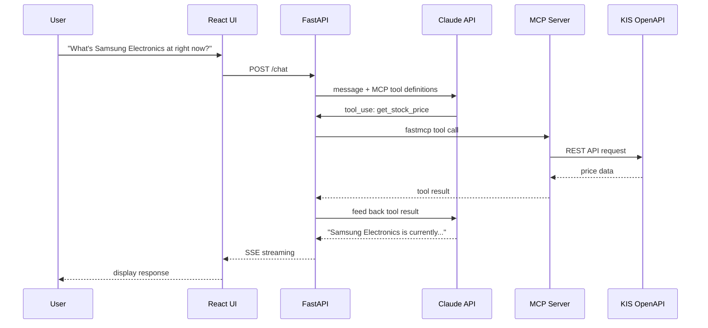
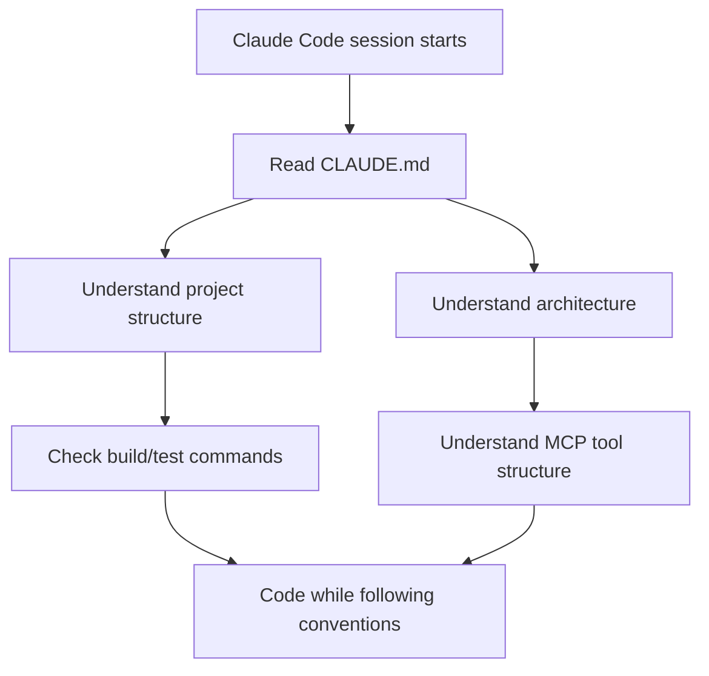

## Overview

[trading-agent](https://github.com/ice-ice-bear/trading-agent) is a web app under development that lets users query stock prices and place paper trading orders using natural language. It wraps the Korea Investment & Securities (KIS) OpenAPI as an MCP (Model Context Protocol) server and uses Claude's tool-calling to interpret user intent. This post walks through the architecture and the role of the CLAUDE.md added in PR #1.

## Architecture

The system is composed of three services: a React frontend (Vite, :5173), a FastAPI backend (:8000), and a KIS Trading MCP Server (SSE, :3000).

```
React (Vite, :5173) <--> FastAPI (:8000) <--> Claude API
                              |
                       MCP Client (fastmcp)
                              |
                  KIS Trading MCP Server (SSE, :3000)
                              |
                      KIS OpenAPI (paper trading)
```

When a user asks "What's the current price of Samsung Electronics?", the flow is:



The key is that FastAPI passes MCP tool definitions alongside the message when calling the Claude API. Once Claude identifies the user's intent and decides which tool to call, FastAPI executes it via the MCP Client (fastmcp) and feeds the result back to Claude. The final response is streamed to the React UI via SSE.

## Tech Stack and Configuration

Requirements: Python 3.12+ (uv), Node.js 22+, an Anthropic API key, and KIS paper trading credentials. The default model is `claude-sonnet-4-5-20250929`. Run `make install && make start` to bring up all three services.

Key environment variables:

| Variable | Description |
|---|---|
| `ANTHROPIC_API_KEY` | Anthropic API key |
| `MCP_SERVER_URL` | MCP server SSE endpoint (default: `http://localhost:3000/sse`) |
| `CLAUDE_MODEL` | Claude model to use |
| `KIS_PAPER_APP_KEY` | KIS paper trading app key |
| `KIS_PAPER_APP_SECRET` | KIS paper trading app secret |
| `KIS_PAPER_STOCK` | Paper trading account number (8 digits) |

`make` targets are provided for `install`, `start`, and starting individual services to streamline the developer experience.

## CLAUDE.md — Project Guide for Claude Code

[PR #1](https://github.com/ice-ice-bear/trading-agent/pull/1) added CLAUDE.md. This file is the first context document Claude Code reads when entering a project. Documenting build commands, architecture overview, and development conventions means Claude Code will stay consistent when modifying code.



Adding CLAUDE.md is not just documentation — it's designing the collaboration interface for an AI agent. Each project has different build commands, different test conventions, different code styles. Rather than explaining all of this in conversation every time, defining it in a single file makes Claude Code's first actions accurate from the start.

## Insights

This project makes MCP's value tangible. KIS OpenAPI is REST-based, but wrapping it in an MCP Server lets Claude go directly from natural language intent to a tool call. The important design point is that FastAPI acts as the orchestrator between the MCP Client and Claude API — Claude decides *which tool to call*, FastAPI *actually runs it*. That separation is clean. Starting with paper trading and being able to switch to the live API via a single environment variable is good design, and the `make start` DX that brings the whole stack up at once is a meaningful detail.
