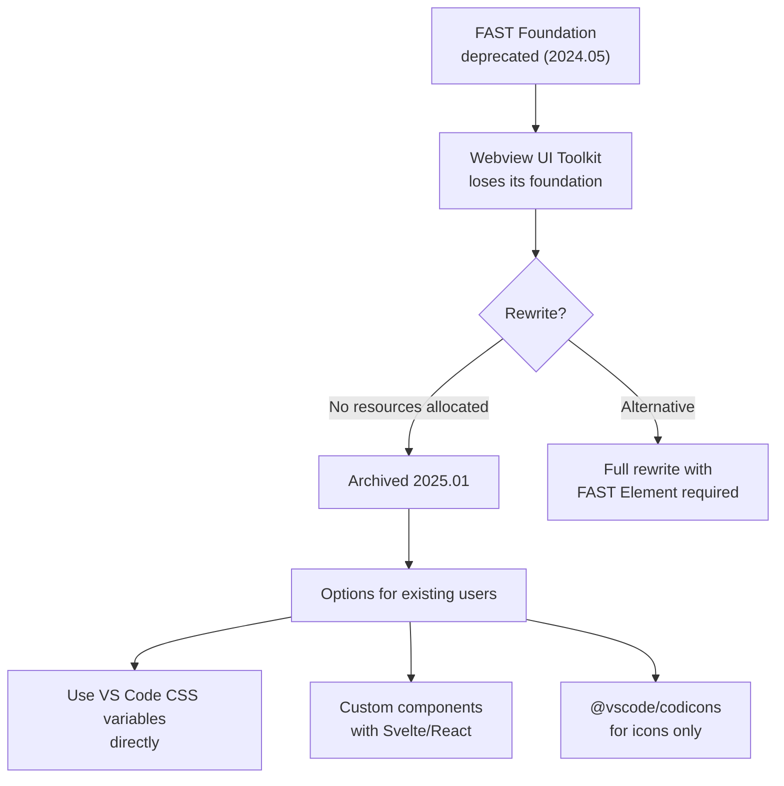
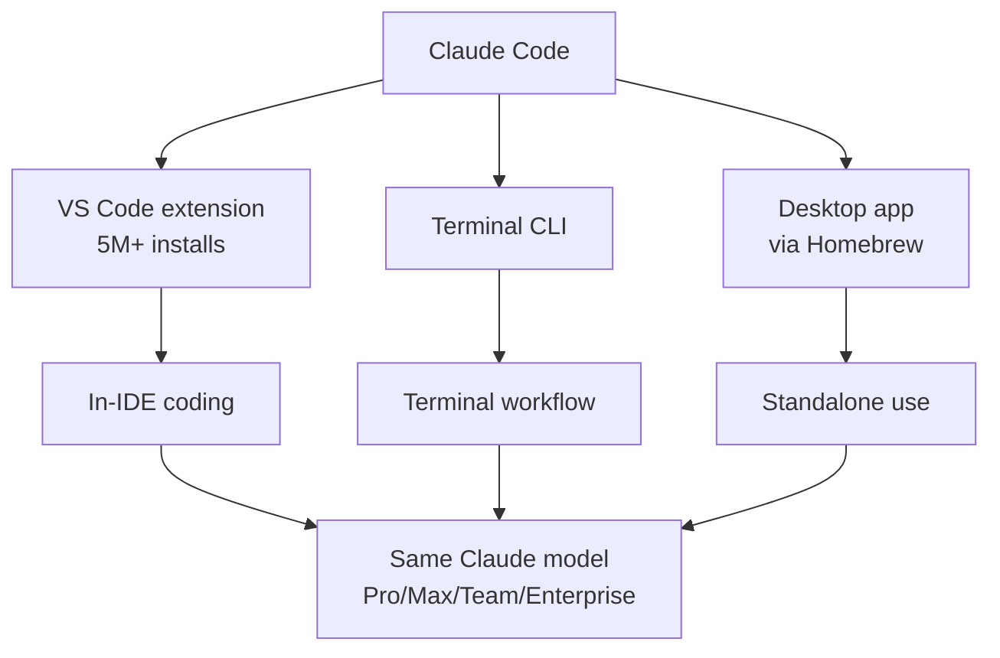

## Overview

The VS Code extension ecosystem is at a crossroads. On one side, Microsoft's official [Webview UI Toolkit](https://github.com/microsoft/vscode-webview-ui-toolkit) has been deprecated and archived. On the other, AI coding assistants have become an essential category of extensions. This post examines both trends.

## The End of Webview UI Toolkit

[Issue #561](https://github.com/microsoft/vscode-webview-ui-toolkit/issues/561) contains the announcement from hawkticehurst. A project with 2.1k stars and 157 forks was archived on January 6, 2025.

The root cause was the deprecation of its core dependency, FAST Foundation. In May 2024, the FAST project announced a re-alignment that placed several core packages on the deprecated list, pulling the rug out from under Webview UI Toolkit's foundation. The only path forward was a complete rewrite using FAST Element (a lower-level web component library), but no resources were allocated for it.

The library provided three things of value:
- UI components following VS Code's design language (buttons, dropdowns, data grids, etc.)
- Automatic theme support (auto-switching between dark and light mode)
- Framework-agnostic web components that worked with React, Vue, Svelte, etc.

There is now no official replacement. Developers are left using VS Code's CSS variables (`--vscode-button-background`, `--vscode-input-border`, etc.) directly, or pulling in `@vscode/codicons` for icons and building everything else themselves.

## Best Extensions for 2026 — AI as Its Own Category

The notable shift in Builder.io's [Best VS Code Extensions for 2026](https://www.builder.io/blog/best-vs-code-extensions-2026) roundup is that **AI extensions are now a standalone category**. The post operates from the premise that 2025 was the year of AI agents, and that by 2026 most developers are already using AI IDEs like Cursor or Claude Code.

Top three AI extension picks:
- **Fusion**: Visual editing + AI code changes that create PRs directly in the real repo
- **Claude Code**: Context-aware in-IDE coding, 5M+ installs
- **Sourcegraph Cody**: Cross-repo context based on code graphs

Other notable recommendations:
- **Thunder Client**: REST client (Postman alternative)
- **Error Lens**: Inline error/warning display
- **Pretty TypeScript Errors**: More readable TS diagnostic messages
- **TODO Tree**: Collects all TODO/FIXME comments in one place
- **Git Graph**: Visual commit history
- **CSS Peek**: Jump from markup/JSX directly to style definitions
- **Import Cost**: Shows bundle size for imports inline

The checklist for evaluating extensions is practical: check who made it (verified publisher, open source), whether it was updated recently, its performance impact, and what permissions it requests. The advice to install heavy extensions only in specific workspaces and exclude folders like `node_modules` is also included.

## Claude Code for VS Code

[On the VS Code Marketplace](https://marketplace.visualstudio.com/items?itemName=anthropic.claude-code), Claude Code has crossed 5M+ installs. It's available through Pro, Max, Team, and Enterprise subscriptions or pay-as-you-go, and supports both a terminal-based workflow and full IDE integration. A separate desktop app via Homebrew is also available (`brew install --cask claude-code`).

## Insights

Two forces are colliding in the VS Code extension ecosystem. Established infrastructure like Webview UI Toolkit collapses through dependency chain failures (FAST Foundation → Toolkit), while AI coding assistants grow into a must-have category. If you're building a webview-based extension, you now have to construct your own UI components or choose a lightweight framework — and ironically, AI tools like Claude Code can help generate that boilerplate. The vacant spot in the extension ecosystem is being filled by AI.
