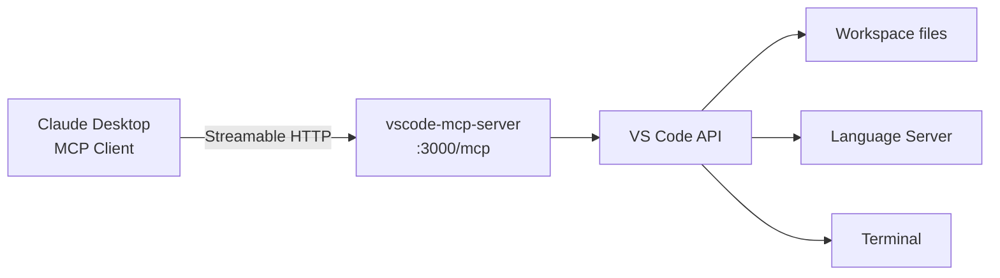

## Overview

[juehang/vscode-mcp-server](https://github.com/juehang/vscode-mcp-server) is a VS Code extension that exposes the editor's built-in capabilities — file manipulation, symbol search, diagnostics, and more — through the MCP protocol. This lets Claude Desktop or any other MCP client code directly inside VS Code. Inspired by Serena, its differentiator is using VS Code's native API rather than external tooling.

## Architecture

The extension provides a Streamable HTTP API (`http://localhost:3000/mcp`), using the newer MCP transport instead of SSE. Connect from Claude Desktop via `npx mcp-remote@next`:

```json
{
  "mcpServers": {
    "vscode-mcp-server": {
      "command": "npx",
      "args": ["mcp-remote@next", "http://localhost:3000/mcp"]
    }
  }
}
```



## MCP Tool Catalog

Five categories, seven or more tools total:

**File Tools** — File system operations
- `list_files_code`: List files in a directory
- `read_file_code`: Read file contents
- `create_file_code`: Create a file (with overwrite option)

**Edit Tools** — Code modifications
- `replace_lines_code`: Replace a specific line range. Requires exact match with the original content.

**Diagnostics Tools** — Code diagnostics
- `get_diagnostics_code`: Returns Language Server diagnostics (errors and warnings)

**Symbol Tools** — Code navigation
- `search_symbols_code`: Search for functions/classes across the entire workspace
- `get_document_symbols_code`: Symbol outline for a single file

**Shell Tools** — Terminal command execution

## How It Differs from Claude Code

Claude Code also supports reading and writing files, but vscode-mcp-server is distinct in exposing **VS Code-native capabilities**. Language Server-backed symbol search, document outlines, and code diagnostics are semantically more precise than Claude Code's grep/ripgrep-based search. Combining both tools gives you Claude Code's powerful file manipulation alongside VS Code's semantic code understanding.

The recommended workflow from the project README:
1. `list_files_code` to understand project structure
2. `search_symbols_code` to find the target function/class
3. `read_file_code` to see current contents
4. `replace_lines_code` for small changes, `create_file_code` with overwrite for large ones
5. **After every edit**, `get_diagnostics_code` to catch errors

## Security Considerations

Shell Tools are included, meaning shell command execution is possible. MCP authentication specs are not yet finalized, so authentication is not implemented — take care that the port is not exposed externally. Only trusted MCP clients should be connected.

## Insights

This extension shows the MCP ecosystem evolving beyond "tool standardization" toward "environment integration." Where LLMs previously read and wrote files directly, vscode-mcp-server enables access to Language Server type checking, symbol indexing, and diagnostics as well. The pattern of calling `get_diagnostics_code` after every edit maps the human developer workflow — "write code → ask the compiler → fix it" — onto an LLM. Once the MCP authentication spec is finalized, this will be even safer to deploy.
