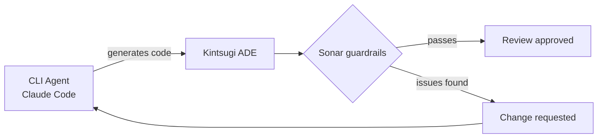
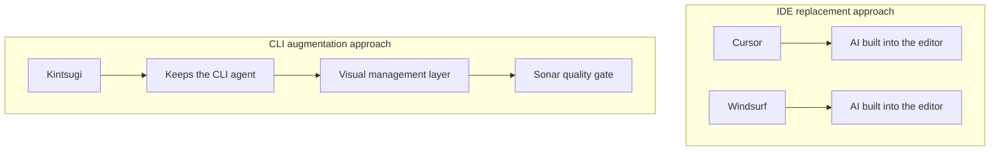

## Overview

**Kintsugi** is an Agentic Development Environment (ADE) being developed experimentally by SonarSource for CLI agent users. Rather than replacing an IDE, it takes a different approach: visually augmenting CLI agents like Claude Code.

## What Is Kintsugi?

Kintsugi is a fundamentally different concept from traditional IDEs. It defines itself as an **Agentic Development Environment (ADE)** — instead of writing code directly, it focuses on **orchestrating and reviewing** code generated by AI agents. Currently it supports only Claude Code, with Gemini CLI and Codex support planned.

Three core features:

- **Multi-threaded development** — Manage multiple AI sessions in parallel with a visual queue tracking each task's status. Solves the problem of losing context when running multiple `claude` commands across different terminals.
- **Plan review and change requests** — Visually inspect an agent's proposed implementation plan and redirect it before any code is written.
- **Sonar-powered guardrails** — Integrates SonarQube/SonarCloud's static analysis engine to automatically check AI-generated code for security vulnerabilities and quality issues at every step.

## Privacy and System Requirements

The privacy story is notable. Kintsugi is a local desktop app that never sends your source code to Sonar servers. Only anonymous usage data is collected, and that can be opted out in settings.

System requirements:
- macOS only (currently)
- Claude Code 2.0.57+
- Git, Node.js, Java 17+

It's in early access with an invite-based rollout, and can be linked with a [SonarCloud](https://sonarcloud.io/) account.

## How It Differs from Cursor and Windsurf

Where Cursor and Windsurf embed AI inside the editor to replace the IDE itself, Kintsugi preserves the full power of the CLI agent and adds only a visual management layer on top. The differentiating factor is that "AI writes code, humans review it" workflow with SonarQube's static analysis guardrails applied automatically.

## Insights

Kintsugi's message is clear: AI-generated code still needs quality and security guarantees. It's an attempt to maintain the productivity of CLI agents while structurally blocking the risk of "AI code merged without review." As the developer's role shifts from "code writer" to "AI orchestrator," a dedicated tool for that orchestration has emerged.
