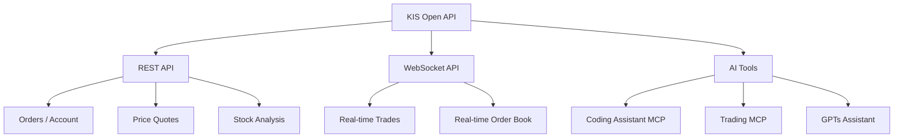

## Overview

KIS Developers, the Korea Investment & Securities developer portal, is the most aggressive Open API platform among domestic Korean brokerages. Beyond REST and WebSocket APIs, it now provides infrastructure for calling trading APIs directly from LLMs via MCP (Model Context Protocol).

## API Structure

KIS Open API is available in two modes: REST and WebSocket. Domestic stocks alone are divided into orders/account, basic quotes, ELW, sector/other, stock info, price analysis, ranking analysis, and real-time quotes. Including overseas stocks, futures/options, and bonds, there are hundreds of endpoints.

Authentication uses an OAuth-style flow — obtain an `appkey` and `appsecret`, then generate an access token. WebSocket requires a separate connection key for real-time data. Python sample code for both REST and WebSocket is published on GitHub, enabling rapid prototyping.

## MCP Integration — Trading Directly from LLMs

The most eye-catching section is **AI Tools**. KIS Developers officially supports MCP with two offerings:

- **Coding Assistant MCP** — Handles API usage questions, sample code generation, and error resolution via LLM conversation
- **Trading MCP** — Exposes trading functions like orders and price queries that can be called directly from ChatGPT or Claude

A 24/7 GPTs-based 1:1 support assistant is also running. Official MCP support from a domestic brokerage is still rare, making this a compelling environment for developers building API-based automated trading systems.

## Security Notes

Two recent security announcements from KIS are worth highlighting:

1. **Do not expose appkey/appsecret** — Never share the issued security credentials or access token publicly or post them on the web. If an anomaly is detected, immediately revoke the service (security code).
2. **WebSocket infinite reconnection blocking** — Abnormal patterns such as repeated connect-immediately-disconnect cycles or infinite subscribe/unsubscribe loops will result in temporary blocking of the IP and app key.

Normal pattern: `Connect → Subscribe to symbols → Receive data → Unsubscribe → Close connection`

## Insights

KIS Developers officially supporting MCP signals that the combination of financial APIs and LLMs is moving beyond experimentation into production. The infrastructure now exists to delegate the process of reading API docs and writing code to AI, and to integrate trading decisions into LLM pipelines. That said, security credential management and abnormal call pattern prevention remain non-negotiable — the more automated the system, the more critical proper error handling becomes.
