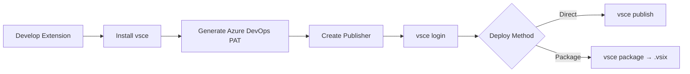

## Overview

Publishing a VS Code extension to the Marketplace requires the `@vscode/vsce` package. This post covers the entire workflow: generating an Azure DevOps PAT, creating a Publisher, packaging, and deploying.

<!--more-->



## Step 1: Install vsce

`vsce` is the CLI tool responsible for packaging and publishing VS Code extensions.

```bash
npm install -g @vscode/vsce
```

Three key commands:
- `vsce login` — authenticate with your publisher account
- `vsce publish` — publish directly to the Marketplace
- `vsce package` — bundle as a `.vsix` static file

## Step 2: Generate an Azure DevOps PAT

The VS Code Marketplace authenticates through Azure DevOps.

1. Sign up / log in at [Azure DevOps](https://dev.azure.com/)
2. Create a Personal Access Token (PAT)
   - **Important**: Grant `Manage` permission for VS Code Marketplace
   - Store the token securely — you cannot retrieve it after creation

## Step 3: Create a Publisher and Log In

1. Go to [VS Code Marketplace](https://marketplace.visualstudio.com/) → `Publish extensions` → `Create publisher`
2. Set a publisher name and create it
3. Log in via the CLI:

```bash
vsce login <publisherName>
# You'll be prompted to enter your PAT
```

## Step 4: Required package.json Fields

```json
{
  "name": "my-extension",
  "displayName": "My Extension",
  "publisher": "my-publisher",
  "version": "0.0.1",
  "engines": {
    "vscode": "^1.84.0"
  }
}
```

Missing any of these fields will cause the publish step to fail.

## Step 5: Deploy

```bash
# Publish directly to the Marketplace
vsce publish

# Or package into a .vsix file for manual upload
vsce package
```

The `.vsix` file produced by `vsce package` can be uploaded manually through the Marketplace web UI, or installed locally with `code --install-extension my-extension.vsix`.

## Insights

Azure DevOps and the VS Code Marketplace are separate systems, which makes the initial setup confusing. The key is to follow this exact order: generate a PAT (Azure DevOps) → create a Publisher (Marketplace) → log in (vsce CLI) → deploy. Once this is configured, every subsequent release is a single `vsce publish` command. You can also integrate this into a CI/CD pipeline to trigger automatic deployments on tag pushes.
