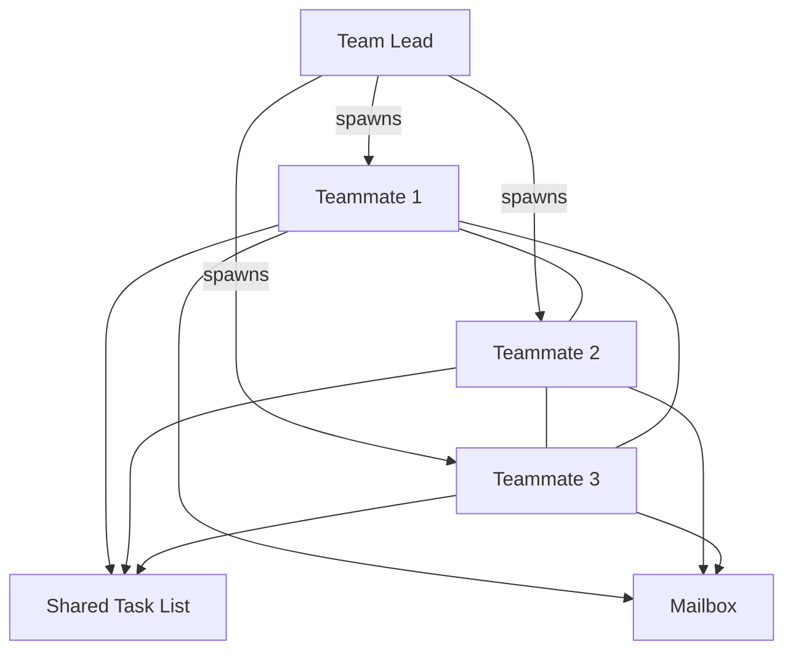
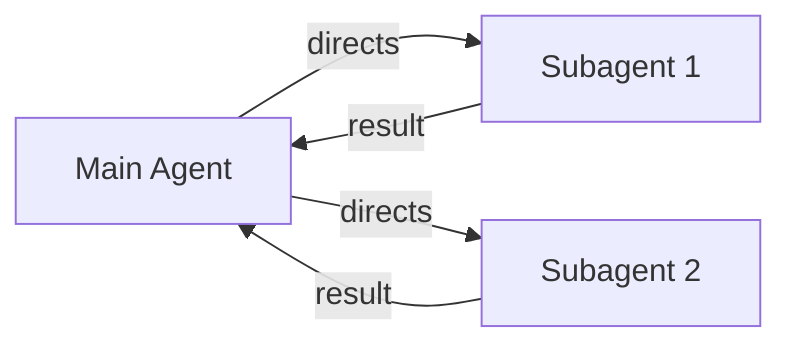
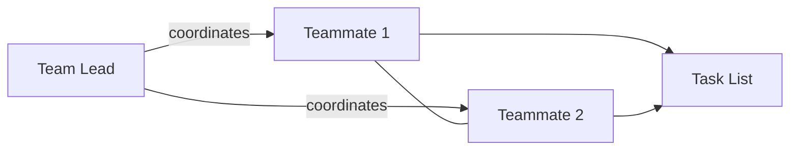
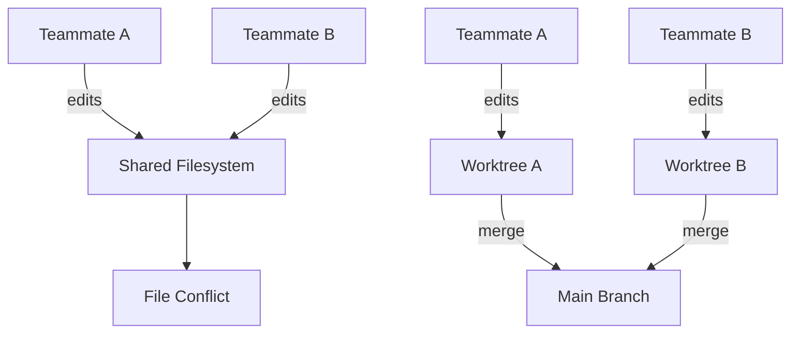

## Overview

Claude Code's Agent Teams is an experimental feature that groups multiple Claude Code instances into a single team for parallel work. Where a traditional Subagent simply returns results to the main session, Agent Teams members can message each other directly and autonomously coordinate through a shared task list. This post covers the Agent Teams architecture, how it differs from Subagents, and practical usage patterns.

<!--more-->



## Agent Teams vs. Subagents — Key Differences

Both Agent Teams and Subagents parallelize work, but their operating models are fundamentally different.

**Subagents** are lightweight helpers that run inside the main session. They perform a task, report the result back, and that's it. Subagents cannot talk to each other or share discoveries mid-task — the main agent is the sole coordinator.

**Agent Teams** consists of fully independent Claude Code instances. Each teammate has its own context window and autonomously claims tasks from a shared task list. The key feature is **direct peer-to-peer communication** — teammates can message each other or broadcast to the whole team.

| | Subagent | Agent Teams |
|---|---|---|
| **Context** | Independent context, returns results only | Independent context, fully autonomous |
| **Communication** | Reports to main agent only | Direct messaging between teammates |
| **Coordination** | Main agent manages everything | Shared task list + autonomous coordination |
| **Best for** | Simple tasks where only the result matters | Complex tasks requiring discussion and collaboration |
| **Token cost** | Low (only summarized results returned) | High (each teammate is a separate instance) |



The **Agent Teams** model changes this structure:



## Setup and Activation

Agent Teams is disabled by default. Enable it by setting an environment variable in `settings.json`:

```json
{
  "env": {
    "CLAUDE_CODE_EXPERIMENTAL_AGENT_TEAMS": "1"
  }
}
```

Once enabled, request a team in natural language:

```text
Create an agent team with 3 teammates — one focused on UX,
one on technical architecture, and one as a devil's advocate.
```

### Display Modes

- **In-process**: All teammates run in the main terminal. Switch between them with `Shift+Down`. No extra setup needed.
- **Split panes**: Each teammate gets its own panel in tmux or iTerm2. View all work simultaneously.

Set the mode in `settings.json`:

```json
{
  "teammateMode": "tmux"
}
```

## Practical Usage Patterns

### 1. Parallel Code Review

A single reviewer naturally focuses on one type of issue at a time. Splitting review perspectives into independent domains lets you cover security, performance, and test coverage simultaneously and thoroughly:

```text
Create an agent team to review PR #142. 3 reviewers:
- Security vulnerability specialist
- Performance impact analysis
- Test coverage verification
Have each review independently and report back.
```

### 2. Competing Hypothesis Debugging

When the cause of a bug is unclear, a single agent tends to stop once it finds one explanation. Running Agent Teams with different hypotheses and encouraging teammates to **challenge each other's theories** means the surviving hypothesis is far more likely to be the real cause:

```text
Investigate why the app exits after a single message.
Spawn 5 teammates, each exploring a different hypothesis,
and have them debate like scientists — actively try to disprove each other.
```

### 3. Cross-Layer Feature Development

For work that requires simultaneous changes across frontend, backend, and tests, assign each layer to a separate teammate. Clearly separate the file sets each teammate owns to avoid conflicts.

## Combining with Git Worktrees

Agent Teams members share the same filesystem by default. Editing different files is fine, but editing the same file simultaneously causes conflicts. Combining with **Git Worktrees** gives each teammate an independent copy of the filesystem:



Set `isolation: worktree` in the agent definition to create a separate worktree for each teammate.

## Cost and Operational Tips

Agent Teams consumes tokens proportionally to the number of teammates. Three teammates use roughly 3–4x the tokens of a single session. Running in Plan mode can push this up to 7x.

Strategies for maximizing value while managing cost:

- **Assign Sonnet to teammates**: Good balance of cost and capability. Reserve Opus for the lead.
- **Start with 3–5 teammates**: Optimal for most workflows. Aim for 5–6 tasks per teammate.
- **Disband immediately after completion**: Idle teammates still consume tokens. Use `Clean up the team` when done.
- **Include sufficient context in spawn prompts**: Teammates do not inherit the lead's conversation history, so include all necessary context in their prompts.

## Quick Links

- [Claude Code Agent Teams Official Docs](https://code.claude.com/docs/en/agent-teams) — setup, commands, and limitations
- [Claude Code Agent Teams Complete Guide (claudefa.st)](https://claudefa.st/blog/guide/agents/agent-teams) — comprehensive 2026 guide
- [Worktree + Agent Teams Guide](https://claudefa.st/blog/guide/development/worktree-guide) — filesystem isolation strategies

## Insights

Agent Teams adds a new dimension beyond simple parallel execution: **communication and autonomous coordination** between agents. If Subagents represent a hierarchical "assign work, receive results" model, Agent Teams is closer to a collaborative model where peers discuss and solve problems together. The competing hypothesis debugging pattern is especially effective at overcoming the confirmation bias that plagues single-agent exploration. The feature is still experimental — sessions can't be resumed, among other limitations — but for tasks requiring parallel exploration across a complex codebase, it delivers real value. Combined with Worktrees, it enables fully parallel development with zero file conflicts, making it particularly useful for large-scale refactoring or multi-layer feature implementation.
