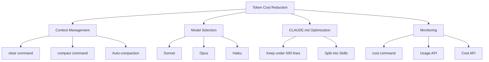
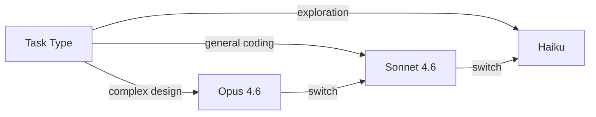
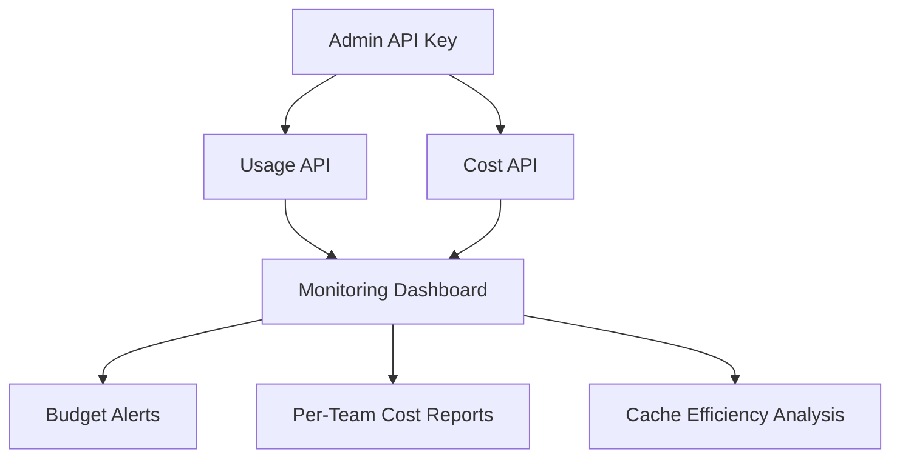

## Overview

Claude Code costs the average developer around $6 per day, or $100–200 per month. But that number varies dramatically based on how you use it. Through context management, model selection, CLAUDE.md optimization, and monitoring with the Usage & Cost API, you can cut token consumption by 50–80%. This post breaks down Claude Code's cost structure and the practical techniques you can apply today.

<!--more-->



## Understanding Where the Costs Come From

Claude Code's token costs scale **proportionally to context size**. The larger the context Claude processes, the higher the cost per message. Longer conversations, more referenced files, and more MCP servers all increase context size.

Claude Code automatically applies two optimizations:

- **Prompt Caching**: Automatically reduces costs for repeated content like system prompts
- **Auto-compaction**: Automatically summarizes conversation history as you approach the context limit

But these alone are not enough. Real savings require active management from the user's side.

## Strategy 1: Aggressively Manage Context

The biggest source of token waste is **accumulating unnecessary context**.

### `/clear` — Essential When Switching Tasks

Always run `/clear` when moving to an unrelated task. Old context from previous conversations wastes tokens on every subsequent message.

```text
/rename auth-refactoring    # name the current session
/clear                       # reset context
# start new task
```

You can return to a named session later with `/resume`.

### `/compact` — Every 10–15 Exchanges

When conversations grow long, use `/compact` to compress history. You can specify what to preserve:

```text
/compact Focus on code samples and API usage
```

You can also customize compaction behavior in CLAUDE.md:

```markdown
# Compact instructions
When you are using compact, please focus on test output and code changes
```

### `/cost` — Real-Time Cost Monitoring

Use `/cost` to check token usage for the current session. For a persistent display, configure the statusline to show it continuously.

## Strategy 2: Match Models to Tasks

Not every task needs Opus.

| Model | Best For | Cost |
|---|---|---|
| **Opus** | Complex architecture decisions, multi-step reasoning | High |
| **Sonnet** | General coding tasks (most of the time) | Medium |
| **Haiku** | File exploration, running tests, simple questions | Low (~80% cheaper) |

Switch mid-session with `/model`, and set defaults in `/config`. Assign `model: haiku` to Subagents for simple tasks to save money.



### Tuning Extended Thinking

Extended Thinking is enabled by default with a 31,999-token budget. Thinking tokens are billed as output tokens, so they're unnecessary cost for simple tasks:

- Lower the effort level for Opus 4.6 via `/model`
- Disable thinking in `/config`
- Cap the budget with `MAX_THINKING_TOKENS=8000`

## Strategy 3: Keep CLAUDE.md Lean

CLAUDE.md is loaded into context in full at the start of every session. If it contains workflow instructions for things like PR reviews or database migrations, those tokens are charged on every turn — even when you're working on something completely unrelated.

### Split Into Skills

Move specialized instructions from CLAUDE.md into **Skills**, which only load when invoked:

```text
CLAUDE.md (essentials only, ~500 lines max)
├── Project architecture summary
├── Core coding conventions
└── Frequently used commands

.claude/skills/ (loaded only when needed)
├── pr-review/       # PR review workflow
├── db-migration/    # DB migration guide
└── deploy/          # Deployment process
```

### Reduce MCP Server Overhead

Each MCP server adds tool definitions to your context even when idle. Check current context occupancy with `/context`, then:

- Disable unused MCP servers via `/mcp`
- Prefer CLI tools like `gh` and `aws` over MCP servers (zero context overhead)
- Lower the tool search threshold with `ENABLE_TOOL_SEARCH=auto:5`

## Strategy 4: Optimize Your Work Patterns

### Use Plan Mode

Enter Plan Mode with `Shift+Tab` to have Claude explore the codebase and suggest an approach before touching code. This avoids expensive rework when the initial direction is wrong.

### Correct Course Early

If Claude heads in the wrong direction, hit `Escape` immediately. Use `/rewind` or press `Escape` twice to restore a previous checkpoint.

### Delegate Heavy Tasks to Subagents

For high-output tasks like running tests, fetching documentation, or processing log files, delegate to a Subagent. The verbose output stays in the Subagent's context; only a summary comes back to the main conversation.

## Strategy 5: Use the Usage & Cost API for Team-Level Monitoring

For tracking costs across an entire team rather than just individually, use Anthropic's Admin API.

### Usage API — Track Token Consumption

Query daily token usage broken down by model:

```bash
curl "https://api.anthropic.com/v1/organizations/usage_report/messages?\
starting_at=2026-03-01T00:00:00Z&\
ending_at=2026-03-03T00:00:00Z&\
group_by[]=model&\
bucket_width=1d" \
  --header "anthropic-version: 2023-06-01" \
  --header "x-api-key: $ADMIN_API_KEY"
```

Key capabilities:
- Time-series aggregation at 1-minute, 1-hour, and 1-day intervals
- Filter by model, workspace, API key, and service tier
- Track uncached input, cached input, cache creation, and output tokens
- Data residency (inference region) and Fast Mode tracking

### Cost API — Track USD Spend

Query costs broken down by workspace:

```bash
curl "https://api.anthropic.com/v1/organizations/cost_report?\
starting_at=2026-03-01T00:00:00Z&\
ending_at=2026-03-03T00:00:00Z&\
group_by[]=workspace_id&\
group_by[]=description" \
  --header "anthropic-version: 2023-06-01" \
  --header "x-api-key: $ADMIN_API_KEY"
```



### Partner Solutions

If you'd rather not build your own dashboard, platforms like Datadog, Grafana Cloud, and CloudZero offer ready-made integrations. For per-user cost analysis of Claude Code, the **Claude Code Analytics API** provides a separate endpoint.

## Quick Links

- [Claude Code Cost Management Official Docs](https://code.claude.com/docs/ko/costs) — official guide
- [Usage and Cost API Docs](https://platform.claude.com/docs/en/build-with-claude/usage-cost-api) — Admin API reference
- [Claude Code Token Optimization (GitHub)](https://github.com/affaan-m/everything-claude-code/blob/main/docs/token-optimization.md) — community tips

## Insights

The core insight of Claude Code token optimization comes down to one simple principle: **keep the context small**. Separating tasks with `/clear`, distributing CLAUDE.md content into Skills, and choosing models appropriate to the task's complexity — these three practices alone eliminate most token waste. At the team level, the Usage & Cost API makes consumption patterns visible, enabling you to measure caching efficiency and set budget alerts. The Data Residency and Fast Mode tracking features added in February 2026 are especially useful for compliance and performance monitoring in enterprise environments. Ultimately, good habits — clearing context between tasks, compacting every 10–15 exchanges, writing specific prompts instead of vague ones — are more effective than any configuration setting.
