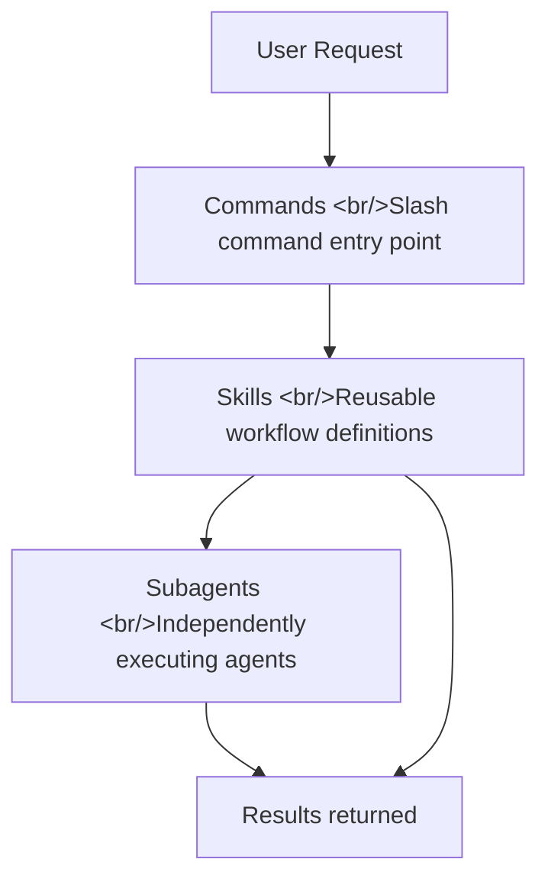
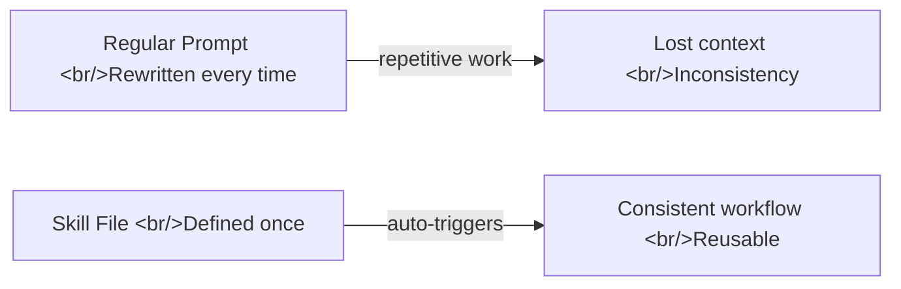
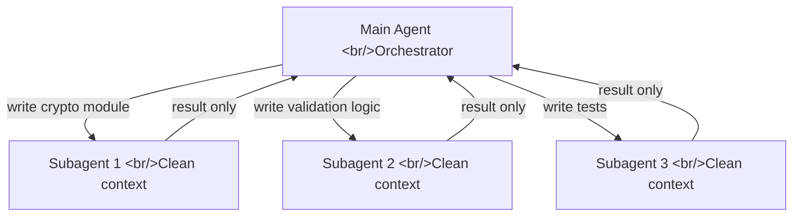
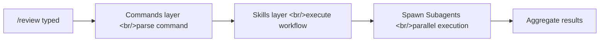
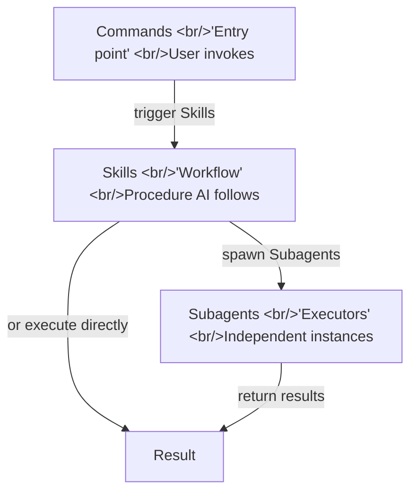

## Overview

When you first start using Claude Code, you type commands like you're chatting. But spend a little time with it and you start to sense something more is going on. And there is — Claude Code isn't just an AI chat window. It's an agent framework built on three core layers: **Skills, Subagents, and Commands**. Without understanding these three concepts, you're only using Claude Code at half capacity.

<!--more-->



## Skills — Handing the AI a Playbook

### What Skills Are

Skills are **reusable workflow definitions** you inject into Claude Code. Each Skill is a single Markdown (`.md`) file that describes, in plain language, how Claude should behave in a given situation and in what order it should work.

The difference from regular prompts matters. A prompt must be rewritten every time. A Skill, once installed, **auto-triggers** when the right conditions are met. When you say "add a feature" and the AI automatically walks through brainstorming → planning → implementation → review on its own — that's a Skill at work.



### Skill File Structure

```
.claude/
└── skills/
    └── my-skill/
        └── SKILL.md
```

A SKILL.md file contains a `description` (when this Skill should activate) and `instructions` (the procedure to follow). Example:

```markdown
---
name: code-review
description: Automatically runs on PR code review requests
---

## Review Procedure
1. Check the list of changed files
2. Check for security vulnerabilities
3. Analyze performance issues
4. Write improvement suggestions
```

### The Skills Marketplace

You can write Skills yourself, but a mature ecosystem of pre-built Skills already exists. The most prominent is **[obra/superpowers](https://github.com/obra/superpowers)** (⭐69k). Install it and the full engineering workflow — brainstorming, planning, TDD implementation, code review — runs automatically.

```bash
# Add marketplace and install in Claude Code
/plugin marketplace add obra/superpowers-marketplace
/plugin install superpowers@superpowers-marketplace
```

## Subagents — AI Delegating to AI

### The Core Idea

A Subagent is a structure where the main Claude Code session **spawns a separate Claude instance and delegates a specific task** to it. Think of a senior developer saying "you own this module" and handing off work to a teammate.

This means more than just splitting tasks. A Subagent has a **completely independent context window**, free from the main session's accumulated context, prior failures, and tangled history. This dramatically reduces the likelihood of hallucinations.



### How to Create Subagents

Use the Task tool inside Claude Code to spawn a Subagent. Specify it in a Skill file like this:

```markdown
## Subagent Execution
Assign each module to an independent Subagent:
- Auth module: run as separate agent via Task tool
- DB layer: run as separate agent via Task tool
Each Subagent reports results back to main only.
```

### Recommended Subagent Patterns

| Pattern | Description | Benefit |
|---|---|---|
| **Parallel module implementation** | Develop independent files/modules simultaneously | 2–3x faster development |
| **Specialized review** | Different agents for security, performance, and style | Thorough, unbiased review |
| **Context reset** | Re-examine complex bugs with fresh eyes | Overcomes confirmation bias |
| **Long task isolation** | Experimental work without polluting the main session | Safe exploration |

> **Subagent vs. Agent Teams**: Subagents are one-directional — they only return results. Agent Teams (experimental feature) allows two-directional collaboration, where teammates message each other directly. Agent Teams is substantially more complex and expensive.

## Commands — Creating Entry Points with Slash Commands

### What Commands Are

Commands are **slash commands** that users invoke directly in the format `/command-name`. Internally, they trigger a specific Skill or encapsulate a complex prompt into a single callable command.

```
.claude/
└── commands/
    └── review.md    # defines the /review command
    └── deploy.md    # defines the /deploy command
```

### Command File Structure

```markdown
# /review — Run PR Code Review

## What This Does
1. Analyze changes on the current branch
2. Review in order: security → performance → style
3. Compile improvement suggestions as Markdown

Use $ARGUMENTS to accept additional options
```

### Built-in vs. Custom Commands

Claude Code ships with built-in commands like `/help`, `/clear`, and `/compact`. Beyond those, any `.md` file you place in `.claude/commands/` becomes a custom command. Installing a plugin like Superpowers adds commands like `/brainstorm`, `/write-plan`, and `/execute-plan`.



## How the Three Layers Relate



The three layers connect like this:

1. **Commands**: The user-facing entry point. When you type `/review`, the Commands layer determines which Skill to run.
2. **Skills**: The AI's operating manual. Defines what order to work in and what principles to follow.
3. **Subagents**: The actual execution units. Independent agents spawned when a Skill needs to delegate complex work.

## Quick Links

- [obra/superpowers GitHub](https://github.com/obra/superpowers) — ⭐69k, the definitive Claude Code Skills collection
- [Claude Code Official Skills Docs](https://code.claude.com/docs/en/skills) — Skill file format reference
- [Claude Code 3 Core Concepts Video](https://www.youtube.com/watch?v=2eqPBLgVH0U) — 25-minute hands-on tutorial

## Insights

Skills, Subagents, and Commands aren't just a feature list — they're **the architecture that elevates Claude Code from a tool into a system**. The difference between repeatedly typing "do this for me" and defining a Skill once for it to run automatically is a difference in a different class of development productivity. The Subagent's "clean context" concept is an elegant structural solution to the hallucination problem. An agent that always starts fresh on a task can't get trapped by prior failures. Commands are the UX layer that gives this complex system a simple entry point — the fact that you can trigger an entire pipeline with a single word like `/deploy` is itself a statement about the system's maturity.
