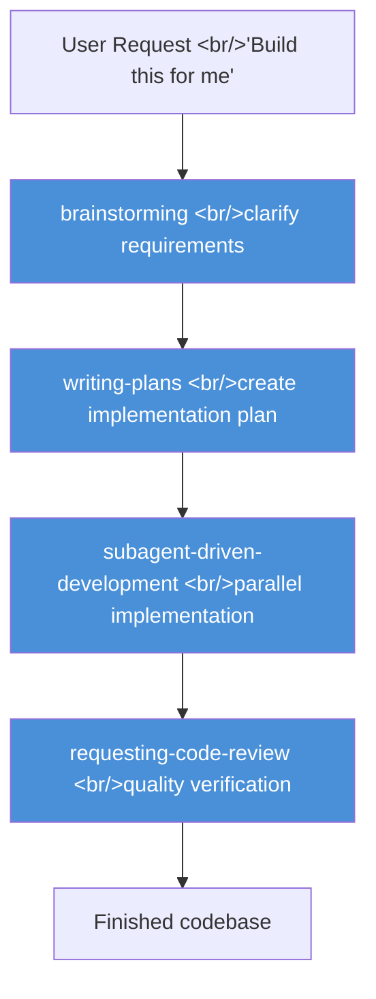
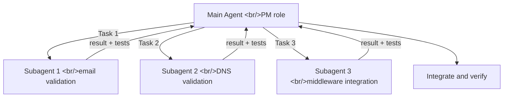
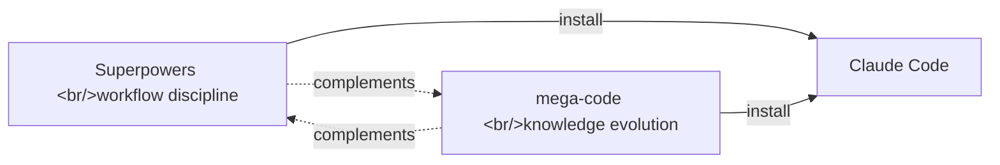

## Overview

Claude Code is powerful. And yet the output can feel unsatisfying. Code that "technically works" but has no tests, shaky structure, and the AI can't remember what you built yesterday. **Superpowers** is a Skills framework that solves this problem structurally. With ⭐69k on GitHub, it's the single most popular installable plugin for Claude Code.

This isn't a collection of clever prompts. It's a system that **forces engineering discipline** — think first, design, test, then implement — onto AI behavior.

<!--more-->



## What Is Superpowers

Superpowers is an **open-source Skills framework** created by Jesse Vincent ([@obra](https://github.com/obra)). It supports Claude Code, Cursor, Codex, and OpenCode.

The core idea is simple: when the AI receives a coding request, **stop it from writing code immediately**. Force it through brainstorming → planning → TDD implementation → review in that order. It's teaching AI the old software engineering truth: the more you're in a hurry, the more you should slow down.

### Installation

```bash
# Register the marketplace in Claude Code
/plugin marketplace add obra/superpowers-marketplace

# Install the plugin
/plugin install superpowers@superpowers-marketplace
```

Start a new session after installation. If `/sup` shows options like `brainstorm`, `write-plan`, and `execute-plan`, the install succeeded.

## The 7 Core Skills

Superpowers covers the entire software development lifecycle with 7 core Skills.


### 1. brainstorming — The Art of Stopping Before You Code

When it receives a request, the AI doesn't write code — it asks questions. "What are the use scenarios?", "What's the deployment environment?", "What are the performance requirements?" Like a veteran architect briefly pausing a junior developer's coding sprint.

At the end of this process, the AI produces a requirements document. Once the user approves it, the workflow advances.

> **Psychological background**: The Superpowers creator studied psychology. The framework applies the cognitive psychology principle that "declaring goals first changes behavior" to AI workflows.

### 2. writing-plans — Plans a Junior Developer Can Follow

After brainstorming, an implementation plan is drafted. The bar for this plan is intentionally specific: **"Clear enough that an enthusiastic junior developer with no judgment and no context — who hates writing tests — can still follow it."**

The plan decomposes into atomic tasks. Each task can be executed independently and its completion is unambiguous.

```
├── Task 1: Create validators/ module structure (files only)
├── Task 2: Email format validation logic + tests
├── Task 3: DNS MX record validation logic + tests
└── Task 4: Integrate middleware layer
```

### 3. using-git-worktrees — Isolated Work Environments

Each development task runs in a Git Worktree — an independent copy of the filesystem that doesn't touch the main branch. If an experiment fails, the main codebase is safe.

```bash
# Worktree creation Superpowers runs automatically
git worktree add .claude/worktrees/feature-auth feature/auth
```

### 4. subagent-driven-development — Parallel Development with an AI Team

Each task from the plan is assigned to an independent Subagent. Each Subagent:
- Starts with a clean context (no memory of prior failures)
- Focuses on exactly one task
- Reports only the result back to main



> "Whoever thought of this architecture is a genius." — developer blog after hands-on experience

### 5. requesting-code-review / 6. receiving-code-review — Verification Before Completion

Once implementation is done, a code review is automatically requested. The `receiving-code-review` Skill prevents the AI from blindly agreeing with all feedback — it validates technical soundness before accepting any suggestion.

### 7. finishing-a-development-branch — Safe Merge

After development, the Skill presents a merge strategy. It guides you systematically through PR creation, branch cleanup, release notes, and other wrap-up steps.

## Live Demo: Building an Email Validation Service

Here's the actual flow when you type the following into Claude Code with Superpowers installed:

```
Build an enterprise-grade email validation service in Python.
Support RFC standards (including sub-addressing), IDN, and DNS MX record checking.
```

**Step 1: brainstorm auto-activates**

Instead of code, the AI asks:
- "Is this single-email validation or batch processing?"
- "What level of DNS validation? (basic/deep)"
- "Do you need a caching strategy?"

**Step 2: Project structure proposed**

```
email_validator/
├── validators/      # validation logic
├── middleware/      # rate limiting
├── cache/          # result caching
└── tests/          # fail-first tests
```

**Step 3: TDD implementation**

Failing tests are written first, then code is written to make them pass. This cuts off at the root the "it runs but has no tests" spaghetti code that AI typically produces.

## Engineering Principles Superpowers Enforces

| Principle | Meaning | Superpowers Implementation |
|---|---|---|
| **TDD** | Tests first, implementation second | Explicit in `subagent-driven-development` Skill |
| **YAGNI** | You Aren't Gonna Need It — build only what's needed now | Scope limiting in `writing-plans` |
| **DRY** | Don't Repeat Yourself | Duplicate detection in the review stage |
| **Clean context** | Fresh start uncorrupted by prior failures | Guaranteed by Subagent architecture |

## Comparison with mega-code

**[wisdomgraph/mega-code](https://github.com/wisdomgraph/mega-code)** (⭐15), which emerged around the same time, is worth noting. Where Superpowers focuses on "enforcing engineering workflow," mega-code focuses on "accumulating knowledge across sessions."



- **Superpowers**: Improves the quality of each session's development. Skills auto-trigger.
- **mega-code**: Remembers mistakes across sessions and improves incrementally. BYOK (bring your own API key) model.

Using both together lets you capture both per-session quality and cross-session learning.

## Quick Links

- [obra/superpowers GitHub](https://github.com/obra/superpowers) — ⭐69k, source code and installation docs
- [Claude Code × Superpowers hands-on (velog)](https://velog.io/@takuya/claude-code-superpowers-guide) — live email validation service demo
- [Superpowers Complete Guide (YouTube)](https://www.youtube.com/watch?v=308zzinIVSA) — 30-minute live demo of all 7 Skills
- [wisdomgraph/mega-code GitHub](https://github.com/wisdomgraph/mega-code) — self-evolving AI coding infrastructure

## Insights

The central insight Superpowers reveals is this: **the problem with AI isn't a lack of capability — it's a lack of discipline**. Claude Code is already more than smart enough. The problem is its instinct to start generating code the moment it receives "build this for me." Just as a veteran developer responds to a new requirement by asking questions, designing, and sketching test scenarios before touching the keyboard, Superpowers forces AI to do the same. The `subagent-driven-development` pattern's design — where each Subagent starts with clean context — is a structural solution to the hallucination problem. Subagent isolation prevents prior failures in a long conversation from contaminating future responses. Sixty-nine thousand stars say this approach has been validated by a lot of developers.
