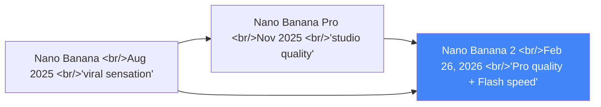
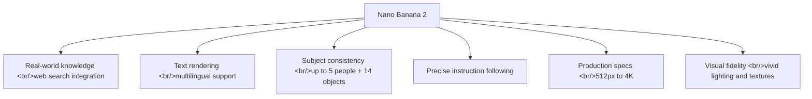

## Overview

On February 26, 2026, Google rewrote the history of image generation models. **Nano Banana 2** (`gemini-3.1-flash-image-preview`) — a new standard that combines Pro-level intelligence with Flash-class speed. If the original Nano Banana was a viral sensation and Nano Banana Pro delivered studio-grade quality, Nano Banana 2 distills the best of both and opens it to everyone.

<!--more-->



## What Nano Banana 2 Changes

### Pro Features, Now for Everyone

Capabilities previously exclusive to Nano Banana Pro are now available to all users in Nano Banana 2:

**Real-world knowledge-grounded generation** — Using Gemini's live web search, it accurately renders specific people, places, and products. Infographics, diagrams, and data visualizations are noticeably more precise.

**Precise text rendering** — Generates sharp, accurate text inside images. Supports marketing mockups, greeting cards, multilingual translation, and localization.

### New Core Capabilities

**Subject consistency** — Maintains consistent appearance for up to 5 characters and 14 objects within a single workflow. Enables storyboarding and sequential image series.

**Precise instruction following** — Captures the specific nuances of complex prompts. "Getting the image you wanted" is far more consistent than before.

**Production-ready specs** — Resolutions from 512px to 4K, with support for extreme aspect ratios including 4:1, 1:4, 8:1, and 1:8. Covers everything from vertical social posts to widescreen backgrounds.



## Three API Access Methods

### Prerequisite: A Paid API Key Is Required

This is where many developers get stuck initially. Image generation is not available on the free tier. If you see this error, you don't have a paid key:

```
Quota exceeded for metric: generativelanguage.googleapis.com/
generate_content_free_tier_input_token_count, limit: 0
```

### Method 1: Google AI Studio (No-Code Testing)

1. Go to [AI Studio](https://aistudio.google.com)
2. Select `gemini-3.1-flash-image-preview` from the model dropdown
3. Enter a prompt and run

Ideal for experimenting with prompts before writing production code.

### Method 2: Direct Gemini API Call

**Python:**

```python
import google.generativeai as genai
import base64

genai.configure(api_key="YOUR_PAID_API_KEY")
model = genai.GenerativeModel("gemini-3.1-flash-image-preview")

response = model.generate_content(
    "A photorealistic golden retriever puppy in a sunlit meadow, "
    "soft bokeh background, warm afternoon light",
    generation_config=genai.GenerationConfig(
        response_modalities=["image", "text"],
    ),
)

for part in response.parts:
    if part.inline_data:
        image_data = base64.b64decode(part.inline_data.data)
        with open("output.png", "wb") as f:
            f.write(image_data)
```

**Node.js:**

```javascript
const { GoogleGenerativeAI } = require("@google/generative-ai");
const fs = require("fs");

const genAI = new GoogleGenerativeAI("YOUR_PAID_API_KEY");

async function generateImage() {
  const model = genAI.getGenerativeModel({
    model: "gemini-3.1-flash-image-preview",
  });

  const result = await model.generateContent({
    contents: [{ role: "user", parts: [{ text: "a photorealistic cat" }] }],
    generationConfig: { responseModalities: ["image", "text"] },
  });

  const imageData = result.response.candidates[0].content.parts[0].inlineData;
  fs.writeFileSync("output.png", Buffer.from(imageData.data, "base64"));
}

generateImage();
```

### Method 3: OpenAI-Compatible Gateway

For projects already using the OpenAI SDK, a gateway lets you switch with minimal code changes:

```python
from openai import OpenAI

client = OpenAI(
    api_key="YOUR_GATEWAY_KEY",
    base_url="https://gateway.example.com/v1",
)

response = client.images.generate(
    model="gemini-3.1-flash-image-preview",
    prompt="A minimalist workspace with a MacBook and plant",
    n=1,
)
```

## Pricing

| Resolution | Google Official | Third-Party Gateway |
|---|---|---|
| **2K image** | $0.101/image | ~$0.081/image (~20% cheaper) |
| **4K image** | $0.150/image | ~$0.120/image |

If you're generating at production volumes, gateway options offer meaningful cost savings.

## Nano Banana 2 vs. Nano Banana Pro

| | Nano Banana 2 | Nano Banana Pro |
|---|---|---|
| **Model ID** | `gemini-3.1-flash-image-preview` | `gemini-3-pro-image-preview` |
| **Speed** | Flash (fast) | Pro (slower) |
| **Quality** | High (near Pro) | Maximum quality |
| **Best for** | Rapid iteration, high-volume generation | Professional work requiring maximum fidelity |
| **Default in Gemini app** | Yes (current default) | Selectable via three-dot menu |

## Launch Platforms

Nano Banana 2 launched simultaneously across Google's entire ecosystem:

- **Gemini app**: Default model in Fast, Thinking, and Pro modes
- **Google Search**: AI Mode, Lens, mobile/desktop browser (141 countries)
- **AI Studio + Gemini API**: Available in preview
- **Google Cloud (Vertex AI)**: Preview
- **Flow**: Default image generation model (no credit consumption)
- **Google Ads**: Integrated into campaign creation suggestions

## Prompt Engineering Tips

**Be specific** — "golden retriever puppy in a sunlit meadow, soft bokeh, warm afternoon light" far outperforms just "puppy."

**Use style keywords** — Combining terms like `photorealistic`, `cinematic lighting`, `studio quality`, `minimalist`, `watercolor` steers the aesthetic direction.

**Set thinking level** — For complex compositions, specifying `Thinking: High` or `Thinking: Dynamic` produces more refined results.

**Multi-turn editing** — Don't expect perfection in a single request. Iterative refinements like "make the background darker" or "change the character's outfit to blue" are the path to the best final result.

## Provenance Technology: SynthID + C2PA

Two technologies mark AI-generated content:

- **SynthID**: Embeds an invisible watermark into the image. Machine-verifiable proof of AI generation.
- **C2PA Content Credentials**: Includes generation metadata in the image file. Enables provenance tracking.

This is Google's technical response to questions about trust in generative AI media.

## Quick Links

- [Nano Banana 2 Official Announcement (blog.google)](https://blog.google/innovation-and-ai/technology/ai/nano-banana-2/) — full feature details and prompt examples
- [Nano Banana 2 API Tutorial (evolink.ai)](https://evolink.ai/blog/how-to-use-nano-banana-2-api-complete-tutorial) — Python/Node.js code samples and pricing guide
- [Google AI Studio](https://aistudio.google.com) — test immediately, no code needed
- [Gemini API Pricing](https://ai.google.dev/pricing) — latest image generation rates

## Insights

Nano Banana 2 represents something more fundamental than "better image generation." By combining Pro-grade capabilities with Flash speed, it changes the economics of image generation entirely. The trade-off that previously forced you to choose between quality and speed disappears. Subject consistency (up to 5 characters + 14 objects) and real-world knowledge integration directly target production workflows in marketing, content creation, and game asset pipelines. Knowledge-grounded image generation points toward a future where AI doesn't just generate patterns but understands and visualizes the world. The built-in SynthID and C2PA provenance technology is also notable — baking in verifiable attribution from day one signals how seriously Google expects this technology to be used in production environments.
