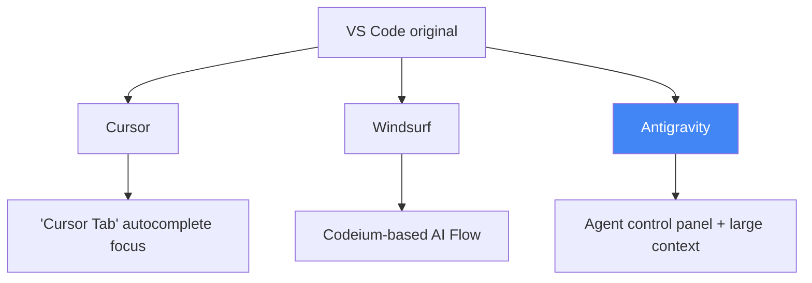
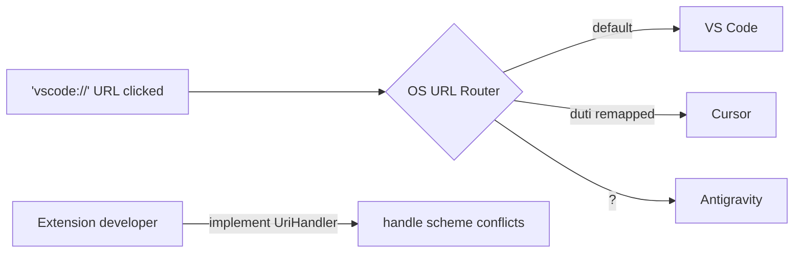

## Overview

**Antigravity**, Google's agentic IDE built as a VS Code fork, has arrived. It's emerging as the third major player in the AI IDE market, after Cursor and Windsurf. This post synthesizes YouTube demos, real-world developer reviews, Reddit community reactions, and the URL scheme compatibility issues it introduces.

<!--more-->



## First Impressions — More Agent Control Panel Than IDE

YouTube demo footage makes Antigravity's key differentiator clear: it feels less like an IDE and more like an **agent control panel**.

According to real-world usage notes from developer Jimmy Song:

- **Interface structure**: Splits into an agent management view and an editor view — feels like AgentHQ and VS Code merged into one
- **Agent execution speed**: Higher task completion rate per code modification compared to typical chat-based assistants
- **Context window**: Wide editor and context panels make it well-suited for analyzing long diffs and logs
- **Extension marketplace**: Defaults to OpenVSX Gallery, which doesn't match the VS Code official Marketplace

## Using It Like VS Code — A Migration Guide

The practical migration steps Jimmy Song shared apply directly to VS Code users making the switch.

### Step 1: Replace the Extension Marketplace

In Settings → Antigravity Settings → Editor, replace the two URLs with the official VS Code ones:

```
Marketplace Item URL:
https://marketplace.visualstudio.com/items

Marketplace Gallery URL:
https://marketplace.visualstudio.com/_apis/public/gallery
```

This single change gives you access to the entire VS Code extension ecosystem.

### Step 2: Installing External Extensions

- **AMP**: Supports free mode, strong for documentation and script execution. In Antigravity, only API key login is possible (no OAuth).
- **CodeX**: Direct VSIX download isn't possible → install in VS Code first, export as `.vsix` → install in Antigravity via `Install from VSIX`.

### Step 3: Fixing TUN Mode Proxy Issues

If you use a VPN or TUN mode, Antigravity's Chrome DevTools Protocol debugging breaks. Fix it by adding `localhost` and `127.0.0.1` to Settings → HTTP: No Proxy.

## Community Reaction — Reddit's Honest Assessment

The title of the Antigravity review thread on Reddit r/ChatGPTCoding says it all: *"I tried Google's new Antigravity IDE so you don't have to"*

The community's core criticisms:

1. **Stability**: "Agent terminated due to error" errors are frequent, requiring manual retries
2. **Model ecosystem**: No native integration with external models from OpenAI, Anthropic, or xAI
3. **Customization**: Cannot create custom prompts or agents like Copilot Chat — only rules settings available
4. **Pricing**: No free model tier (estimated $20+/month), in contrast to GitHub Copilot's free tier

## The URL Scheme War — vscode:// vs cursor:// vs antigravity://

VS Code forks create an interesting problem: which editor at the OS level handles a `vscode://` URL click?

From a discussion in the Cursor forum:

> "VS Code registers the `vscode://` URI scheme to open files, trigger specific actions, etc. Does Cursor have its own unique scheme?"

A practical solution using **duti**, a macOS tool, was shared for remapping URL schemes:

```bash
# Find Cursor's bundle ID
osascript -e 'id of application "Cursor"'

# Remap vscode:// → Cursor
duti -s com.todesktop.230313mzl4w4u92 vscode

# Test it
open "vscode://file/somefile.text:123"
```

Antigravity's arrival makes this problem more complex — three IDEs can now all claim `vscode://`. Handling custom URIs through VS Code API's `UriHandler` interface has become an essential consideration for extension developers.



## Quick Links

- [Google Antigravity YouTube Demo](https://www.youtube.com/watch?v=9C0ZG8xV8p4) — 9-minute hands-on demo
- [Using Antigravity Like VS Code (Jimmy Song)](https://jimmysong.io/zh/blog/antigravity-vscode-style-ide/) — practical migration guide (Chinese)
- [URL Scheme Remapping with duti](https://gist.github.com/eduwass/e04da7e635e4ef731a2148c86127d42a) — macOS-only solution
- [Cursor Forum: URL scheme discussion](https://forum.cursor.com/t/does-cursor-have-a-unique-open-scheme/3659) — community thread
- [VS Code UriHandler API](https://code.visualstudio.com/api/references/vscode-api#UriHandler) — reference for extension developers

## Insights

The AI IDE war has evolved beyond "which AI writes better code" into a **platform lock-in** battle. The VS Code fork strategy lets each IDE borrow the existing extension ecosystem, but unexpected friction emerges — URL scheme conflicts, authentication compatibility, and marketplace policy. Antigravity's agent control panel approach is a philosophical inversion of the usual formula: instead of "attach AI to a code editor," it says "attach an editor to an AI agent environment." This philosophical difference may ultimately determine the winner. For now, stability issues and model ecosystem limitations make production adoption difficult. The `duti` URL scheme remapping tip is immediately actionable, and extension developers should seriously consider multi-IDE compatibility via `UriHandler` going forward.
