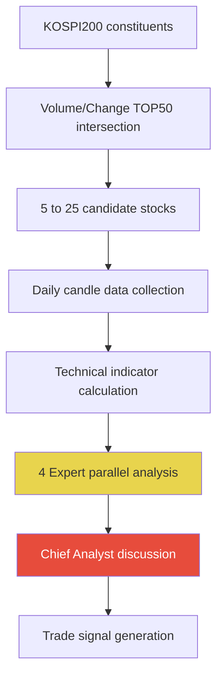
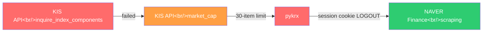

## Overview

A one-day development log of introducing an **Expert Agent Team** architecture into a KIS OpenAPI-based AI trading system. Covers the four-expert AI + Chief Analyst discussion simulation, a pure-Python technical indicator calculator, and three KOSPI200 data source swaps that ended in hard lessons.

<!--more-->



## Expert Agent Team Architecture

The previous `MarketScanner` analyzed stocks with a single Claude call. This was replaced by a discussion structure: four specialists analyze from their own perspectives, and a Chief Analyst synthesizes their views.

### The Four Specialists

| Specialist | Analysis Focus |
|---|---|
| Technical Analyst | MA alignment/divergence, RSI zones, MACD cross, Bollinger Bands |
| Momentum Trader | Volume surge ratio, Stochastic K/D, short-term breakout patterns |
| Risk Assessor | ATR-based volatility, RSI overbought, portfolio concentration |
| Portfolio Strategist | Cash allocation, sector diversification, opportunity cost |

The key is calling all four in **parallel** via `asyncio.gather`:

```python
async def run_expert_panel(data_package: dict) -> list[dict]:
    experts = [
        ("Technical Analyst", "MA alignment/divergence, RSI, MACD ..."),
        ("Momentum Trader", "Volume surge, Stochastic K/D ..."),
        ("Risk Assessor", "ATR-based volatility, RSI overbought ..."),
        ("Portfolio Strategist", "Cash allocation, sector concentration ..."),
    ]
    tasks = [_call_expert(persona, focus, data_package)
             for persona, focus in experts]
    return await asyncio.gather(*tasks, return_exceptions=True)
```

### Chief Analyst Discussion Simulation

Once four opinions are in, the Chief Analyst reviews the bullish/bearish ratio and makes a final call. The prompt is designed to **evaluate the reasoning behind minority views**, not just count votes:

```python
# even 3 bullish vs 1 bearish can result in HOLD if the bearish reasoning is strong
prompt = f"""
Expert opinion summary:
{analyses_text}

When the vote is not unanimous, pay special attention to
the concerns raised by the minority opinion.
"""
```

## Pure Python Technical Indicator Calculator

To eliminate external library dependencies (TA-Lib, pandas-ta), RSI, MACD, Stochastic, Bollinger Bands, and ATR were implemented directly.

```python
def calculate_rsi(closes: list[float], period: int = 14) -> float | None:
    gains, losses = [], []
    for i in range(1, len(closes)):
        diff = closes[i] - closes[i - 1]
        gains.append(max(diff, 0))
        losses.append(max(-diff, 0))

    avg_gain = sum(gains[:period]) / period
    avg_loss = sum(losses[:period]) / period

    # Wilder's smoothing — exponential smoothing, not SMA
    for i in range(period, len(gains)):
        avg_gain = (avg_gain * (period - 1) + gains[i]) / period
        avg_loss = (avg_loss * (period - 1) + losses[i]) / period

    rs = avg_gain / avg_loss if avg_loss != 0 else float('inf')
    return round(100 - (100 / (1 + rs)), 2)
```

Wilder's Smoothing is used because it's more sensitive to recent values than a plain SMA, improving the timeliness of trading signals.

## The KOSPI200 Data Source Saga

Three data source swaps in a single day. Here's each failure and how it was resolved.



### Attempt 1: KIS API `inquire_index_components`

```
❌ Not registered in domestic_stock.json → API call impossible
```

KIS OpenAPI's `inquire_index_components` exists in the documentation but was never registered in the actual SDK. A ghost API.

### Attempt 2: KIS API `market_cap` (fid_input_iscd=2001)

```
⚠️ Call succeeds but returns a maximum of 30 items
```

Even with a KOSPI200 filter (`2001`), only the top 30 market-cap stocks are returned. Not enough for screening all 200 constituents.

### Attempt 3: pykrx

A popular Python library for pulling KRX official data. But:

```
❌ KRX endpoint returns LOGOUT without a session cookie
```

pykrx's internal HTTP session sometimes fails to manage KRX server authentication cookies properly, causing the server to return only the text `LOGOUT`.

### Final Solution: NAVER Finance Scraping

The most stable source turned out to be NAVER Finance:

```python
def _fetch_kospi200_via_naver() -> dict[str, str]:
    session = requests.Session()
    session.headers["User-Agent"] = "Mozilla/5.0"
    session.get("https://finance.naver.com/")  # acquire session cookie

    codes: dict[str, str] = {}
    for page in range(1, 25):  # iterate 24 pages
        resp = session.get(
            "https://finance.naver.com/sise/entryJongmok.naver",
            params={"indCode": "KPI200", "page": str(page)},
        )
        pairs = re.findall(
            r"item/main\.naver\?code=(\d{6})[^>]*>([^<]+)",
            resp.text,
        )
        if not pairs:
            break
        for code, name in pairs:
            codes[code] = name.strip()
    return codes  # returns exactly 199 constituents
```

Key points:
- `session.get("https://finance.naver.com/")` must run **first to acquire the session cookie**
- `indCode=KPI200` in `entryJongmok.naver` is the KOSPI200 filter
- Iterating 24 pages retrieves all 199 constituents
- Results are upserted into SQLite for a same-day cache with automatic next-day refresh

## Market Scanner Pipeline

The final pipeline runs in four stages:

| Stage | Action | Output |
|---|---|---|
| 1 | KOSPI200 × (Volume TOP50 + Change TOP50) intersection | ~5 candidates |
| 2 | Collect daily candles + calculate technical indicators | enriched data |
| 3 | 4 Expert parallel Claude analysis | each returns bullish/bearish/neutral |
| 4 | Chief Analyst discussion → final signal | BUY/SELL/HOLD |

10 commits in a day, 2,689 lines added — the entire architecture migrated from a single Claude call to an Expert Team discussion system.

## Quick Links

- [sharebook-kr/pykrx](https://github.com/sharebook-kr/pykrx) — KRX stock data scraping library (not adopted due to session issues)
- [NAVER Finance KOSPI200](https://finance.naver.com/sise/entryJongmok.naver?&indCode=KPI200) — the final data source

## Insights

The biggest lesson here is that **financial data API reliability can only be verified by actually running it, not by reading the docs**. KIS API had endpoints documented but missing from the SDK; pykrx had session management bugs that made it unsuitable for production.

The Expert Agent Team pattern is applicable to **any AI system that needs to make decisions** — not just stock analysis. The key is the Chief Analyst's prompt design: evaluating the reasoning behind minority opinions, not just counting votes. Three bullish vs. one bearish can still result in HOLD if the bearish view is backed by ATR-based volatility data.

Pure Python technical indicator implementation fully eliminates the TA-Lib installation headache (C library dependency) while maintaining algorithmic accuracy like Wilder's Smoothing. A valuable approach for projects with deployment environment constraints.
