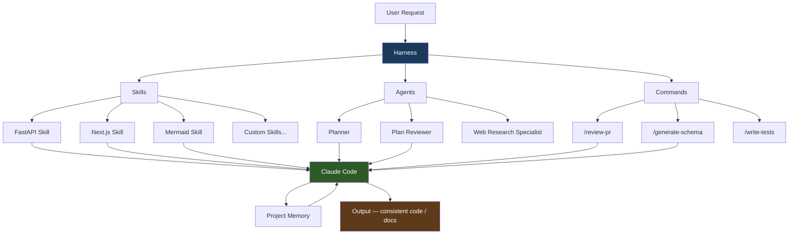

## Overview

A new employee joins the team. They're talented, but they don't know your coding conventions, your preferred frameworks, or your PR review standards. So you prepare onboarding docs, walk them through the style guide, and explain the patterns you use repeatedly. It takes time, but once they've been properly onboarded, they work in the right direction without needing constant reminders.

Using Claude Code without Harness is like resetting that onboarding every single day. Harness solves this. Define your project's coding approach, preferred libraries, and team rules once — and Claude Code carries that context forward from session to session. One-time setup, compounding savings over time.

<!--more-->

---

## What Is Harness

Harness is a configuration system that gives Claude Code persistent context. Where CLAUDE.md stores project-wide instructions in a single Markdown file, Harness defines AI behavior in a more structured way. Its three core components are Skills, Agents, and Commands.

Without Harness, Claude Code is a general-purpose AI. It might use FastAPI or Django, handle dependencies differently, and apply different error-handling patterns depending on the session. With Harness installed, Claude Code starts every session already knowing: this project uses FastAPI, schemas are defined with Pydantic v2, and error responses follow this specific format. The difference isn't just convenience — it directly affects the quality and consistency of AI output.

The new-hire analogy makes this intuitive. Even a skilled new developer can head in the wrong direction without team context. If the team lead has to re-explain context every session, that cost multiplies across the whole team, not just the individual. Harness replaces that recurring cost with a single initial installation.

---

## The Three Core Concepts

### Skills — Domain Knowledge Documents

A Skill is a Markdown document that teaches Claude Code the patterns for a specific domain: how to structure a FastAPI backend in this project, what rules govern Next.js component creation, how to write Mermaid diagrams correctly. Skill files are the core mechanism for shifting Claude Code's behavior from general to specialized.

Here's an example of what a FastAPI backend Skill file might look like:

```markdown
# FastAPI Backend Skill

## Project Structure
- Routers in `app/routers/` separated by domain
- Schemas with Pydantic v2 (`app/schemas/`)
- Dependency injection in `app/dependencies.py`

## Response Format
Success:
{
  "success": true,
  "data": { ... }
}

Error:
{
  "success": false,
  "error": { "code": "...", "message": "..." }
}

## Coding Rules
- async/await required — no synchronous endpoints
- Specify response_model on every endpoint
- Use custom AppException instead of HTTPException
```

Skill files document the team's decisions as a reference Claude Code uses when generating code. They're not just style guides — they become Claude Code's decision-making criteria. When the team's rules change, update the Skill file, and Claude Code's output automatically follows.

Skills become more valuable as their scope broadens. Define a FastAPI Skill, a Next.js Skill, a database migration Skill, a PDF generation Skill, and a Mermaid diagram Skill — and Claude Code writes code consistently across that entire stack. No need to include all that knowledge in every prompt; Harness loads the right Skill automatically.

### Agents — Purpose-Built AI Instances

Agents are Claude Code instances pre-configured for a specific role: Planner, Plan Reviewer, Web Research Specialist. Each agent has pre-defined instructions for what it should do, which Skills to reference, and which tools it can use.

The Planner agent writes a detailed execution plan before implementation begins. The Plan Reviewer agent independently examines that plan and identifies gaps. The Web Research Specialist searches for up-to-date library documentation and technical references. Splitting agents by role produces far more predictable, reliable output than a single generalist AI trying to do everything.

### Commands — Trigger Entire Workflows with a Single Slash

Commands are macros that bundle a recurring workflow into a single slash command. Define `/review-pr`, `/generate-schema`, `/write-tests` — and instead of writing a complex prompt each time, a single command triggers the entire workflow. The Claude Code skill in this log-blog project operates on the same principle.

---

## Skills in Practice — From FastAPI to Mermaid

Skills in the Harness ecosystem are organized around the project's tech stack. A FastAPI backend Skill defines router structure, schema patterns, and error handling. A Next.js frontend Skill defines component naming conventions, state management approach, and API call patterns.

A Mermaid diagram Skill prevents the syntax errors that commonly appear when Claude Code generates diagrams. For example, documenting the rules that Mermaid v11 doesn't support `\n` for line breaks in node labels, and that the Hugo Stack theme requires `&lt;br/&gt;` instead of `<br/>`, means Claude Code automatically follows these rules every time it creates a diagram.

```markdown
# Mermaid Diagram Skill

## Hugo Stack Theme Rules
- Node label line breaks: use `&lt;br/&gt;` (NOT `\n`, NOT `<br/>`)
- Labels containing slashes must be quoted: `['label/text']`
- No double quotes — potential Hugo parsing conflict
- One diagram with a syntax error hides ALL diagrams on the page —
  validate syntax thoroughly

## Allowed Diagram Types
flowchart TD, graph TD, sequenceDiagram, classDiagram
```

PDF/PPTX document tool Skills and web design review Skills each guide Claude Code to produce consistent output in their respective domains. As the number of Skills grows, Claude Code becomes more consistent and predictable across the entire project.

---

## Building an Agent Team

One of the interesting aspects of Harness's agent design is that it builds a team structure where role-optimized agents collaborate — rather than a single AI trying to cover all roles. Just as a development team divides responsibilities between developers, reviewers, and researchers, AI agents are structured the same way.

The Planner agent writes a detailed plan before implementation. It determines which files need to change, in what order, and what risks to watch for. The Plan Reviewer agent independently examines this plan and surfaces missed edge cases or flawed assumptions. The collaboration between these two agents reduces the self-confirmation bias that emerges when a single agent both writes and reviews its own plan.



The Web Research Specialist agent focuses on finding current API documentation, library changes, and technical references. Instead of telling Claude Code "refer to the latest Pydantic v2 docs" every time, the research agent autonomously gathers and organizes the necessary information, then hands it off to the implementation agent. This division of labor improves the overall workflow quality by letting each agent focus on its own role.

---

## General AI vs. Dedicated Expert

The question Harness poses contains a more fundamental perspective on how AI tools should be used. A general-purpose AI can do anything but may not be optimal in specific contexts. A dedicated specialist has a narrower scope, but within that scope delivers far more predictable and reliable results.

Just as a software development team gets better overall productivity from specialized roles rather than one person covering everything, the same principle applies to AI agents. Harness is a framework that layers project-specific expertise onto Claude Code — a powerful general-purpose AI — and turns it into a dedicated team member.

Developer accounts of spending six months training their AI to work well reflect the fact that this process isn't trivial. What Skills to define, how to divide agents by role, at what level of abstraction to create Commands — all of this depends on the characteristics of the project and the team. But once it's properly configured, the savings that compound with each subsequent session quickly recoup the initial investment.

---

## Quick Links

- [Harness Unveiled — Making Claude Code Your Dedicated AI Employee](https://www.youtube.com/watch?v=8ExzWKXRLiM) — Maker Evan channel, full walkthrough from installation to Skills/Agents/Commands (5 min 13 sec, 7,800 views)
- [Why It Took a Developer 6 Months to Train Their AI](https://www.youtube.com/@makerivan) — Maker Evan earlier video, all the trial and error exposed (110k views)

---

## Insights

Harness isn't technically a new invention. It's a combination of Markdown files and a configuration system. But the reason this simple combination qualitatively changes the Claude Code experience comes from a shift in how you think about working with AI — from explaining everything from scratch every session, to configuring once and having it remember permanently. The tripartite structure of Skills, Agents, and Commands each solves a distinct problem: documenting knowledge, specializing roles, and automating workflows. The most effective way to transfer team context to AI is the most explicit way. Skill files have a side effect of converting the team's tacit knowledge into explicit documentation — in the process, rules that team members took for granted get formally documented for the first time. Separating agents by role has genuine practical value in reducing the self-confirmation bias that emerges when a single AI both writes and evaluates its own plans. If you calculate the ROI by comparing the initial setup investment against the long-term savings, it typically pays back faster than almost any other developer tool investment — especially for individuals and teams who repeatedly work with the same tech stack.
