## Overview

Claude Code is Anthropic's agentic coding tool. It doesn't just autocomplete code — it reads entire codebases, edits files, executes terminal commands directly, and integrates deeply with development tooling. As of early 2026, Claude Code supports nearly every environment where developers work: Terminal, VS Code, Desktop app, Web, JetBrains, and Chrome extension (beta).

A recent short video from the YouTube channel `@codefactory_official` ("Claude Code Latest Update: Statusline") drew 246 likes and considerable attention. The key feature highlighted is **Statusline** — a status bar displayed at the bottom of the terminal — whose addition makes the terminal UI substantially smarter. This post starts from the Statusline update and covers the full multi-environment AI coding ecosystem Claude Code is building.

<!--more-->

## Statusline — A Smarter Terminal

Statusline is a status bar UI component that Claude Code added to its terminal interface. Previously, when running Claude Code in a terminal, it was hard to quickly see what task was in progress or how much context had been consumed. With Statusline, current task state, the model in use, and context usage are displayed in real time at the bottom of the terminal.

This is more than a UX improvement. For developers who prefer terminal-based workflows, Claude Code now provides IDE-level visual feedback from within the terminal itself. Statusline works properly alongside multiplexers like `tmux` and `zellij`, and makes it easy to distinguish the state of each session when managing multiple sessions simultaneously. "The terminal got beautiful...?" may sound like a casual observation, but it signals clearly that Anthropic is treating the terminal as a first-class citizen for AI coding.

The introduction of Statusline shows Claude Code evolving from a simple CLI tool into a fully-featured terminal development environment. Where most AI coding tools have been distributed as GUI IDE plugins, Claude Code has a distinctive position: the terminal is at the center, with other environments as extensions. This direction squarely targets the need to use AI coding assistants in environments without a GUI — server access, CI/CD pipelines, Docker containers.

## Every Environment Claude Code Supports

```mermaid
graph TD
    CC[Claude Code Core]

    CC --> T["Terminal&lt;br/&gt;CLI / Statusline"]
    CC --> VS["VS Code&lt;br/&gt;Extension"]
    CC --> DA["Desktop App&lt;br/&gt;macOS / Windows"]
    CC --> WB["Web Browser&lt;br/&gt;claude.ai"]
    CC --> JB["JetBrains&lt;br/&gt;IntelliJ family"]
    CC --> CR["Chrome Extension&lt;br/&gt;beta"]

    CC --> RC["Remote Control&lt;br/&gt;mobile / remote devices"]
    CC --> GA["GitHub Actions&lt;br/&gt;CI/CD integration"]
    CC --> GL["GitLab CI/CD&lt;br/&gt;pipeline integration"]
    CC --> SL["Slack&lt;br/&gt;team collaboration"]
    CC --> SDK["Agent SDK&lt;br/&gt;custom agents"]
    CC --> MCP["MCP&lt;br/&gt;tool connection protocol"]

    style CC fill:#4a90d9,color:#fff
    style RC fill:#f5a623,color:#fff
    style SDK fill:#7ed321,color:#fff
    style MCP fill:#9b59b6,color:#fff
```

Claude Code's supported environments fall into two axes. The first is the interface layer where developers interact directly: Terminal (CLI), VS Code extension, Desktop App, Web (claude.ai), JetBrains IDEs, and Chrome Extension (beta). The second is the automation and integration layer: GitHub Actions, GitLab CI/CD, Slack integration, Remote Control, and the Agent SDK.

The VS Code extension lets you call Claude Code directly from within the editor. With a file open, you issue natural language commands like "refactor this function" or "write tests for this module," and Claude Code reads the current file's context and performs the edits. JetBrains support covers the entire IntelliJ IDEA family — IntelliJ IDEA, PyCharm, GoLand, WebStorm — letting backend developers in Java/Kotlin/Python ecosystems use Claude Code from within their own IDE.

The Chrome Extension is still in beta, but it opens interesting possibilities. While browsing a code page in the browser (GitHub, GitLab, documentation sites), you can interact with Claude Code directly. Particularly useful for PR reviews and exploring open-source code. Installation on macOS/Linux is a single command: `curl -fsSL https://claude.ai/install.sh | bash`. Windows uses a PowerShell script.

## Remote Control and the Future of Async Coding

Remote Control is one of Claude Code's most innovative features. You run a local development session, then continue it from a phone or another device. For example, kick off a complex refactoring task in the office, head home, and check progress and issue the next instruction from your smartphone. This shifts the AI coding paradigm from synchronous interaction to **asynchronous collaboration**.

Remote Control is technically grounded in Claude Code's session persistence. A running Claude Code instance on your local machine syncs session state to the server, and authorized devices can connect to that session to send instructions or check results. This makes it possible to hand off long-running tasks — large codebase migrations, full test suite runs — and only intervene when needed.

GitHub Actions and GitLab CI/CD integration is effectively an automated extension of Remote Control. When a PR opens, Claude Code automatically reviews the code; when tests fail, it analyzes the cause and suggests fixes. This elevates the CI/CD pipeline beyond simple build/test automation into an AI-assisted code quality gate. Slack integration lets teams assign tasks to Claude Code from a team channel and receive result reports, naturally fitting into a team's async collaboration workflow.

## Expanding the Agent Ecosystem — MCP, Skills, Hooks

MCP (Model Context Protocol) is the standard protocol through which Claude Code connects to external tools. Any tool — database, API, file system, other AI services — implemented as an MCP server becomes usable by Claude Code via natural language commands. Anthropic published MCP as an open spec, and a growing ecosystem of third-party MCP servers has already emerged. This log-blog repository uses Claude Code skills with Claude AI as the intelligence layer in the same spirit.

Skills and Hooks are Claude Code's customization layer. Skills let Claude Code learn behavior specialized to a specific domain or project — define domain knowledge and task patterns in a SKILL.md file, and Claude Code references them to produce more accurate results. Hooks connect custom scripts to specific events (file save, before/after a command runs, etc.) — useful for enforcing project-specific rules or building automation pipelines.

The Agent SDK is Claude Code's most extensible feature. It lets developers build custom agents from scratch and supports "agent team" execution where multiple agents collaborate on complex tasks. For example: one agent analyzes requirements, another writes code, a third runs tests and verifies results. This opens the door to genuine multi-agent software development, beyond the limits of a single AI assistant.

The competitive landscape is also moving fast. Amazon recently launched **Kiro IDE** (`app.kiro.dev`). Using AWS Cognito-based authentication, Kiro is a strategic move to anchor developers to Amazon's AI coding ecosystem. With Kiro joining GitHub Copilot, Cursor, and Windsurf, competition in the AI coding tool market is intensifying further. Claude Code's differentiators are agent-level autonomy, the breadth of multi-environment support, and open extensibility through MCP.

## Quick Links

- [Claude Code Official Docs](https://code.claude.com/docs/en/overview) — full guide from installation to Agent SDK
- [Claude Code Install Script](https://claude.ai/install.sh) — install instantly with `curl -fsSL https://claude.ai/install.sh | bash`
- [Anthropic Academy — Claude Code in Action](https://www.anthropic.com/learn) — official hands-on course
- [YouTube: Claude Code Latest Update Statusline](https://www.youtube.com/shorts/1oLIsWs5vqc) — @codefactory_official short video
- [Kiro IDE](https://app.kiro.dev) — Amazon's new AI IDE, the competitor to watch

## Insights

Claude Code's Statusline update looks like a minor UI improvement, but it signals that Anthropic is making a serious investment in the terminal as the core interface for AI coding. The multi-environment support spanning Terminal, VS Code, JetBrains, Web, and Chrome Extension is a strategy to make Claude Code available regardless of what tools a developer uses — and a message that it won't lock in to any specific IDE ecosystem. Remote Control and GitHub Actions/GitLab integration mean something deeper: AI coding is shifting from "a tool I sit in front of and chat with" to "an agent that works in the background and reports results." MCP's open spec and the Agent SDK's availability are attempts to turn Claude Code from a standalone tool into a platform — potentially a significant moat compared to competitors. Amazon Kiro, GitHub Copilot Workspace, and Cursor are all rapidly building out agent capabilities, and 2026 looks like the year AI coding tools make a genuine leap toward autonomous agents. In that competition, the winner will likely be determined not by raw code generation quality, but by how seamlessly the tool weaves itself into developers' entire workflow.
