## Overview

Building a presentation takes real time — hours gathering material, more hours organizing it, and more still on slide design. The idea of automating this with AI isn't new, but workflows that actually produce high-quality results have been rare. Combining two of Google's AI tools — **NotebookLM** and **Gemini** — changes the equation.

That's exactly why a YouTube tutorial titled "The Insane Gemini + NotebookLM Combo for Making High-Quality PPTs" (14 min 20 sec) struck a nerve. It doesn't just say "ask AI to make your PPT" — it shows a systematic method that plays to each tool's strength: NotebookLM handles research and synthesis, Gemini handles content generation and formatting. The division of labor is genuinely efficient.

<!--more-->

## What Is NotebookLM?

NotebookLM is a free AI-powered research tool from Google. Its key difference from a general-purpose LLM: it only answers based on the source documents you provide. Add PDFs, Google Docs, Google Slides, YouTube video links, web URLs, or plain text files to a notebook, and NotebookLM analyzes those sources to answer questions, generate summaries, and surface insights. Because sources are clearly cited, the hallucination risk drops significantly.

One standout feature is **Audio Overview** — NotebookLM automatically generates a podcast-style audio commentary from your notebook sources. Two AI hosts discuss the material in a natural radio-show style. It's not directly about PPT creation, but it's a fast way to absorb material. Beyond that, NotebookLM can restructure content into mind maps, study guides, briefing documents, and FAQs — all of which become input material for slide creation.

NotebookLM also shines at cross-analyzing multiple sources simultaneously. Load three papers, two YouTube lectures, and five news articles into one notebook and ask "What's the core argument when you synthesize all this?" — NotebookLM gives you an integrated analysis with citations from each source. That's what cuts hours of research down to minutes. The more complex and multi-perspective your topic, the bigger the payoff.

## Gemini's Role

Gemini is Google's multimodal large language model, available free at `gemini.google.com/app`. It competes with GPT-4 and Claude, supporting text generation, summarization, code writing, and image analysis. Starting with Gemini 2.0, multimodal capabilities expanded to include describing images passed as input and extracting data from charts.

In the PPT workflow, Gemini takes NotebookLM's organized research and generates actual slide content. Use a specific prompt like "Organize the following content into 10 slides. Each slide should include a title, 3 key points, and presenter notes" — and you get an immediately editable slide structure. Its natural integration with Google Slides is another advantage: generate content in Gemini, paste into Google Docs, then convert to Slides or use Gemini in Slides directly.

Gemini also follows detailed formatting instructions well. Tell it "structure each section as intro → problem → solution → case study → summary" or "explain technical terms in plain language for a non-specialist audience" — and the output reflects those instructions. If NotebookLM decides *what* to say, Gemini decides *how* to say it.

## The Practical PPT Workflow

```mermaid
flowchart LR
    A["Gather Sources &lt;br/&gt; PDFs, YouTube, Web"] --> B["Add to &lt;br/&gt; NotebookLM"]
    B --> C["NotebookLM Analysis &lt;br/&gt; Summaries / Mind Map / FAQ"]
    C --> D["Extract Key Insights &lt;br/&gt; as Text"]
    D --> E["Feed to Gemini &lt;br/&gt; Generate Slide Structure"]
    E --> F["Gemini Output &lt;br/&gt; Titles + Content Per Slide"]
    F --> G["Paste Into &lt;br/&gt; Google Slides / PowerPoint"]
    G --> H["Design Editing &lt;br/&gt; Images / Layout"]
    H --> I["Finished High-Quality PPT"]

    style A fill:#4285f4,color:#fff
    style B fill:#34a853,color:#fff
    style C fill:#34a853,color:#fff
    style E fill:#4285f4,color:#fff
    style F fill:#4285f4,color:#fff
    style I fill:#ea4335,color:#fff
```

The workflow breaks into three stages. **Stage 1: Source collection and NotebookLM analysis.** Gather as wide a variety of material as possible — academic papers, relevant YouTube talks, industry reports, competitive analysis. Add everything to one NotebookLM notebook. Once loaded, ask NotebookLM to "structure these materials for a presentation — suggest major sections and summarize the key points for each." The mind map and study guide generation features help you grasp the overall structure fast.

**Stage 2: Slide structure generation with Gemini.** Copy the summary and key insights from NotebookLM and paste them into Gemini. Write a specific prompt: specify audience (expert vs. non-expert), presentation length (10 min / 30 min / 1 hour), number of slides, and structure format (problem-solution, storytelling, etc.). Gemini outputs a complete slide structure — titles, bullet points, and presenter notes for every slide. This becomes the skeleton of your deck.

**Stage 3: Editing and design.** Paste the Gemini output into Google Slides or PowerPoint and begin design editing. Here, Gemini 2.0's image analysis is useful — attach charts or data images and Gemini analyzes them, generates interpretive text, and adjusts the explanation to fit your presentation context. The final polish is still a human job, but by this point you're refining and visualizing existing content rather than creating content from scratch.

## What Changes When You Combine the Two

Using either tool alone has clear limits. Gemini alone relies on its training data without a source basis, making it hard to guarantee accuracy on specific contexts or recent information — hallucination risk included. NotebookLM alone excels at analysis but leaves the slide formatting and presentation-language conversion to you. Only together do you get "source credibility + generation flexibility" at the same time.

The synergy is especially strong for presentations where you need to quickly master a new domain, rather than just organize what you already know. If you suddenly get asked to present on an unfamiliar technical topic, load 10 relevant sources into NotebookLM, spend 30 minutes grasping the structure, then generate slides with Gemini — you can be presentation-ready in under two hours. The same work used to take a full day or more.

Another value is reusability. NotebookLM notebooks are saved, so you can generate multiple presentations on the same topic from different angles. Tell Gemini "make a 5-minute executive summary version of the same topic" and it instantly produces a new version based on the already-organized research. The more expertise accumulates in a notebook, the faster future presentations become — a virtuous cycle that goes beyond tool usage into building a personal knowledge base.

## Quick Links

- [Google NotebookLM](https://notebooklm.google.com) — Free AI research tool, document analysis and Audio Overview generation
- [Google Gemini](https://gemini.google.com/app) — Google's multimodal LLM, free to use
- [YouTube: Gemini + NotebookLM PPT Combo](https://www.youtube.com/watch?v=davL3rRogTA) — 14 min 20 sec practical tutorial
- [Google Slides](https://docs.google.com/presentation) — The final editing tool for Gemini output
- [NotebookLM Official Guide](https://support.google.com/notebooklm) — Source addition methods and feature documentation

## Insights

The Gemini + NotebookLM combination draws attention because the two tools solve different problems in AI productivity. NotebookLM fundamentally limits the hallucination problem — AI fabricating content — by restricting answers to source documents. Gemini solves the formatting problem — rapidly converting organized content into a presentable form. This division of labor produces more trustworthy results than using either tool alone.

As PPT automation workflows mature, tighter integration that passes NotebookLM analysis results directly to Gemini in Slides seems likely. But the bigger implication this combination reveals is that the benchmark for "using AI tools well" is shifting. Prompt engineering matters, but workflow design — knowing how to connect the right AI tools at the right moment — is becoming the new core competency. The dramatic reduction in time cost for presentation creation is significant for knowledge worker productivity: specialists can spend more time reviewing content and making strategic judgments, rather than generating content in the first place.
