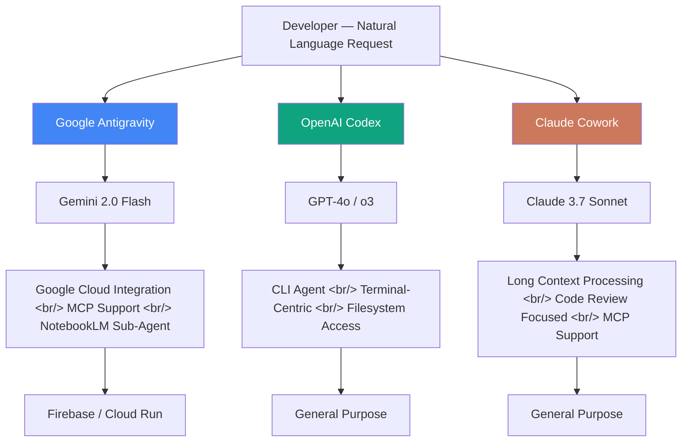

## Overview

Google Antigravity is Google's AI-first IDE powered by Gemini, entering the AI-driven development environment market alongside OpenAI Codex and Anthropic Claude Cowork. It goes beyond code autocomplete, targeting the vibe coding paradigm — building entire projects from natural language commands alone. Its key differentiator: deep integration with Google NotebookLM to build specialized sub-agent architectures.

---

## Antigravity: Basic Setup and UI Structure

On first launch, Antigravity presents a web-based IDE layout reminiscent of Cursor or VS Code — but it's fundamentally different in where control lives. The sidebar holds a file tree and project navigator, the center pane is a code editor, but the Gemini chat panel on the right is where actual work begins. Every toolbar button maps to a specific Gemini function, so reading the UI is itself a guide to the tool's design philosophy.

The most important step in initial setup is connecting your Google account and initializing a project. After account linking, creating a new project lets Gemini automatically understand the project context — all subsequent chat requests are processed against that context. Notably, MCP (Model Context Protocol) connection settings are exposed right on the setup screen, a clear signal that Google has officially adopted MCP as the standard interface for external tool integration.

From a vibe coding perspective, Antigravity's barrier to entry is lower than other AI IDEs. Type "Build a to-do app in React" and Gemini proposes a file structure; approve it and code is generated immediately, with results visible in a built-in preview pane. This flow looks similar to Claude Cowork or Codex on the surface, but for developers in the Google ecosystem there's a clear edge: direct integration with Google Cloud infrastructure (Cloud Run deployment, Firebase, etc.) is essentially one-click.

---

## Three-Way Comparison: Antigravity vs Codex vs Claude Cowork

All three tools claim natural language-based code generation, but their design philosophies and actual user experience diverge sharply. OpenAI Codex leans toward a terminal-friendly CLI agent. Anthropic Claude Cowork excels at long-context processing and precise code review. Google Antigravity leads with visual UI and Google service ecosystem integration. Rather than one being objectively better, the right choice depends on your workflow style and cloud environment.

Code quality differences surface most clearly when handling complex logic. Claude Cowork's long context window shines for refactoring that references an entire large codebase. Codex delivers consistent performance on test writing and automation scripts. Antigravity provides the fastest results for UI component generation and Google Cloud boilerplate, but tends to require more revision cycles as domain-specific logic grows more complex.

MCP support is becoming an increasingly important axis in comparing these tools. Claude Cowork was MCP's original champion, Antigravity adopted it quickly, and Codex is building compatible external tool integration as well. This suggests the next front in AI IDE competition is shifting from model quality benchmarks toward ecosystem integration depth — how naturally a tool connects to external data sources and services is becoming the real productivity differentiator.

---

## Building a NotebookLM Sub-Agent

Google NotebookLM is known as a document analysis and knowledge management tool, but connecting it to Antigravity transforms it into a domain-specific knowledge sub-agent. There are two integration paths. The first registers a NotebookLM share link in Antigravity's MCP settings, injecting that notebook's document knowledge directly into Antigravity's chat context. The second wraps NotebookLM's API endpoint as a custom MCP server — more precise query control, but higher upfront setup cost.

The practical value of this sub-agent architecture is clear. Upload hundreds of pages of legacy system documentation to NotebookLM, connect it to Antigravity, and when you ask "Write a new Python client that calls this legacy API," Antigravity searches the relevant spec in NotebookLM to generate grounded code. The core value: significantly higher accuracy in internal domain knowledge areas where AI IDEs are normally most prone to hallucination.

The key concept in this architecture is role separation. Antigravity acts as the orchestrator handling code generation and execution. NotebookLM acts as the retriever providing domain knowledge. This pattern is essentially identical to RAG (Retrieval-Augmented Generation) architecture — but developers get the same effect through GUI-level setup without building a vector database or managing an embedding pipeline.

Real-world demos have revealed limitations too. Noticeable latency exists in context transfer between NotebookLM and Antigravity, and longer NotebookLM responses reportedly correlate with some degradation in code generation quality. Access permission management for specific notebooks is also not yet granular, requiring additional information security consideration in team environments. Even so, the pattern this integration demonstrates — plugging a domain knowledge base into an AI IDE — is likely to become core architecture in enterprise AI development environments.

---

## Quick Links

- [Google Antigravity Setup, Codex App, and Claude Cowork Comparison](https://www.youtube.com/watch?v=v3m-QXMCZ6M) — todaycode channel, 29 min 43 sec. UI button walkthrough and three-way comparison hands-on
- [Sub-Agent with Antigravity + NotebookLM](https://www.youtube.com/watch?v=IMFiasVnc0o) — Two-soul AI Agent channel, 14 min 20 sec. Two NotebookLM integration methods and agent-building practice

---

## Insights

Google Antigravity's arrival means more than just another competitor. Google embedding Gemini inside a developer tool rather than selling it as a standalone product makes clear that the main battleground in the AI model race has shifted from API performance benchmarks to developer workflow integration. The NotebookLM sub-agent integration is particularly interesting — it signals that AI IDEs are evolving toward supplementing a single model's limitations with multiple specialized agents. MCP as the standard connecting protocol for this ecosystem is also becoming evident: Anthropic proposed it, Google adopted it, and OpenAI is moving toward compatibility. Vibe coding is increasingly real, but right now it's most practical for rapid prototyping in the design phase and boilerplate generation — complex business logic implementation still requires developer judgment and validation. In the three-way AI IDE competition, the real winner is likely not a specific model but whichever tool integrates most naturally with a developer's existing stack.
