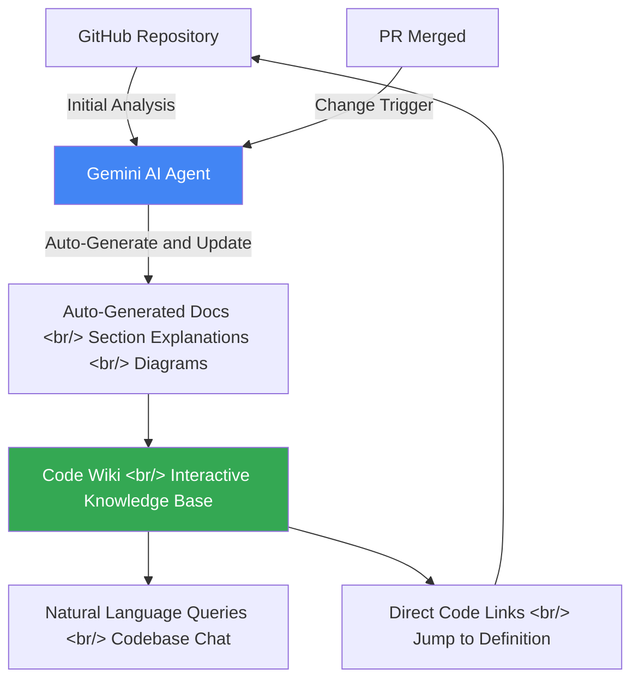

## Overview

Google Code Wiki, publicly available at codewiki.google, is Google's new AI documentation tool. Gemini analyzes a codebase, automatically generates an interactive knowledge base, and updates relevant documentation in real time every time a PR is merged. The tagline "Stop documenting. Start understanding." captures it well: this tool is an attempt to shift documentation from a burden developers must shoulder to infrastructure AI maintains automatically.

---

## What Is Code Wiki?

Code Wiki looks like an automated documentation tool on the surface, but its essence is an agentic system that transforms a codebase into a living knowledge graph. Traditional documentation tools — Confluence, Notion, GitBook — require developers to write content manually, and when code changes, documentation doesn't follow automatically. This "drift" between code and docs is a chronic problem in large codebases. Because Code Wiki's Gemini AI agent reads the code directly to generate documentation, code becomes the source of truth and documentation becomes its derivative.

The tool's core positioning is captured in the phrase "A new perspective on development for the agentic era." The agentic era means AI doesn't just assist tools but judges and acts autonomously — Code Wiki declares it will take on that agentic role in the domain of documentation. The promise that Gemini-generated documentation stays "always up-to-date" suggests developers could be freed from the obligation to maintain docs manually.

Code Wiki currently operates on an invite-only basis, publicly demoing some notable open-source repositories as featured repos. Private repository support is listed as "Coming Soon." This staged rollout looks like a deliberate strategy — publicly validate AI-generated documentation quality while scaling infrastructure.

---

## Core Features

Code Wiki's first core feature is **section-by-section deep exploration** (Understand your code section by section). Rather than generating a single high-level overview, you can select a specific section and drill down into how it works. For new team members onboarding to a large project, or returning developers trying to understand how a particular service behaves, this replaces the old approach — read the code directly or ask a colleague. Whether Gemini's explanations are accurate and useful enough is the key question, but the interactive exploration experience itself proposes a new documentation UX.

The auto-update mechanism is the most technically interesting part of Code Wiki. Every time a PR is merged, the Gemini agent analyzes the changed code and automatically updates relevant documentation. For this pipeline to work correctly, it must simultaneously solve three hard problems: diff analysis, identifying related documentation, and maintaining consistency with existing docs. Refactoring in particular — where code structure changes substantially — requires significant reasoning ability to determine which parts of previous documentation to update and which to retire.

The bidirectional link between code and documentation (Linked back to your code) has strong practical value. Reading an architecture overview and clicking on a specific service description takes you directly to that service's source file; a function description links directly to the function's definition. This moves away from the silo model where docs and code live separately, proposing a new pattern where documentation functions as a navigation layer over the code. JetBrains' code navigation and GitHub's code search provide this experience at the code level — Code Wiki attempts the same experience at the natural language description level.

Auto-generated diagrams are also notable. The promise: instead of mentally assembling complex systems piece by piece, code is transformed into clear, intuitive visual diagrams. Whether these diagrams are actually accurate for large microservice architectures or complex data flows needs more real-world validation. That said, a diagram extracted directly from code by AI is probably more current than one drawn manually by a human.

The natural language chat with your codebase feature (Talk to your codebase) is described as a "24/7 on-call engineer" experience. This isn't just document search — it's real-time conversation with an AI that understands the codebase. If you could instantly answer questions like "What authentication method does this API endpoint use?" or "What events flow between the payment service and order service?", onboarding time for new team members and the context-sharing burden on senior engineers would both drop.

---

## The Paradigm Shift in Documentation for the Agentic Era

Traditional documentation philosophy is built on the norm: "When code changes, update the docs." In reality, this norm is rarely followed. The faster the development pace, the larger the team, and the harder it is to feel documentation has direct business value — the more docs fall behind. Code Wiki's approach attempts to solve this human limitation through automation rather than norms. Instead of placing the documentation obligation on developers, it makes code changes an automatic pipeline trigger.

The deeper implication of this paradigm shift is a change in developer roles. Until now, one of a senior developer's important contributions was capturing tacit knowledge — design decisions not explicit in code, historical context, tradeoffs — in documentation or passing it on to junior developers. As AI can automatically extract explicit knowledge from code, the valuable knowledge contributions developers make will increasingly move toward this tacit knowledge domain. Ironically, for AI to capture even tacit knowledge, developers need to leave richer context in commit messages, PR descriptions, and code comments — the better AI tools get, the higher the quality of structured information developers need to produce. A paradox emerges.

For Code Wiki to become a meaningful long-term tool, it must solve the trust problem with AI-generated documentation. When a developer writes documentation, accountability is clear. When AI-generated documentation is wrong — who's responsible? And how much will developers trust and act on AI documentation? These are cultural questions, not technical ones. Particularly in mission-critical systems, basing maintenance decisions on AI documentation requires high confidence in that documentation's accuracy.

Code Wiki currently only works with public open-source repositories, with private repo support in progress. Enterprise adoption will require meeting governance requirements: code security, data sovereignty, on-premises deployment options. Google's existing enterprise Google Cloud customer base is an advantage here, but overcoming corporate conservatism about exposing codebases to an external AI service is a separate challenge.

---

## Quick Links

- [[Product Review] Google's Code Wiki, Codebase Documentation](https://www.youtube.com/watch?v=JXTPHsN4rcE) — LOADING_ channel, 9 min 12 sec. Real-world review of codewiki.google
- [Code Wiki Official Site](https://codewiki.google) — Featured repo demos and invitation signup

---

## Insights

Code Wiki isn't just a documentation tool — it's a symbol of the inflection point where AI agents begin autonomously handling portions of the software development lifecycle. A developer's action (merging a PR) automatically triggers an AI agent's work, and the result is immediately shared with the whole team. This shows an early model of how agents and humans collaborate. Google releasing Antigravity (code writing) and Code Wiki (code documentation) simultaneously feels intentional — an attempt to create a complete loop where AI writes code and AI explains that code. If NotebookLM serves as the knowledge repository, Antigravity generates the code, and Code Wiki documents the results, the integration of these three tools may be the big picture Google has in mind for AI development environments. The practical implication for developers: good commit messages and well-structured PR descriptions are no longer just team collaboration etiquette — they become the key inputs that determine AI documentation quality.
