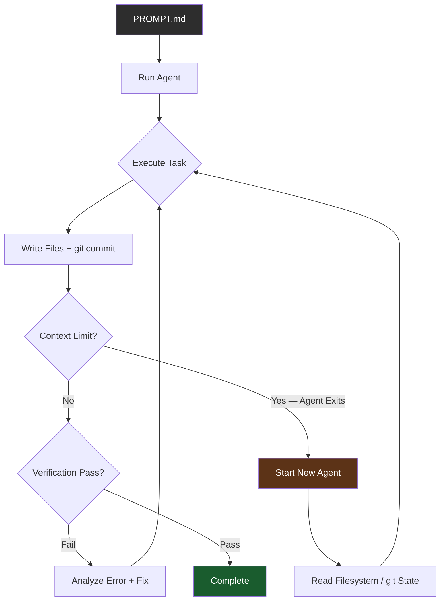

## Overview

You give Claude Code a task. It reports "successfully completed." You run the tests. Errors. This mismatch comes from a structural limitation in AI coding tools: the AI stops the moment it decides the task is done, without verifying whether that decision is actually correct.

Ralph Loop directly addresses this problem. The core idea is simple: even when AI says "done," automatically restart it and make it verify itself. Trap an AI agent inside a loop that never ends, and the agent detects failures, makes fixes, and keeps going until it actually passes. This idea emerged as one of the most watched automation patterns in the AI development community during 2025–2026.

---

## The Origin of Ralph Loop

The name comes from Ralph Wiggum, a character from The Simpsons. Ralph isn't particularly smart, but he never gives up. Geoffrey Huntley drew on this metaphor to propose the simplest possible agent loop pattern, and the original implementation is a single bash command:

```bash
while :; do cat PROMPT.md | agent; done
```

That's it. Write your task instructions in `PROMPT.md`, and this loop immediately spins up a new agent every time the previous one exits, restarting with the same prompt. Context window full, agent hangs, error thrown — the loop keeps going. Each new agent reads the filesystem and git history to understand how far the previous agent got, then picks up where it left off.

The pattern's breakthrough moment was a Y Combinator hackathon. Participants spun up Ralph Loop on a GCP instance and went to sleep. By morning, 1,100 commits had accumulated across 6 repositories. The Browser Use library had been nearly completely ported from Python to TypeScript overnight. Total cost: $800 — equivalent to hiring a developer at $10.50 per hour. This case validated the real-world utility of Ralph Loop and spread through the community.

Derivative projects followed quickly. The `snarktank/ralph` repository accumulated over 9,200 GitHub stars, and the `oh-my-opencode` project included `/ralph-loop` as a built-in command. What started as an experimental hack rapidly evolved into a standardized tool.

---

## Why It Works: Context vs. Filesystem

Traditional AI coding tools store progress only inside the context window. An LLM's context window is finite; once full, earlier content is forgotten. On long tasks, agents either fail to remember what they've already done or hit context limits and terminate.

Ralph Loop's key insight is storing state in the external filesystem and git, not in context. When an agent writes code, it's saved to files. When it makes git commits, history accumulates. When context overflows and the agent exits, the loop spins up a new agent. That new agent reads the filesystem and checks git log to understand how far the previous agent got, then continues.



Why this architecture matters: it completely decouples the persistence of an agent loop from the limits of a context window. Context can reset at any time, but the filesystem and git are persistent. Each new agent starts "fresh" while fully inheriting the previous agent's results. This pattern is particularly powerful for long-context work: large-scale refactoring, library porting, legacy code migration.

---

## Patterns That Evolved to Production Level

Starting from a simple bash loop, Ralph Loop has evolved in multiple directions to meet production complexity. Peter Steinberger's OpenClaw project (152,000+ GitHub stars) represents a case of bringing agent loops to real service level. OpenClaw connects 12+ channels including WhatsApp, Slack, Discord, iMessage, and Telegram; manages the agent's personality and behavioral principles with a "soul document"; and includes gateway-based session routing and usage monitoring — with over 8,700 total commits.

The Nanobot project distills the agent loop's essence into 330 lines. Stripping away infrastructure and preserving only the core loop, this code most clearly shows Ralph Loop's mechanical structure:

```python
while iteration < self.max_iterations:
    iteration += 1
    response = await self.provider.chat(
        messages=messages,
        tools=self.tools.get_definitions()
    )
    if response.has_tool_calls:
        for tool_call in response.tool_calls:
            result = await self.tools.execute(
                tool_call.name, tool_call.arguments)
            messages = self.context.add_tool_result(
                messages, tool_call.id, tool_call.name, result)
    else:
        final_content = response.content
        break
```

Looking at this structure, it's clear how much Ralph Loop is based on ancient computer science concepts: `while` loop, tool call response handling, message history accumulation, exit condition. Nothing new. What changed: the decision-maker inside the loop shifted from rules-based logic to an LLM, and the definition of "done" became a contextual judgment by AI rather than a pre-programmed condition. `max_iterations` is a safety guard against infinite loops — when the limit is reached, instead of force-terminating, it calls `MaxReachedAgent` to summarize progress and suggest next steps.

---

## FrontALF's Real-World Design at Channel.io

Channel.io's AI support system FrontALF is a case of applying the Ralph Loop pattern to a real B2B service, separating two loops by purpose. This design shows an architectural perspective that specializes agent loops for different situations beyond simple repetition.

The first is a **Stateless Agent Loop**, used for customer Q&A, RAG search, and situations requiring fast response. Each turn runs independently without storing state externally:

```go
for i := 0; i < maxTurns; i++ {
    response := llm.Request(currentHistory)
    currentHistory = append(currentHistory, response.Events...)
    if !checkShouldContinue(response.Events) { break }
}
```

Inside the RAG Handler, a mini-loop judges whether search results are sufficient and re-searches if needed. The outer loop is simple, but inner loops autonomously supplement as needed.

The second is a **Stateful Task Loop**, used for multi-step workflows like refund processing or tasks requiring external system approvals:

```go
type TaskSession struct {
    CurrentNodeID string
    TaskMemory    map[string]any  // Shared state across nodes
    NodeTrace     []string        // Execution path tracking
}
```

`TaskMemory` maintains shared state across nodes; `NodeTrace` records the execution path to support debugging and restarting. If a specific node fails, it can be re-run from that node. Sessions can be paused while waiting for external approval, then resumed. The separation of the two loops is a pragmatic choice — when requirements differ, don't force a single pattern.

---

## Quick Links

- [Claude Code Ralph Loop — Making AI Code While You Sleep](https://www.youtube.com/watch?v=UqbUpxdLsng) — OhNoteToday channel, Ralph Loop concept intro and practice (8 min 16 sec)
- [How to Make Claude Test and Fix on Its Own | Ralph Loop](https://www.youtube.com/watch?v=wz7oFfIR7LA) — DingCodingCo channel, hands-on tutorial (6 min 29 sec, 32,000 views)
- [Ralph Loop, OpenClaw — Nothing New](https://channel.io/blog) — Channel.io engineer Mong's in-depth analysis, including FrontALF real-world design

---

## Insights

What makes Ralph Loop interesting isn't technical innovation — it's a shift in perspective. `while` loops, state machines, retry patterns, graceful shutdown — these have existed for decades. What changed: the decision-maker inside the loop went from rules-based logic to an LLM, and the definition of "done" became a contextual criterion that AI judges rather than a pre-programmed condition. The Y Combinator case's $800 / $10.50 per hour figure shows this pattern already operates as a realistic economic unit. Channel.io's two-loop separation — Stateless and Stateful — leaves a practical lesson: don't force a single pattern when requirements differ. OpenClaw's soul document concept — explicitly defining an agent's personality and behavioral principles as a document — raises a deeper design question beyond simple loop repetition: how do you control and make agents trustworthy? For production deployment of Ralph Loop, safety guards like `max_iterations` and cost monitoring are essential — an unconverging loop can drive up costs at non-linear rates.
