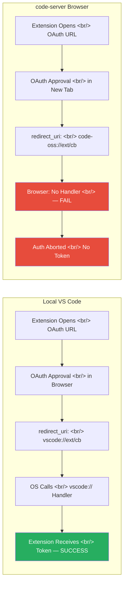

## Overview

`code-server` is an open-source project (GitHub 76,491 stars, primary language TypeScript) that lets you run VS Code in a browser. Install code-server on a server, connect via browser, and you have a full VS Code development environment anywhere. But that same "runs in a browser" property creates a critical problem for VSCode extensions that use OAuth-based authentication.

The issue is URI schemes. Local VS Code handles OAuth redirects via the `vscode://` scheme — the OS registers a handler that routes URLs starting with `vscode://` to the VS Code process. In code-server, VS Code runs as a browser tab. The browser doesn't know the `code-oss://` scheme, and there's no OS-level handler. The OAuth flow breaks entirely at the redirect step after authentication completes. This post analyzes the technical structure of that problem and maps out the correct solutions.

## The Core Problem: vscode:// vs code-oss:// URI Schemes

Extensions using OAuth in local VS Code typically follow this flow: the extension opens the OAuth provider's auth URL in the browser; the user logs in and approves permissions; the provider redirects to a pre-registered `redirect_uri` in the form `vscode://extension-name/auth-callback`; the OS recognizes this scheme and wakes the VS Code process; the extension extracts the authorization code from the URI and exchanges it for an access token.

In code-server, VS Code's own URI scheme changes to `code-oss://` — the default scheme of Code-OSS, the VS Code fork that code-server uses. This scheme is not registered in either the browser or the OS. When a redirect occurs to a URL like `code-oss://augment.vscode-augment/auth/...`, the browser shows an error like this:

```
Failed to launch 'code-oss://{extension_name}?{params}'
because the scheme does not have a registered handler
```

code-server Issue #6584, filed by user `@tianze0926` using the Augment Code extension, reported exactly this symptom. After authentication completed, the `code-oss://augment.vscode-augment/auth/...` URI wouldn't open automatically, requiring manual copy-paste. This isn't a code-server-specific quirk — it's a structural limitation of any browser-based VS Code environment.

## Why OAuth Fails in Browser Environments



The OS-level URI scheme handler acts as a bridge in local VS Code. On macOS through Info.plist-registered URL schemes, on Windows through the registry, on Linux through XDG settings — `vscode://` URLs get delivered to the VS Code process because VS Code registers that scheme handler at install time.

code-server runs as a browser tab. OAuth authentication proceeds in a new tab or popup, and when complete the OAuth provider attempts to redirect to the registered redirect_uri. But `code-oss://` isn't in the browser's custom protocol handler list. The browser doesn't know how to handle this URL and returns an error. As code-server maintainer `@code-asher` analyzed, fixing this requires either modifying VS Code itself or having the extension choose a different authentication approach.

The polling approach was an early suggested workaround: instead of an OAuth redirect, the extension opens its own server endpoint and the client polls it periodically to check whether a token has arrived. This changes the redirect_uri to a regular HTTPS URL like `https://extension-server.com/callback`, bypassing the browser scheme problem. But it requires separate server infrastructure and raises security concerns about tokens passing through an intermediate server, making it an incomplete solution.

## registerUriHandler — The Correct Solution

The VSCode Extension API's `vscode.window.registerUriHandler` is the official solution. This API lets an extension directly register a handler for URIs in the form `vscode://publisher.extension-name/path`. In code-server environments, the code-server server side intercepts incoming requests for that URI and routes them to the extension handler.

How it works: code-server runs as a web server, so the OAuth redirect_uri can be set to a regular HTTPS URL like `https://your-code-server.com/vscode-extension/callback`. When authentication completes, this HTTPS endpoint is called, and code-server internally converts it into a `vscode://` URI event and delivers it to the extension handler. The browser's custom scheme problem is bypassed at the HTTP/HTTPS layer.

```typescript
// Correct approach — using registerUriHandler
import * as vscode from 'vscode';

export function activate(context: vscode.ExtensionContext) {
    // Register handler for vscode://publisher.my-extension/auth-callback URI
    const uriHandler = vscode.window.registerUriHandler({
        handleUri(uri: vscode.Uri): void {
            if (uri.path === '/auth-callback') {
                const params = new URLSearchParams(uri.query);
                const code = params.get('code');
                const state = params.get('state');

                if (code && state) {
                    // Exchange authorization code for token
                    exchangeCodeForToken(code, state);
                }
            }
        }
    });

    context.subscriptions.push(uriHandler);
}

// Setting redirect_uri when starting OAuth flow
function startOAuthFlow() {
    // In code-server, this gets translated and routed via HTTPS
    const redirectUri = vscode.env.uriScheme + '://publisher.my-extension/auth-callback';
    const authUrl = buildOAuthUrl({ redirect_uri: redirectUri });
    vscode.env.openExternal(vscode.Uri.parse(authUrl));
}
```

```typescript
// Wrong approach — hardcoded code-oss:// scheme
function startOAuthFlowBroken() {
    // This URL cannot be opened in code-server browser environments
    const redirectUri = 'code-oss://extension-name/auth-callback';
    const authUrl = buildOAuthUrl({ redirect_uri: redirectUri });
    vscode.env.openExternal(vscode.Uri.parse(authUrl));
    // Browser: "the scheme does not have a registered handler" error
}
```

Using `vscode.env.uriScheme` is the key. This value returns `vscode` in local VS Code and `code-oss` (or the appropriate value for the environment) in code-server. You can dynamically detect the current environment's scheme and construct the redirect_uri without hardcoding. GitLens successfully implemented this pattern and was cited by the code-server maintainer as the reference implementation. Community confirmation: GitLens OAuth authentication works correctly in code-server.

## Popup Window API Request (VSCode #142080)

VSCode issue #142080 requests an Extension API addition for handling OAuth2 authentication in popup windows. Currently OAuth windows can only be opened as new tabs; with popup windows, scripts can automatically close the window after authentication completes, greatly improving the user experience.

VSCode team member `@TylerLeonhardt` explained that the GitHub Authentication extension receives popup handling on `vscode.dev` through a hardcoded URI whitelist — not an official API available to general extensions. Electron maintainer `@deepak1556` noted that on desktop, the implementation delegates to OS platform handlers (XDGOpen, OpenURL, ShellExecuteW), making a general-purpose popup API complex to implement. There's some opinion that implementation is feasible in web-embedded environments.

This issue is currently OPEN, awaiting community upvotes (20 needed). The current situation — where only the GitHub Authentication extension receives special popup treatment — is a known community frustration. The core demand is an official API that lets general extensions provide the same user experience.

## Browser Restrictions on window.close()

Using OAuth popup windows requires `window.close()` to close the window after authentication completes. But browsers have an important restriction on `window.close()`. Per MDN spec, scripts can only close windows that were opened by script (via `window.open()`) or windows opened through links/forms without user-initiated navigation.

If a user directly opens a new tab via Ctrl+Click or the middle mouse button, scripts cannot close it. Chrome prints this to the console in that case:

```
Scripts may not close windows that were not opened by script.
```

For the OAuth popup pattern to work correctly, the popup window must be opened with `window.open()`. The completion page uses `window.opener` to send a message to the parent window (`window.opener.postMessage()`), then calls `window.close()`. This is the standard implementation for OAuth popups:

```javascript
// OAuth initiator side (extension/app)
const popup = window.open(authUrl, 'oauth-popup', 'width=600,height=700');

window.addEventListener('message', (event) => {
    if (event.source === popup && event.data.type === 'oauth-success') {
        const { code, state } = event.data;
        // Proceed with token exchange
        exchangeCodeForToken(code, state);
    }
});

// OAuth callback page (redirect_uri)
// Pass code to parent window and close popup after auth completes
window.opener.postMessage({
    type: 'oauth-success',
    code: new URLSearchParams(location.search).get('code'),
    state: new URLSearchParams(location.search).get('state')
}, '*');
window.close(); // Closeable because opened via window.open()
```

## Debugger Detach Issues in WSL1

VSCode issue #1650 (vscode-js-debug) looked like an OAuth problem at first but had a different root cause. Reports described a Chrome debug session disconnecting on OAuth redirect (cross-domain navigation). vscode-js-debug maintainer `@connor4312` responded that "once connected, connections should stay connected — no known issues."

Investigation revealed the actual cause: **WSL1 network isolation**. WSL1 runs without a Linux kernel, translating Linux system calls on top of the Windows kernel — this structure causes cases where network interfaces aren't properly shared. Chrome DevTools Protocol connections breaking during OAuth redirects when passing through WSL1's network layer were the problem. The fix: run VS Code directly on Windows rather than in WSL1, or migrate to WSL2. WSL2 uses a real Linux kernel and doesn't have network isolation issues.

This issue is a separate example from the code-oss scheme problem, but illustrates a broader pattern: "VSCode extensions in browser/remote environments behave differently from local environments." With extensions running in WSL, Docker, code-server, vscode.dev, and more, extension developers need to deeply understand the differences between each environment.

## Quick Links

- [code-server GitHub](https://github.com/coder/code-server) — 76,491 stars, TypeScript open-source project
- [code-server Issue #6584](https://github.com/coder/code-server/issues/6584) — code-oss:// scheme OAuth failure (CLOSED)
- [VSCode Issue #142080](https://github.com/microsoft/vscode/issues/142080) — OAuth2 popup window Extension API request (OPEN)
- [VSCode API: registerUriHandler](https://code.visualstudio.com/api/references/vscode-api#window.registerUriHandler) — Official API documentation
- [MDN: window.close()](https://developer.mozilla.org/en-US/docs/Web/API/Window/close) — Browser window close restrictions
- [GitLens Extension](https://github.com/gitkraken/vscode-gitlens) — Reference implementation using registerUriHandler

## Insights

The code-server OAuth problem illustrates just how complex a compatibility challenge "VS Code running in a browser" entails. The OS-level URI scheme handler that works transparently in local environments simply doesn't exist inside a browser sandbox — bridging that gap is a VS Code core-level problem that the code-server team can't solve alone. The `registerUriHandler` API exists as the solution, but not every extension developer knows about it or uses it correctly — even commercial products like Augment Code ran into this problem. That GitLens provides a successful reference implementation demonstrates the value of open-source knowledge sharing once again. The pattern of using `vscode.env.uriScheme` to dynamically detect environment is a technique every VSCode extension developer who needs to support local, remote, and browser environments must master. If the popup window API (#142080) is standardized as an official API, OAuth UX would improve significantly — but whether the current situation where only GitHub Auth gets special treatment will improve is unclear. The WSL1 debugger issue offers a separate lesson: networking problems can stem from structural differences in the execution environment rather than code bugs, so environment diagnosis should come first in debugging.
