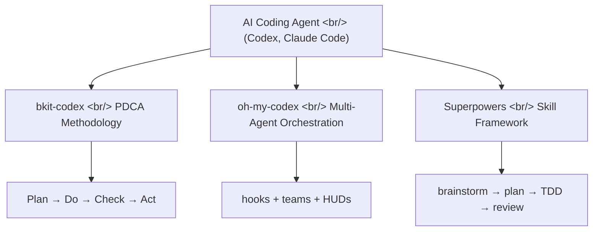
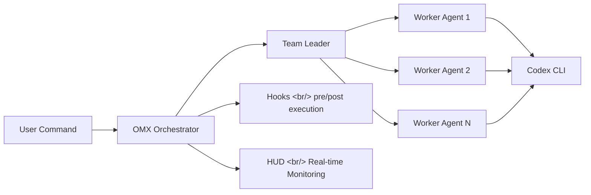

## Overview

We're moving from an era of "just using" AI coding agents to one of "using them with structure." This post compares three extension frameworks that layer on top of OpenAI Codex and Claude Code to control agent behavior, shape team workflows, and enforce development methodology.

<!--more-->

## bkit-codex — PDCA + Context Engineering

[bkit-codex](https://github.com/popup-studio-ai/bkit-codex) is an OpenAI Codex CLI extension that provides an AI-native development workflow through PDCA (Plan-Do-Check-Act) methodology and a Context Engineering architecture.

### What Is Context Engineering?

A methodology for systematically curating the context tokens delivered to AI. It goes beyond writing good prompts — it structures which information to provide to AI, and in what order.

### Core Components

- **PDCA Cycle**: Plan (write a planning document) → Do (generate code) → Check (test/verify) → Act (improve/deploy)
- **Skills**: Reusable agent behavior modules
- **Pipeline**: Chain multiple skills to compose complex workflows
- **MCP Integration**: Tool connection via Model Context Protocol

### Tech Stack

JavaScript-based, Apache 2.0 license, 10 Stars

## oh-my-codex (OMX) — Multi-Agent Orchestration

[oh-my-codex](https://github.com/Yeachan-Heo/oh-my-codex) adds a multi-agent orchestration layer on top of the OpenAI Codex CLI. With 1,744 Stars, it has the most active community in this space.

### Core Features

- **Agent Teams**: Multiple agents divide roles and collaborate (leader/worker structure)
- **Hooks**: Insert custom logic before/after agent execution
- **HUDs (Head-Up Displays)**: Real-time monitoring of agent status
- **Harness**: Standardizes and packages agent execution environments
- **OpenClaw Integration**: Agent status notifications via notification gateway

### Architecture

### Tech Stack

TypeScript-based, MIT license, 1,744 Stars, v0.8.12

## Superpowers — Skill-Based Development Methodology

[Superpowers](https://github.com/obra/superpowers) is an agent skill framework with an overwhelming 76,619 Stars. More than a simple tool, it provides a **complete software development methodology**.

### Philosophy

It starts from the principle that a coding agent "doesn't write code first." Instead:

1. **Brainstorming**: Ask the user clarifying questions about what they want to build
2. **Spec Review**: Break the spec into digestible units for review
3. **Implementation Plan**: A plan that even "an enthusiastic but inexperienced junior engineer" can follow
4. **Subagent-Driven Development**: Sub-agents handle individual tasks; the main agent reviews
5. **TDD + YAGNI + DRY**: Enforce test-driven development and conciseness

### Key Skills

- `brainstorming` — Explore requirements before implementing features
- `writing-plans` — Create implementation plans
- `test-driven-development` — Enforce Red/Green TDD
- `systematic-debugging` — Systematic debugging workflow
- `dispatching-parallel-agents` — Parallel processing of independent tasks
- `verification-before-completion` — Force verification before claiming done

### Tech Stack

Shell + JavaScript, v5.0.0, 76,619 Stars

## Three-Way Comparison

| Criterion | bkit-codex | oh-my-codex | Superpowers |
|-----------|-----------|------------|-------------|
| **Target Agent** | Codex CLI | Codex CLI | Claude Code + general |
| **Core Value** | PDCA methodology | Multi-agent collaboration | Enforce development methodology |
| **Stars** | 10 | 1,744 | 76,619 |
| **Language** | JavaScript | TypeScript | Shell |
| **Team Features** | Pipeline | Agent Teams | Subagent |
| **Monitoring** | Reports | HUD real-time | Verification checklist |

## Quick Links

- [If You Want to Use Claude Code Properly — Complete AI Coding Mastery with bkit](https://www.youtube.com/watch?v=NZGONJIWmj8) — 58-minute hands-on bkit tutorial

## Insights

All three frameworks share the same theme: "imposing structure on AI." This is the core trend in AI coding in 2026.

bkit-codex is an experimental attempt to apply manufacturing's PDCA cycle to software. oh-my-codex is a practical approach to scaling Codex into a team. Superpowers — with 76K Stars as evidence — is the most validated methodology.

Superpowers' philosophy in particular is striking: "prevent the coding agent from writing code first." It's a good lesson for human developers too — diving into coding without design is inefficient, whether you're AI or human.

AI's ability to "write" code is already sufficient. What's needed now is a framework that makes AI write code *well*, and these three projects are leading in that direction.
