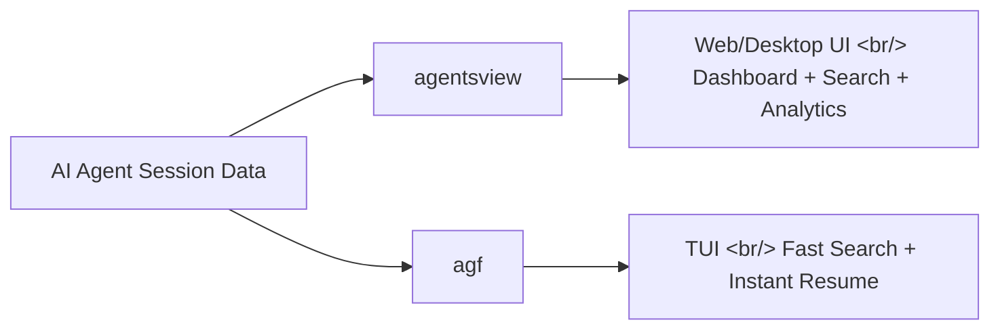
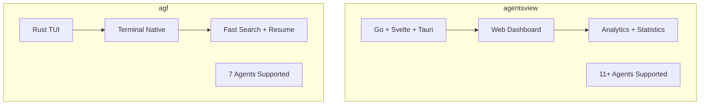

## Overview

Use AI coding agents seriously for a while and sessions pile up in the dozens. Remembering what work you did in which project, and where you left off, becomes genuinely hard. Two tools have emerged to solve this: **agentsview** and **agf**. Here's a comparison.

<!--more-->



## agentsview — Session Analytics Dashboard

[agentsview](https://github.com/wesm/agentsview) is a local-first desktop/web application for browsing, searching, and analyzing AI agent coding sessions. Built with a Go backend, Svelte frontend, and Tauri desktop app.

### Supported Agents

Supports **11+ AI coding agents** including Claude Code, Codex, and OpenCode. Parses session logs from each agent and presents a unified view.

### Key Features

- **Dashboard**: Usage statistics and visualizations per project and per agent
- **Full-text Search**: Search session contents to answer "what did I do back then?" questions
- **Local-First**: All data stored locally, privacy guaranteed
- **Desktop App**: macOS/Windows installers provided, auto-update supported

### Installation

```bash
# CLI
curl -fsSL https://agentsview.io/install.sh | bash

# Desktop App
# Download from GitHub Releases
```

### Tech Stack

| Component | Technology |
|-----------|-----------|
| Backend | Go 1.25+ |
| Frontend | Svelte + TypeScript |
| Desktop | Tauri (Rust) |
| Stars | 453 |

## agf — Terminal Session Finder

[agf](https://github.com/subinium/agf) is a TUI-based agent session management tool built by Korean developer subinium. Written in Rust — fast and simple to install.

### The Problem It Solves

It describes the typical experience of agent users like this:

1. Can't remember which project you were working in
2. `cd` to the wrong directory
3. Try to remember the session ID
4. Give up and start a new session

### Key Features

- **Unified View**: Supports Claude Code, Codex, OpenCode, pi, Kiro, Cursor CLI, Gemini
- **Fuzzy Search**: Instant search by project name
- **One-Key Resume**: Resume a selected session with a single Enter press
- **Resume Mode Picker**: Tab to choose resume mode (v0.5.5)
- **Worktree Scanning**: Parallelized worktree scan that tracks even deleted projects

### Installation

```bash
brew install subinium/tap/agf
agf setup
# Then restart shell and run agf
```

### Quick Resume

```bash
agf resume project-name   # Resume immediately via fuzzy match
```

## Comparing the Two



| Criterion | agentsview | agf |
|-----------|-----------|-----|
| **Interface** | Web/Desktop GUI | TUI (terminal) |
| **Primary Use** | Session analytics + search | Fast session resumption |
| **Language** | Go + Svelte | Rust |
| **Installation** | curl or desktop app | Homebrew |
| **Stars** | 453 | 99 |
| **Agents Supported** | 11+ | 7 |

## Insights

The emergence of session management tools for AI coding agents itself speaks to this ecosystem's maturity. Like editor plugins, agents have moved past "just using them" — "managing them well" is now the core of productivity.

agentsview is strong for retrospective questions like "what did I do with AI this week?" agf is strong for immediate needs like "pick up right where I left off." Both tools are local-first, which is impressive — you can use them without worrying about AI session data leaking to the cloud. Ultimately, the two tools are complementary rather than competitive.
