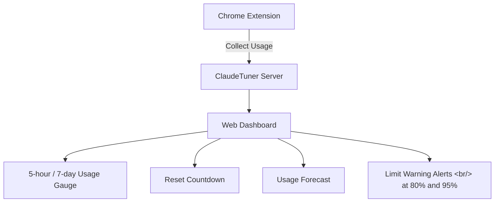

## Overview

As Claude Opus 4.6's quality improvements lead to heavier use at work, questions naturally arise: "Am I actually getting value from this plan?" and "How much headroom do I have before hitting my limit?" [ClaudeTuner](https://news.hada.io/topic?id=27171) is a Chrome extension plus web dashboard that addresses exactly these questions.

<!--more-->

## Key Features

### Personal Usage Monitoring

Install the Chrome extension and log in to Claude — usage is collected automatically. Claude Code usage is tracked and included in the total.

- **5-hour / 7-day usage gauge**: See your current status at a glance
- **Reset countdown**: Shows time remaining until the next reset
- **Usage forecast**: Projects your usage rate at the next reset based on current pace
- **Limit warning alerts**: Browser notifications when you hit 80% and 95% to encourage throttling
- **Hourly usage patterns**: Analyze when you use Claude most

### B2B Cost Optimization

Management features are also provided for organizations using the Claude Team plan. Track usage per team member and get recommendations for the optimal plan based on actual usage patterns.

## How Data Is Collected

The Chrome extension periodically reads usage data from the Claude website. After the initial login, collection is automatic — no additional steps needed.

## Insights

It's interesting that AI tool usage management is becoming its own independent software category. A tool that shows actual usage relative to subscription cost in data form signals that AI tools have shifted from "try it and see" to "manage and optimize." The fact that team management features are included is evidence that AI tool cost optimization has become a real operational concern for organizations.
