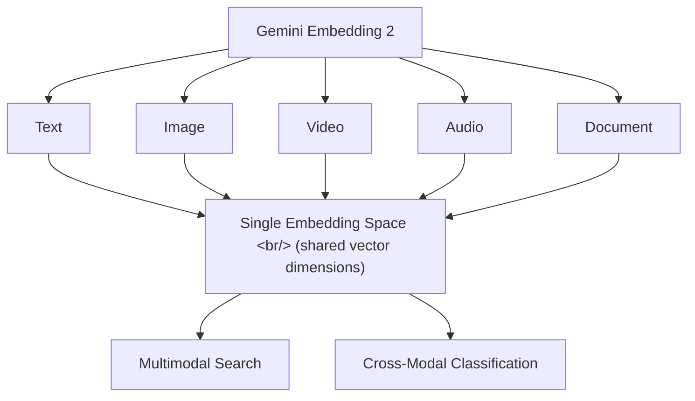

## Overview

Google DeepMind released [Gemini Embedding 2](https://blog.google/innovation-and-ai/models-and-research/gemini-models/gemini-embedding-2/) on March 10, 2026. It's the first native multimodal embedding model to map text, images, video, audio, and documents into a **single embedding space**.

<!--more-->

## New Modalities and Flexible Dimensions

Prior embedding models either handled text only, or used separate encoders even when nominally multimodal. Gemini Embedding 2 natively maps multiple modalities into a single vector space.

This means searching with "a photo of a cat" can retrieve video clips where cats appear, audio containing cat sounds, and documents containing the text "cat" — all in one query.

## State-of-the-Art Performance

Google announced that Gemini Embedding 2 achieves state-of-the-art performance across multiple benchmarks, demonstrating strong performance not only in text-to-text retrieval but also in cross-modal search.

## Use Cases

### Multimodal RAG

Traditional RAG (Retrieval-Augmented Generation) pipelines only indexed text documents for retrieval. With Gemini Embedding 2, images, video, and audio can be included in the retrieval corpus — enabling genuinely multimodal RAG.

### Media Library Search

For large media archives: search for images or videos using a text query, find similar videos from an image, or otherwise perform cross-modal search across modalities.

### Content Classification

Organize diverse content types under a single classification scheme. Because text labels and image/audio content are compared in the same space, no separate classification models are needed.

## Insights

Multimodal embeddings can be a game-changer for search and RAG. Until now, "image search" and "text search" were entirely separate pipelines — a single embedding space dissolves that boundary. Particularly in RAG pipelines, the ability to search images inside PDFs, presentation slides, and whiteboard photos alongside text could dramatically expand the coverage of enterprise knowledge management systems. Released as a public preview, so you can start testing it right away.
