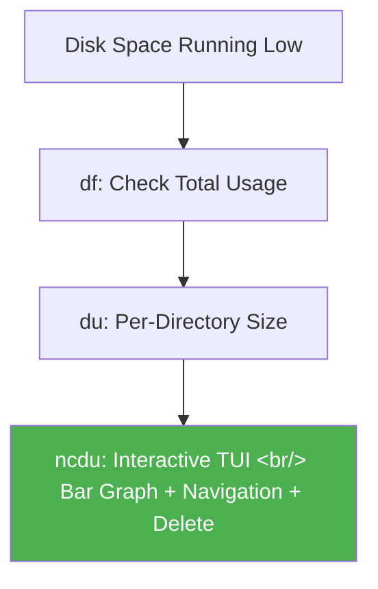

## Overview

When an EC2 instance runs low on disk space, `df` and `du` alone make it hard to pinpoint which directories are consuming the most storage. [ncdu](https://dev.yorhel.nl/ncdu) is an ncurses-based TUI tool that visually analyzes disk usage.

<!--more-->



## Installation

```bash
# Ubuntu/Debian
sudo apt-get install ncdu

# CentOS/RHEL
yum install -y ncdu

# macOS
brew install ncdu
```

## Basic Usage

```bash
# Analyze current directory
ncdu

# Analyze a specific path
ncdu /var/log

# Analyze entire disk
ncdu /
```

After scanning, ncdu displays a tree of directories and files with graphical bar indicators. It's immediately obvious where storage is being consumed.

## Key Controls

| Key | Action |
|----|------|
| Arrow keys | Navigate directories |
| Enter | Enter subdirectory |
| `i` | Item info |
| `d` | Delete selected item (with confirmation) |
| `?` / `Shift+?` | Help |
| `q` | Quit |

## How ncdu Compares to df and du

| Tool | Strengths | Weaknesses |
|------|---------|---------|
| `df` | Instantly shows per-partition total usage | Doesn't tell you which directory is the problem |
| `du` | Calculates per-directory sizes | Output is long and sorting is tedious |
| `ncdu` | Interactive TUI, instant sorting, in-place deletion | Requires separate installation |

## Insights

For server disk management, ncdu does what `htop` does for process management — the same operations are possible with the basic commands (`df`, `du`), but interactive TUI navigation changes efficiency dramatically. Especially in disk-constrained environments like EC2 when disk unexpectedly fills up, ncdu handles everything from diagnosing the cause to cleaning up, all without leaving the terminal.
