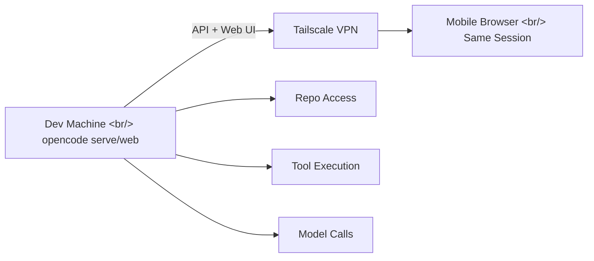

## Overview

"I want to pick up where I left off on OpenCode — without going back to my desk." SSH feels clunky, and mobile makes it even worse. [opencode serve/web](https://tilnote.io/pages/699fc2a3e2c6450408637dac) may be the answer.

<!--more-->

## Key Insight: "The Server Is the Real Thing, Not the TUI"

There's an important shift in perspective when thinking about opencode's architecture. The TUI (terminal UI) is just a client connecting to the server — the actual work happens in the server (backend). Once you internalize this, remote development becomes natural.

## opencode web

The most convenient option when you need it fast. Since it launches both the API server and the web UI together, you can open a phone browser and jump right back into the session you were working on — no app install, no SSH required.

Heavy lifting (repo access, tool execution, model calls) stays on the server machine. Your mobile device only handles input and display.

## opencode serve

`opencode serve` starts a "headless backend." It runs the API server without a web UI, so you can connect a custom client or integrate it into an automation pipeline.

## Security: Tailscale + Password

Rather than opening a port directly, the recommended approach is to connect through Tailscale VPN. Since access is limited to your Tailscale network, there is no risk of external exposure.

## Insight

The "server-client separation" pattern for AI coding tools is becoming the norm. GitHub Codespaces, code-server, and now opencode — the architecture of "heavy computation on the server, interaction on the client" is settling naturally into AI-assisted coding. The ability to give an AI agent a quick instruction from your phone can significantly reduce the time constraints in a development workflow.
