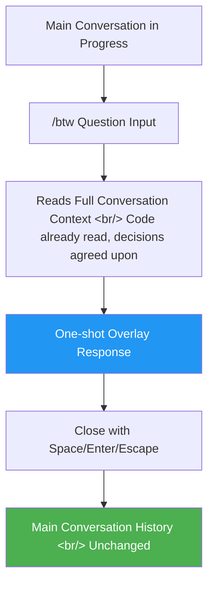

## Overview

You're deep in a complex refactoring session with Claude Code and something comes to mind: "What was the reason this function was deprecated again?" Typing it into the main prompt dirties your conversation history and risks breaking the agent's context. `/btw` is the **side question** feature designed to solve exactly this problem.

<!--more-->

## How /btw Works



Key properties:

- **Context access**: Reads the full context of the current conversation — code already seen, decisions made, everything discussed so far.
- **History isolation**: The question and answer are handled as a one-shot overlay and never written to the main conversation history.
- **Non-blocking**: You can invoke `/btw` even while Claude is generating its main response. It does not interrupt the main output.

## /btw vs Subagent: Different Tools for Different Jobs

| Property | /btw | Subagent |
|----------|------|----------|
| **Context** | Full conversation context ✓ | New session, no context |
| **Tool use** | Not available ✗ | Available ✓ |
| **Conversation** | One-shot (single response) | Multi-turn capable |
| **History** | Not saved | Result returned only |
| **Cost** | Reuses prompt cache (low cost) | New session cost |

Rule of thumb:

- **"Something Claude probably already knows"** → `/btw`
- **"Something that requires fresh research or exploration"** → Subagent

## Limitations

### No Tool Access

`/btw` cannot use any tools — no file reading, command execution, or web search. It answers purely from what is already in the current conversation context. This is intentional: if tool calls were allowed, a side question could interfere with the main task.

### Single-Turn Only

If you need follow-up questions and a back-and-forth exchange, use a regular prompt instead. `/btw` is literally "by the way" — one quick question, then move on.

## Cost

`/btw` is designed to **reuse the parent conversation's prompt cache**, so no new context needs to be built. If you're watching your Claude Code token costs, quick confirmations are cheapest as `/btw` questions.

## Practical Usage Patterns

```
# Quick check during refactoring
/btw Which method was it that you said was deprecated earlier in this file?

# Convention check during code review
/btw Are we using try-catch or a Result type for error handling in this project?

# Referencing a past decision during design discussion
/btw What was the reason we went with PostgreSQL earlier?
```

## Insight

`/btw` looks like a small feature, but it fills an important gap in Claude Code's conversation model. There was no way to leverage context without polluting the main conversation. This design reflects a real pattern in how developers think during work — "wait, what was that again?" — without stopping what they're doing. The constraints (no tool access, single-turn) are intentional guardrails to ensure side questions never disrupt the main workflow.
