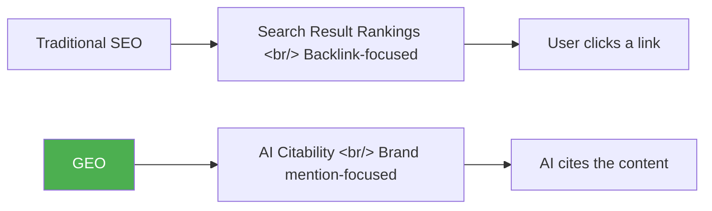
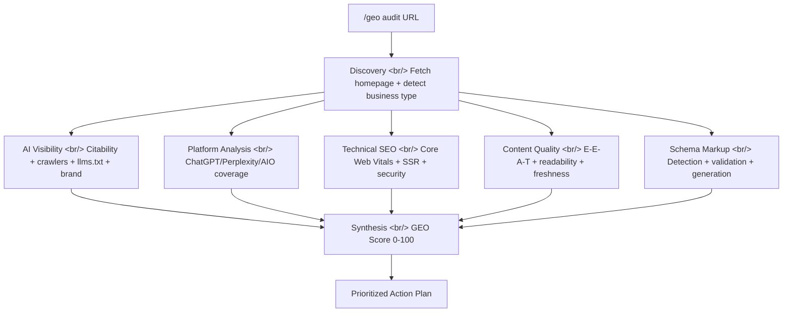

## Overview

Gartner predicts Google search traffic will drop 50% by 2028. AI referral traffic grew 527% year-over-year. AI-driven traffic converts at 4.4x the rate of organic. The numbers are clear: SEO's center of gravity is shifting toward **GEO (Generative Engine Optimization)**. [geo-seo-claude](https://github.com/zubair-trabzada/geo-seo-claude) is a single Claude Code skill that addresses this transition.

<!--more-->

## What Is GEO?

GEO means optimizing for **AI search engines** — ChatGPT, Claude, Perplexity, Gemini, Google AI Overviews. Traditional SEO was about getting users to click your link in search results. GEO is about getting AI to cite your content.



Key market signals:

| Metric | Value |
|--------|-------|
| GEO services market | $850M+ (projected $7.3B by 2031) |
| Backlinks vs brand mentions (AI visibility) | Brand mentions show **3x** stronger correlation |
| Domains cited by both ChatGPT and Google AIO | Only **11%** |
| Marketers actively investing in GEO | Only **23%** |

## Architecture: 5 Parallel Subagents

What makes geo-seo-claude interesting is how textbook-perfectly it demonstrates Claude Code's **skill + subagent** pattern.



A single `/geo audit` command runs 5 subagents **simultaneously**:
1. **AI Visibility** — citability score, crawler access, llms.txt, brand mentions
2. **Platform Analysis** — optimization for ChatGPT, Perplexity, Google AIO individually
3. **Technical SEO** — Core Web Vitals, SSR, security, mobile
4. **Content Quality** — E-E-A-T, readability, content freshness
5. **Schema Markup** — detection, validation, JSON-LD generation

## Key Features

### AI Citability Scoring

Quantifies what makes a text block easy for AI to cite. The optimal citation passage is **134–167 words**, self-contained, fact-dense, and directly answers a question.

### AI Crawler Analysis

Checks the accessibility of **14+ AI crawlers** (GPTBot, ClaudeBot, PerplexityBot, etc.) in `robots.txt` and provides allow/block recommendations.

### Brand Mention Scanning

Scans 7+ platforms (YouTube, Reddit, Wikipedia, LinkedIn, etc.) for brand mentions — which show **3x stronger correlation** with AI visibility than backlinks.

### llms.txt Generation

Analyzes or generates an `llms.txt` file, an emerging standard that helps AI crawlers understand site structure.

## Scoring Methodology

| Category | Weight |
|----------|--------|
| AI Citability & Visibility | 25% |
| Brand Authority Signals | 20% |
| Content Quality & E-E-A-T | 20% |
| Technical Foundation | 15% |
| Structured Data | 10% |
| Platform Optimization | 10% |

## Installation and Usage

```bash
# One-command install
curl -fsSL https://raw.githubusercontent.com/zubair-trabzada/geo-seo-claude/main/install.sh | bash

# Usage in Claude Code
/geo audit https://example.com    # Full audit
/geo quick https://example.com    # 60-second snapshot
/geo citability https://example.com  # Citability score only
/geo report-pdf                   # Generate PDF report
```

Requires Python 3.8+, Claude Code CLI, and Git. Playwright is optional.

## Business Angle

The tool itself is free under the MIT license. What's interesting is the accompanying **GEO agency business model** it presents alongside the tool. GEO agency retainer ranges: $2K–$12K/month. The tool does the auditing; the community teaches you how to sell. 2,264 stars, 369 forks — a notable scale for a Claude Code skill.

## Insight

geo-seo-claude demonstrates two things. First, a Claude Code skill can be more than a prompt wrapper — it can be a full software product built on **11 sub-skills + 5 parallel subagents + Python utilities**. Second, as AI search replaces traditional search, the SEO → GEO transition is a real business opportunity. "AI search is eating traditional search" — the tool's own slogan is becoming reality faster than expected.
