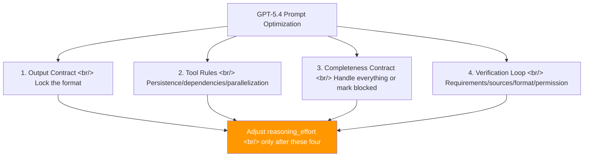
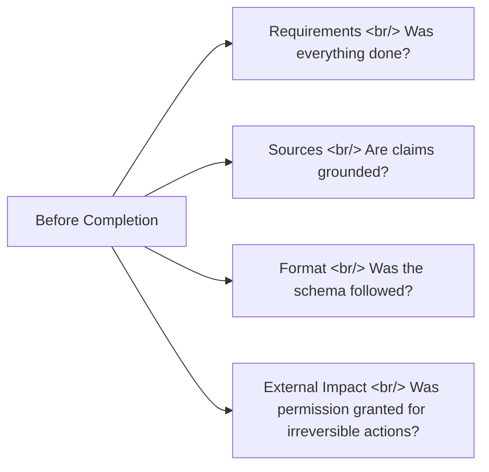

## Overview

GPT-5.4 excels at maintaining long context, multi-step agentic tasks, and grounded synthesis. But these strengths don't emerge automatically. OpenAI's official prompt guide makes a clear point: **"reduce drift" comes before "encourage deeper thinking."**

<!--more-->

## Four Core Techniques



Raising `reasoning_effort` is the **last fine-tuning knob**. In most cases, the four prompt techniques below give better cost-effectiveness first.

## 1. Output Contract

Prevents GPT-5.4 from breaking your format by inserting helpful-sounding explanations.

```xml
<output_contract>
- Return exactly the sections requested, in the requested order.
- If a format is required (JSON, Markdown, SQL, XML), output only that format.
</output_contract>
```

Think of it like a delivery spec. Stating "the deliverable must follow this template" reduces over-helpfulness and parsing failures.

## 2. Tool Persistence Rules

The most common agent failure pattern: **skipping a prior lookup because the answer seems obvious**. Three principles to prevent this:

| Principle | Description |
|-----------|-------------|
| **Forced use** | When accuracy, grounding, or completeness is at stake, tools must be used; if results are empty, retry with a different strategy |
| **Dependency check** | Before acting, verify whether a prior lookup is needed — never skip it even if the final state seems obvious |
| **Parallel vs sequential** | Independent lookups run in parallel for speed; dependent steps run sequentially for accuracy |

The goal: make tool use a **prerequisite**, not an option.

## 3. Completeness Contract

Solves the problem of models "halfheartedly finishing" long batch tasks.

- Every requested item must be processed, or marked `[blocked]` if not
- When a search returns empty, don't immediately conclude "nothing found" — try **at least 1–2 alternative strategies** first (different query, broader filter, prior lookup, different source)

These two rules give prompts the "endurance" to carry long tasks all the way through.

## 4. Verification Loop

A four-pronged check just before completion:



Additional gating rule: **"If needed information is missing, don't guess — use a lookup tool if possible; if not, ask only the minimum necessary question."**

## Handling Mid-Conversation Direction Changes

Users frequently change course. The default policy:

- **Reversible and low-risk** → proceed without asking
- **External impact / irreversible / sensitive data** → ask for permission
- **Instruction priority**: the latest user instruction overrides earlier style rules — except safety, honesty, and privacy, which are never overridden

## Grounding Research Quality

The biggest risk in AI research: blurring the line between what was actually found and what was inferred.

- Only cite sources actually retrieved in this workflow
- Never fabricate URLs, IDs, or quotations
- Place citations **inline next to each claim**, not bundled at the end
- Enforce a 3-phase research cycle: decompose the question → search each sub-question + follow secondary leads → reconcile contradictions, then write with citations

## reasoning_effort Tuning

| Task type | Recommended level |
|-----------|------------------|
| Fast execution / extraction / classification / short transforms | `none` ~ `low` |
| Long synthesis / multi-document review / strategic writing | `medium` or above |
| `xhigh` | Only when evals show a clear gain |

Migration order: swap the model first → fix reasoning effort → evaluate → add prompt blocks → adjust the reasoning knob one step at a time.

## Insight

The lessons in this guide aren't specific to GPT-5.4. They're universal patterns that apply to Claude, Gemini, and any other LLM agent. The core strategy is to exploit the model's ability to **follow rules precisely and consistently**: output contract, forced tool use, completeness contract, verification loop. Fix these four first, then raise reasoning effort only if you still need more. Ultimately, prompt engineering is not about telling an AI to think harder — it's about eliminating the room for it to drift.
