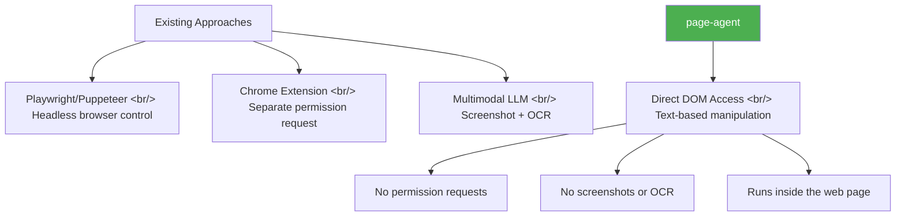

## Overview

Attaching an AI agent to a web page normally requires a headless browser like Playwright or a Chrome extension. Alibaba's [page-agent](https://github.com/alibaba/page-agent) flips that assumption — one line, `<script src="page-agent.js"></script>`, and your website becomes an AI-native app.

<!--more-->

## Core Architecture: The In-Page Execution Model

page-agent's biggest differentiator is its **in-page execution model**. Compare it to existing browser automation approaches:



Everything runs inside the web page. DOM elements are controlled directly — no separate permissions, no screenshots, no OCR, no multimodal LLM required. Text-based DOM manipulation keeps it fast.

## How to Use It

### Embed Directly in Your Code

```html
<script src="page-agent.js"></script>
```

### Apply to Any Site via Bookmarklet

You don't need to touch the source code. A bookmarklet lets you inject page-agent into **any website on the fly**. The default bookmarklet goes through Alibaba's servers, but you can point it at your own LLM endpoint:

```javascript
javascript:(function(){
  import('https://cdn.jsdelivr.net/npm/page-agent@1.5.5/+esm')
    .then(module => {
      window.agent = new module.PageAgent({
        model: 'gpt-5.4',
        baseURL: '<your-api-url>',
        apiKey: '<your-api-key>'
      });
      if(window.agent.panel) window.agent.panel.show();
    })
    .catch(e => console.error(e));
})();
```

### Supported Models

OpenAI, Claude, DeepSeek, Qwen, and more — including fully offline operation via Ollama (API key-based integration).

## Use Cases

| Use case | Description |
|----------|-------------|
| **SaaS AI Copilot** | Add an in-product AI Copilot without touching the backend |
| **Smart form automation** | Compress multi-step click flows to a single sentence (ERP/CRM/admin tools) |
| **Accessibility** | Voice commands and screen readers for enhanced web accessibility |
| **Admin tool workflows** | Build only CRUD, then use sequential instructions to compose workflows automatically |

The **admin tool** use case got the strongest reaction in the GeekNews community. The pattern: "build basic CRUD, then tell it to do this and then that, and you get a workflow." One user reported it running noticeably faster than Playwright for a demo that fetched 30-day stock prices from a financial site.

## Chrome Extension — Multi-Page Support

Beyond the single-page bookmarklet, installing the Chrome extension adds support for **tasks spanning multiple pages** — browser-level control and external integrations, enabling complex automation scenarios beyond simple DOM manipulation.

## Security Considerations

The primary concern raised by the community is security. API keys are exposed on the client side, so:

- In production, route API calls through a proxy server
- Safest for internal admin tools or development environments
- If routing through Alibaba's servers by default is a concern, specify your own LLM endpoint

The MIT license means you can fork and customize freely.

## Insight

page-agent's "in-page execution model" represents a paradigm shift in browser automation. Where external tools previously controlled the browser from the outside, AI now reads and manipulates the DOM directly from inside the page. Instead of the heavyweight pipeline of screenshot → OCR → coordinate-based clicking, text-based DOM understanding wins on both speed and accuracy. Particularly compelling is the scenario of inserting an AI Copilot into a SaaS product without any backend changes — a new path for modernizing legacy systems.
