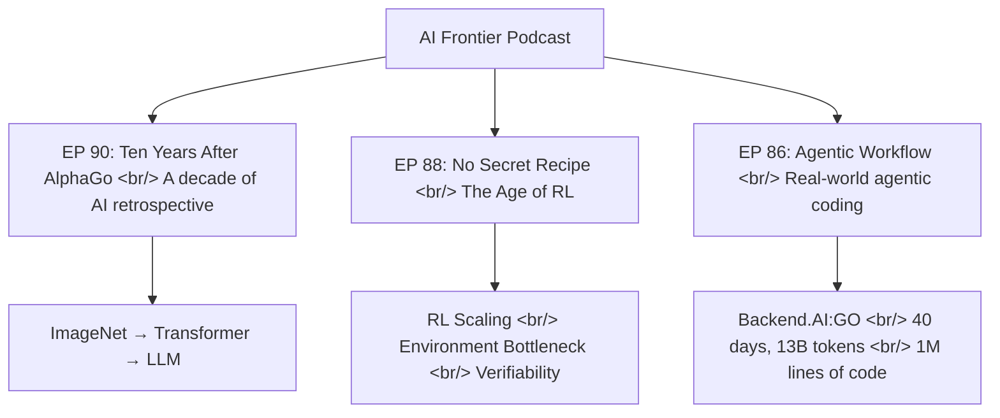
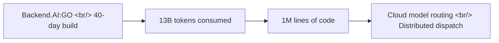

## Overview

Three recent episodes from AI Frontier, a leading Korean AI podcast. EP 90 looks back on ten years since AlphaGo. EP 88 surveys the RL-driven technical landscape. EP 86 gets into the real mechanics of agentic coding workflows. The thread running through all three: **verifiability**.

<!--more-->

## Navigation Map

---

## EP 90: Ten Years After AlphaGo

**Guest**: Jinwon Lee, CTO of HyperAccel (inference-focused AI chip startup)

Recorded on Pi Day (March 14, 2026) to mark the tenth anniversary of the AlphaGo match, this episode reflects on a decade of deep learning. Hosts Jeongseok Noh and Seungjun Choi are joined by CTO Jinwon Lee.

**Key timeline**:
- **ImageNet and NPU development**: Lee's experience building deep learning NPUs at Samsung
- **Framework evolution**: The progression from Theano → Caffe → TensorFlow → PyTorch
- **From GAN to Transformer**: The GAN era and the rise of generative AI, then the emergence of the Attention mechanism
- **BERT vs GPT**: The encoder (BERT) and decoder (GPT) fork, and how GPT became the path to LLMs
- **Korean foundation models**: The roles of HyperCLOVA and the Stability AI community

Andrej Karpathy's Autoresearch and "repeated verification of verifiable signals" emerge as key phrases, alongside a revisit of Noam Brown's AlphaGo anniversary post on the significance of Move 37.

---

## EP 88: No Secret Recipe

**Guest**: Seunghyun (AI researcher)

The title says it all — there is no single "secret sauce" in AI. That's the core message.

**Key points**:
- **GLM 5 report and RL**: Yao Shunyu's "The Second Half" paper proposing an RL-centric paradigm. The conclusion: "there's no secret recipe, but RL is currently the most promising direction."
- **Back to basics**: At this stage, data quality and product intuition matter more than flashy architectural innovations
- **Fog of Progress**: Why predicting the future is structurally hard. Model performance curves are nonlinear, so the intuition "this will work by end of year" often misfires
- **Environment scaling**: The biggest bottleneck for agentic RL isn't the model — it's scaling the **environment**. The key question is how richly you can build verifiable simulation environments
- **Context management**: Strategies for working around context length limits with Sparse Attention and multi-agent approaches
- **Harness-model fusion**: The blurring of the boundary between product and model. A good harness pulls up model performance

---

## EP 86: Agentic Workflow in Practice

**Guest**: Jungkyu Shin, CEO of Lablup (Backend.AI)

The most hands-on episode. The story centers on building Backend.AI:GO — **in 40 days, using 13 billion tokens, generating 1 million lines of code** — and what it taught about agentic coding.

**Core insights**:
- **Token cost competitiveness and fast inference**: Inference speed directly impacts developer productivity in agentic coding
- **Bio-tokens**: The concept of "human cognitive load" in the AI era — even humans have a limit on how much information they can process
- **Software abundance**: The rise of "instant apps" — is the value of code converging toward zero?
- **Claude Code's real advantage is the harness**: The differentiator isn't the model itself, but what wraps it — tools, context management, workflow
- **Build the generator, not the output**: Automation's real goal is a system that produces results, not individual results
- **Polite prompting**: An empirical observation that tone in a prompt may affect output (though the mechanism is unclear)

Particularly memorable is the analogy to "Cyber Formula" to explain the philosophical difference between Claude Code and Codex.

---

## Quick Links

- [AI Frontier EP 90](https://aifrontier.kr/ko/episodes/ep90) — Ten Years After AlphaGo
- [AI Frontier EP 88](https://aifrontier.kr/ko/episodes/ep88) — No Secret Recipe
- [AI Frontier EP 86](https://aifrontier.kr/ko/episodes/ep86) — Agentic Workflow in Practice

## Insight

The keyword running through all three episodes is **verifiability**. EP 90: Karpathy's "repeated verification of verifiable signals." EP 88: "verifiable environments" as the bottleneck for RL scaling. EP 86: "build the generator, not the output." All three are different facets of the same underlying problem. As AI models grow more powerful, the weight of the question "how do you know this result is correct?" only increases. EP 88's conclusion — "focus on fundamentals: data, harness, environment" — is probably the most honest answer available.
