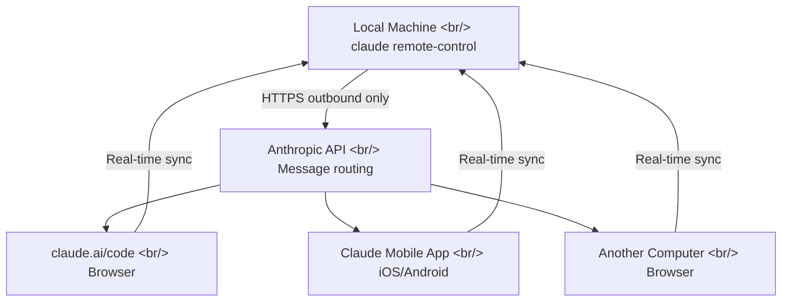
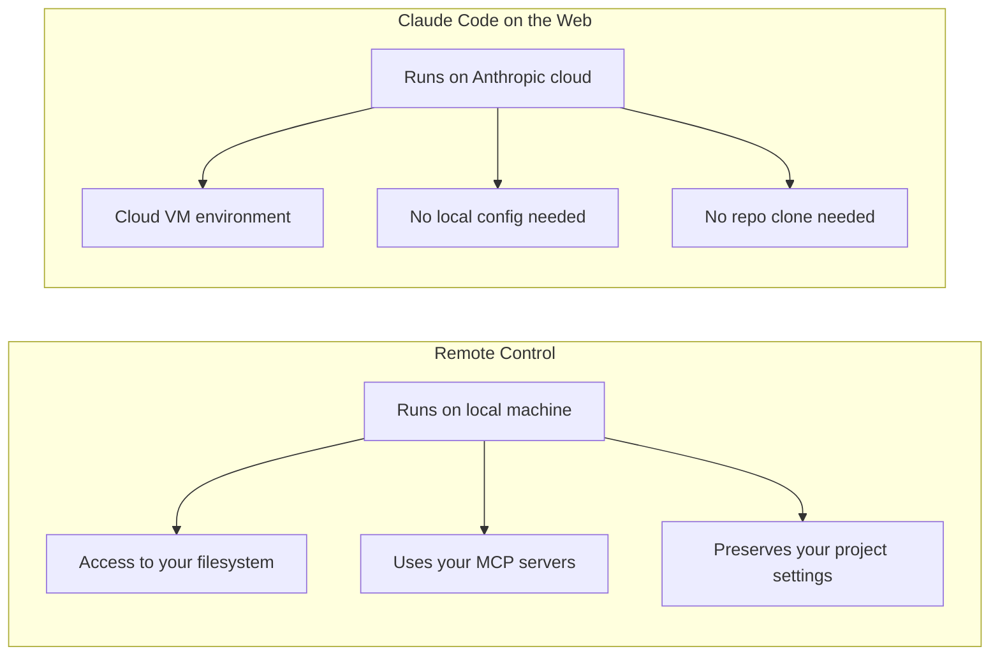

## Overview

You're deep into a refactoring session with Claude Code at your desk and have to step away. Closing the terminal ends the session. Previously, this required an SSH tunnel or a third-party tool (happy, hapi, etc.). Now Claude Code has an official Remote Control feature. One command — `claude remote-control` — lets you resume the same session from a smartphone, tablet, or another computer.

<!--more-->

## How It Works



The key point: **the session always runs on your local machine**. Code never leaves for the cloud — your filesystem, MCP servers, and project settings remain intact. The local Claude Code process only sends HTTPS outbound requests; no inbound ports are opened. Anthropic's API handles message routing in the middle.

If the network drops or your laptop sleeps, the session auto-reconnects when the machine comes back online — though a network outage longer than 10 minutes will time out the session.

## Usage

### Basic: Server Mode

```bash
claude remote-control
```

A session URL and QR code are printed in the terminal. Press Space to toggle the QR code so you can scan it with your phone.

### Key Flags

| Flag | Description |
|------|-------------|
| `--name "My Project"` | Name shown in the claude.ai/code session list |
| `--spawn same-dir` | Concurrent sessions share the same directory (default) |
| `--spawn worktree` | Each session gets its own independent git worktree |
| `--capacity <N>` | Maximum concurrent sessions (default 32) |
| `--sandbox` | Enables filesystem/network isolation |

### Activating From an Existing Session

You can also activate Remote Control from an in-progress interactive session with `/remote-control`. Or go to `/config` and turn on "Enable Remote Control for all sessions" to apply it globally.

### Three Ways to Connect

1. **URL**: Enter the session URL from the terminal directly in a browser
2. **QR code**: Press Space to show the QR code, then scan with your phone camera
3. **Session list**: Find the session by name in claude.ai/code or the Claude app (green dot = online)

## Remote Control vs Claude Code on the Web



| | Remote Control | Claude Code on the Web |
|--|----------------|------------------------|
| Runs on | Your local machine | Anthropic cloud |
| Filesystem | Your local files | Cloud VM |
| MCP servers | Available | Not available |
| Local setup needed | Yes (project must be cloned) | No |
| Best for | Continuing ongoing work | Starting something new quickly |

**Remote Control = "continue in my environment"**. **Web = "start fresh anywhere"**.

## Third-Party Alternatives

Community-mentioned third-party projects:

- **[slopus/happy](https://github.com/slopus/happy)**, **[tiann/hapi](https://github.com/tiann/hapi)** — open-source tools with similar goals
- SSH tunnel to a remote terminal

The official Remote Control's advantage: no separate server setup, TLS security via the Anthropic API by default. The downside, noted in community discussion, is that you have to set up the session in advance — which can feel less flexible than some open-source alternatives.

## Limitations

- **Plans**: Pro, Max, Team, Enterprise (Team/Enterprise requires an admin to enable Claude Code first)
- **No API key support**: Authentication via claude.ai login only
- **Terminal dependency**: Closing the claude process ends the session
- **Single remote connection**: Outside server mode, only one remote connection per session is allowed
- **Version**: Requires Claude Code v2.1.51 or later (check with `claude --version`)

## Insight

The real value of Remote Control isn't "remote access" — it's **context preservation**. A Claude Code session accumulates conversation history, the context of files already read, and active MCP server connections. Being able to switch devices without losing any of that is the point. A comment from the GeekNews discussion — "I can already see the YouTube videos about vibe coding from a café" — captures this feature's use pattern perfectly. Combined with cmux's notification system — monitoring multiple agents in cmux, then picking up with Remote Control on mobile when you step away — you have a complete multi-device agentic coding workflow.
