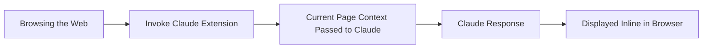
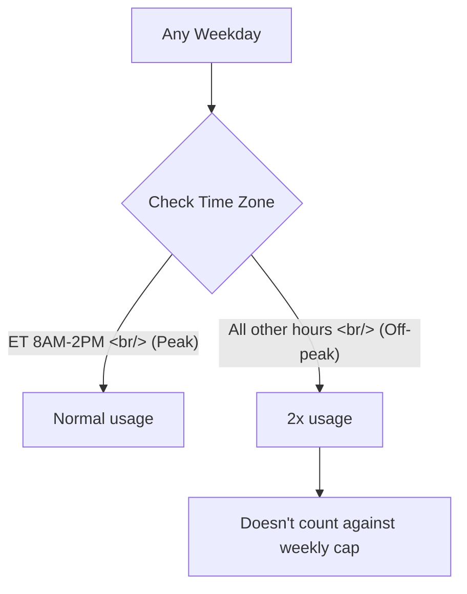
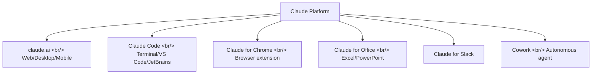

## Overview

Anthropic has launched the Claude for Chrome extension. You can now invoke Claude directly inside your browser without switching to a separate tab or app. Simultaneously, from March 13 to March 27, Anthropic is running a promotion that doubles usage limits during off-peak hours.

<!--more-->

## Claude for Chrome Extension

Claude for Chrome is available on the Chrome Web Store. Key capabilities:

- **In-browser invocation**: Pass the current web page's context to Claude instantly
- **Claude Code integration**: Works alongside Claude Code for code review, doc summarization, etc.
- **Background tasks**: Run tasks in the background and get a notification on completion
- **Scheduled workflows**: Automated execution of scheduled tasks

The strategic significance is broader access to Claude. Previously you needed the claude.ai site, the desktop app, or the API. Now Claude is reachable from anywhere in the browser with a single shortcut. ChatGPT, Gemini, and Perplexity already offer browser extensions — Anthropic has now joined the field.

## March 2x Usage Promotion

| Detail | Value |
|--------|-------|
| Period | 2026.03.13 – 2026.03.27 |
| Plans | Free, Pro, Max, Team (Enterprise excluded) |
| Condition | Off-peak hours (outside ET 8AM–2PM / PT 5AM–11AM) |
| Activation | Automatic (no sign-up required) |
| Weekly limit | Bonus usage does not count against the weekly cap |

**For users outside the US**: ET 8AM–2PM corresponds to roughly 10PM–4AM in Korea, Japan, and other East Asian time zones. This means **daytime hours in East Asia are almost entirely off-peak**, making the 2x bonus available throughout a normal workday.

The promotion covers Claude web, desktop, mobile, Cowork, Claude Code, Claude for Excel, and Claude for PowerPoint.

## Claude Platform Expansion Strategy

Anthropic is expanding Claude from a single chatbot into an **AI layer present across every work environment**. Terminal (Claude Code), browser (Chrome), office (Excel/PowerPoint), collaboration (Slack), autonomous agent (Cowork) — Claude now exists on nearly every surface where a developer works.

## Insight

Launching the Chrome extension and running a usage promotion at the same time is a clear strategy: raise accessibility (extension), lower the cost of trying it (promotion), and build habits. The timing advantage for users in East Asian time zones — where business hours fall almost entirely in off-peak periods — is notable. Through March 27, both Claude Code and the web interface carry 2x usage, making it a good window to try new features or tackle a large-scale refactor.
