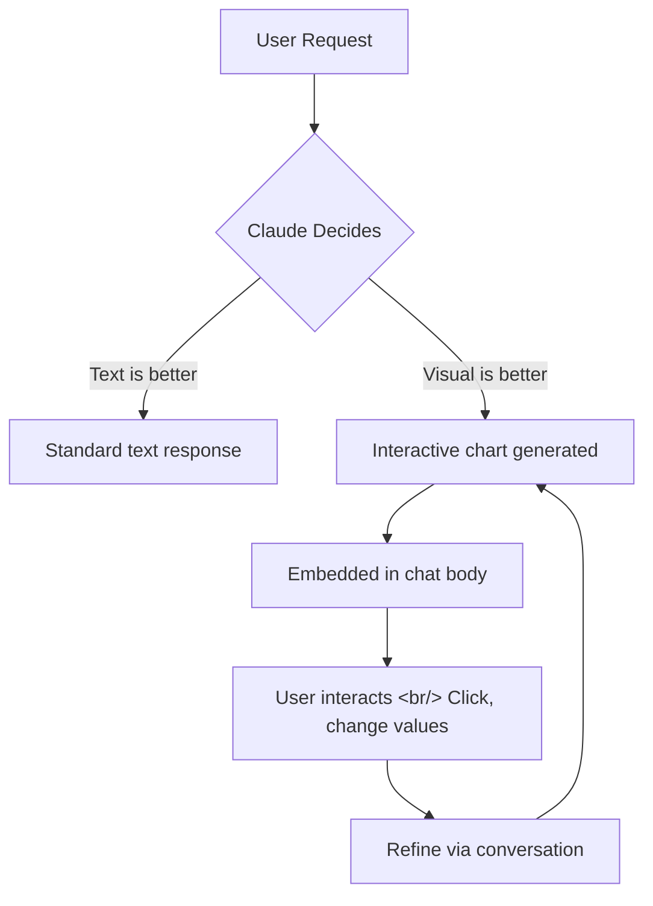
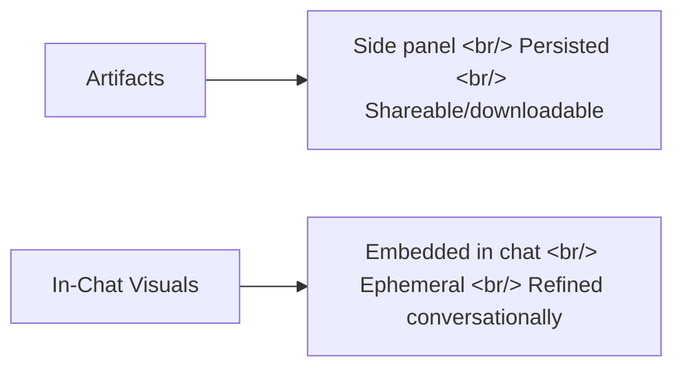

## Overview

Anthropic has added a beta feature to Claude that generates interactive charts, diagrams, and visualizations directly within the conversation. It builds on last fall's "Imagine with Claude" preview and existing Artifacts functionality — with the key difference that visuals are embedded in the chat body itself as "temporary visualizations," not pushed to a side panel.

<!--more-->

## The Core Change: No Code, Right in the Flow

Two things define this feature. First, asking "draw that as a diagram" or "show how this changes over time" triggers immediate generation — and Claude may also auto-generate a visualization when it judges a diagram would communicate faster. Second, the output is an **ephemeral tool**, not a permanent document.

You can generate a compound interest graph and then refine it conversationally — "extend it to 20 years," "switch to monthly contributions." Clickable periodic tables and interactive decision trees are particularly well-suited to this exploratory format.

## How It Differs From Artifacts

| | Artifacts | In-Chat Interactive Visuals |
|--|-----------|----------------------------|
| Location | Side panel | Answer body |
| Lifespan | Permanent (save/share) | Temporary (evolves with conversation) |
| Purpose | Delivering a deliverable | Supporting explanation |
| Modification | Separate edit | Reflected immediately via conversation |

Community reports indicate that rendering location varies by environment — some see the inline version, others get an artifact (right panel), and platform support varies across app versions. iOS/iPadOS visual support was reportedly delayed, and some users hit usage limits quickly.

## Practical Use Cases

**Learning**: Clickable periodic tables and decision trees turn "reading to learn" into "exploring to learn." In math and science, watching a graph change the moment you tweak one variable accelerates comprehension dramatically.

**Work meetings**: Ask Claude to "diagram our funnel by stage" or "compare hypothesis A vs B in a chart" to pull up a temporary dashboard during the meeting and update it in real time as questions come up.

**Data analysis**: There are reports of automated portfolio visualizations producing results that "would have taken a person a week" in a matter of minutes.

## Important Caveat: Impressive ≠ Accurate

Testing by The New Stack found that while diagrams looked plausible, some label positions in an aviation pattern diagram were incorrect. A visualization is a UI that aids understanding — it is not a certificate of correctness.

A practical workflow:

1. Start with **"show this as a table/chart"**
2. Add **"also include the assumptions and formulas behind this graph"** as a verification layer
3. Iterate with **"change just one variable and compare"**

This feature is available on all plans (Free, Pro, Max, Team).

## Insight

Claude's in-chat interactive charts are a signal of the transition from AI delivering answers in text to users **exploring answers by interacting**. Combining text-based conversation with visual exploration is a direction shared with ChatGPT Canvas and Gemini's multimodal output — a glimpse of how AI interfaces are evolving. Since it's still in beta, rendering location, speed, and platform support may be inconsistent. The most important habit to maintain: don't get swept up in an impressive-looking visualization — always ask for the underlying data and assumptions alongside it.
