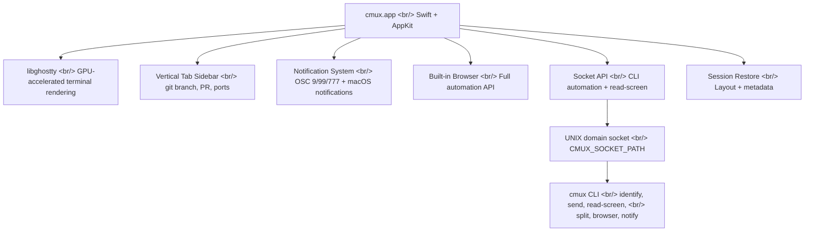
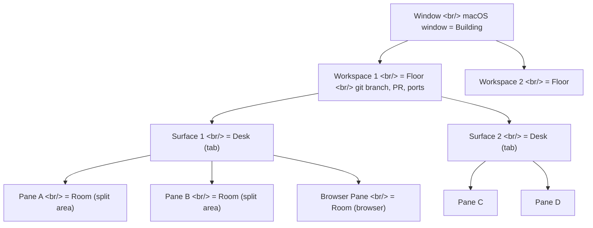

## Overview

Run three or four AI coding agents simultaneously and your terminal explodes. Fifteen iTerm2 tabs, eight tmux sessions — you spend time just hunting for which agent is waiting on input. [cmux](https://www.cmux.dev/) is a macOS-native terminal designed from the ground up to solve exactly this problem.

Built with Swift + AppKit and using Ghostty's libghostty as its rendering engine, cmux is completely free under the AGPL license. It displays git branch, PR status, open ports, and notification text in a real-time workspace sidebar; supports inter-pane communication via `read-screen`; and provides a full automation API through a built-in browser. This isn't a comparison to traditional terminal multiplexers — it's a new category of tool built for AI agents.

> Comparison with tmux is covered in [a separate post.](/posts/2026-03-23-tmux-cmux/)

<!--more-->

## Architecture: A New Layer on Top of Ghostty

cmux is **not a fork of Ghostty**. It's a separate app that uses libghostty as a library — the same relationship Safari has to WebKit, not a fork of it. Mitchell Hashimoto (creator of both Ghostty and HashiCorp) gave it a positive mention as "another libghostty-based project."



GPU-accelerated rendering comes from Ghostty unchanged — same speed. cmux adds workspace management, notifications, browser integration, and CLI automation on top. Communication is via UNIX domain socket; each pane automatically receives a `CMUX_SOCKET_PATH` environment variable.

Existing Ghostty users don't need a separate Ghostty installation. cmux bundles libghostty itself. And installing both Ghostty and cmux causes no conflicts.

## Installation and Initial Setup

### Homebrew Install

```bash
brew tap manaflow-ai/cmux && brew install --cask cmux
```

Or download the DMG directly from the official site.

### CLI Symlink

To use the cmux CLI from anywhere in the terminal, set up a symlink.

```bash
sudo ln -sf /Applications/cmux.app/Contents/MacOS/cmux-cli /usr/local/bin/cmux
```

The GUI works without this, but CLI automation commands like `cmux send` and `cmux read-screen` require it.

### Ghostty Config Compatibility

cmux reads your existing Ghostty config file directly.

```
~/.config/ghostty/config
```

Font, theme, and color settings are applied automatically. Coming from Ghostty, you get an identical terminal environment with no extra configuration. New users can start with cmux's defaults immediately.

### Verify CLI Installation

```bash
# Confirm CLI is installed
cmux identify --json

# Check environment variables
env | grep CMUX
```

`cmux identify` prints the current workspace, surface, and pane IDs. Run this inside a cmux terminal.

### Troubleshooting

| Symptom | Cause | Fix |
|---------|-------|-----|
| `cmux: command not found` | CLI symlink not set up | Run the `sudo ln -sf` command |
| Socket connection error | cmux app not running | Launch cmux.app first |
| Ghostty config conflict | Incompatible config keys | Separate into cmux-specific config |
| Font looks different | Ghostty config path mismatch | Check `~/.config/ghostty/config` |

## Core Concept: The Hierarchy

cmux's hierarchy is easiest to understand with a building analogy.



| Level | Analogy | Description |
|-------|---------|-------------|
| **Window** | Building | macOS window. Usually just one. |
| **Workspace** | Floor | Independent work context. Shown as sidebar tabs. Includes git branch, PR status, ports, notification metadata. |
| **Surface** | Desk | A tab inside a workspace. Contains multiple panes. |
| **Pane** | Room | A split area running an actual terminal or browser. |

This maps to tmux's Session > Window > Pane, but the decisive difference is that cmux attaches metadata to each workspace. A single glance at the sidebar tells you the git branch, related PR number, open ports, and latest notification for each project.

### Environment Variables

cmux automatically injects environment variables into each pane.

| Variable | Purpose |
|----------|---------|
| `CMUX_WORKSPACE_ID` | ID of the workspace this pane belongs to |
| `CMUX_SURFACE_ID` | ID of the surface this pane belongs to |
| `CMUX_SOCKET_PATH` | cmux socket path — used for CLI communication |

An agent can read `CMUX_WORKSPACE_ID` to automatically know which project it's running in — no need to pass a project path as a parameter.

## Workspace Management

Workspaces are cmux's top-level work units. They appear as vertical tabs in the sidebar, each updated in real time with:

- **Git branch name**: currently checked-out branch
- **PR status/number**: pull request associated with this branch
- **Working directory**: current path
- **Open ports**: `localhost:3000`, `localhost:8080`, etc.
- **Latest notification text**: preview of the last notification

Think Firefox's vertical tabs, but for terminals. When switching between 5–6 projects, the sidebar tab alone gives you full context.

### Workspace Shortcuts

| Action | Shortcut |
|--------|----------|
| New workspace | `⌘N` |
| Switch workspace | `⌘1` – `⌘8` |
| Rename | `⌘⇧R` |
| Close | `⌘⇧W` |

### CLI Workspace Management

```bash
# Create a new workspace
cmux new-workspace --name "my-project"

# List workspaces
cmux list-workspaces

# Get current workspace info
cmux identify --json
```

Sample `cmux identify --json` output:

```json
{
  "workspace_id": "ws-abc123",
  "surface_id": "sf-def456",
  "pane_id": "pn-ghi789"
}
```

These IDs are used to target specific panes in `cmux send` and `cmux read-screen`.

## Surfaces and Panes

### Surface

A surface is a tab inside a workspace. One workspace can hold multiple surfaces, each maintaining a different work context.

| Action | Shortcut |
|--------|----------|
| New surface | `⌘T` |
| Next surface | `⌘⇧]` |
| Previous surface | `⌘⇧[` |
| Close surface | `⌘W` |

### Pane

A pane is a split region of a surface — horizontal or vertical. Each pane runs an independent terminal session or browser.

| Action | Shortcut |
|--------|----------|
| Split right | `⌘D` |
| Split down | `⌘⇧D` |
| Move to pane (left) | `⌥⌘←` |
| Move to pane (right) | `⌥⌘→` |
| Move to pane (up) | `⌥⌘↑` |
| Move to pane (down) | `⌥⌘↓` |

Key difference: **no prefix key**. tmux requires pressing `Ctrl+b` before every command key. cmux uses native macOS shortcuts directly — `⌘D` to split, `⌥⌘→` to move. Users coming from iTerm2 or VS Code's integrated terminal face almost no learning curve.

### CLI Pane Management

```bash
# Split right
cmux split --direction right

# Split down
cmux split --direction down

# Send command to a specific pane
cmux send --pane-id <target-pane-id> "npm run dev"
```

## Notification System

cmux's notification system is layered. When running multiple AI agents simultaneously, it's designed to instantly answer: "which agent is waiting on my input?"

### 4-Level Notifications

1. **Pane notification ring (blue ring)**: A blue ring appears around a pane that is waiting for input. Instantly identifies which pane on the current surface needs attention.

2. **Sidebar unread badge**: When a notification fires in another workspace, the sidebar tab shows an unread count. You can check the status of other projects without leaving your current workspace.

3. **In-app notification panel**: Open the panel with `⌘I` to see all notifications in chronological order, with the workspace and pane context for each.

4. **macOS desktop notification**: macOS notification center fires even when cmux doesn't have focus. You'll know when an agent needs input even while working in a browser.

### Notification Shortcuts

| Action | Shortcut |
|--------|----------|
| Open notification panel | `⌘I` |
| Jump to most recent unread | `⌘⇧U` |

`⌘⇧U` is especially useful with 5 agents running across 5 workspaces — one shortcut jumps you directly to the pane of the agent that most recently requested input.

### Standard Escape Sequence Support

cmux notifications use standard terminal escape sequences (OSC 9, OSC 99, OSC 777). Any tool that outputs these sequences automatically triggers cmux notifications with no plugins or configuration needed.

### CLI Notifications

```bash
# Send a custom notification
cmux notify --title "Build done" --body "Success"

# In a CI/CD script
npm run build && cmux notify --title "Build" --body "Build succeeded" \
  || cmux notify --title "Build" --body "Build FAILED"

# Long-running task completion
python train_model.py && cmux notify --title "Training" --body "Model training complete"
```

This integrates with Claude Code hooks — configure agents to automatically notify when they complete specific tasks.

## read-screen and send: Inter-Agent Communication

These two features are what elevate cmux from a terminal app to an **agent communication platform**.

### read-screen

Read the terminal output of another pane from within one pane.

```bash
# Read the current screen of a target pane
cmux read-screen --pane-id <target-pane-id>
```

This returns the text currently displayed in the specified pane. Agent A can read Agent B's output and decide what to do next based on it.

#### Practical Scenarios

```bash
# Agent A: check test results in another pane
TEST_OUTPUT=$(cmux read-screen --pane-id $TEST_PANE_ID)
if echo "$TEST_OUTPUT" | grep -q "FAIL"; then
    echo "Test failure detected — starting fix"
fi

# Agent B: monitor build server status
BUILD_STATUS=$(cmux read-screen --pane-id $BUILD_PANE_ID)
if echo "$BUILD_STATUS" | grep -q "compiled successfully"; then
    cmux notify --title "Build" --body "Build succeeded"
fi
```

Similar to tmux's `capture-pane`, but `read-screen` is designed with a clear intent: inter-agent communication. Pane IDs are injected via environment variables, so agents can programmatically discover both their own ID and the IDs of neighboring panes.

### send

Send commands to another pane programmatically.

```bash
# Send to a specific pane
cmux send --pane-id <target-pane-id> "npm run test"

# Send to current surface
cmux send --surface-id <target-surface-id> "cd ~/projects/my-app"

# Send sequentially to multiple panes
cmux send --pane-id $PANE_1 "git pull"
cmux send --pane-id $PANE_2 "npm install"
cmux send --pane-id $PANE_3 "docker compose up -d"
```

### read-screen + send Combined

Combining both, an agent can read another agent's state and issue commands in response — an autonomous workflow.

```bash
# Agent A: check build pane status and proceed
while true; do
    STATUS=$(cmux read-screen --pane-id $BUILD_PANE)
    if echo "$STATUS" | grep -q "ready on"; then
        cmux send --pane-id $TEST_PANE "npm run e2e"
        cmux notify --title "Pipeline" --body "E2E tests started"
        break
    fi
    sleep 2
done
```

## Built-in Browser

cmux can open a browser pane inside the same window as the terminal. This enables workflows like viewing a PR page alongside Claude Code modifying code, or checking a localhost dev server result immediately.

### Basic Usage

```bash
# Open a standalone browser window
cmux browser open http://localhost:3000

# Open as a split pane in the current surface
cmux browser open-split http://localhost:3000

# Navigate the current browser pane
cmux browser navigate https://github.com/my/repo/pull/42

# Back/forward
cmux browser back
cmux browser forward

# Reload
cmux browser reload

# Get current URL
cmux browser url
```

`open-split` is the key command. The browser appears as one side of a terminal split — code and result visible simultaneously without leaving the screen.

## Browser Automation in Depth

The built-in browser is not just a viewer. It provides a full Playwright-level automation API.

### Waiting

```bash
# Wait for element by CSS selector
cmux browser wait --selector ".login-form"

# Wait for text to appear
cmux browser wait --text "Dashboard loaded"

# Wait for URL change
cmux browser wait --url-contains "/dashboard"

# Wait for page load state
cmux browser wait --load-state networkidle

# Wait for JavaScript function result
cmux browser wait --function "document.readyState === 'complete'"
```

### DOM Manipulation

```bash
cmux browser click --selector "#submit-button"
cmux browser dblclick --selector ".editable-cell"
cmux browser hover --selector ".dropdown-trigger"
cmux browser focus --selector "#email-input"
cmux browser check --selector "#agree-terms"
cmux browser type --selector "#search" --text "query"
cmux browser fill --selector "#email" --text "user@example.com"
cmux browser press --key "Enter"
cmux browser select --selector "#country" --value "KR"
cmux browser scroll --selector ".content" --direction down
```

### Inspection

```bash
cmux browser snapshot                              # Accessibility-tree-based page snapshot
cmux browser screenshot --output /tmp/page.png    # Screenshot
cmux browser get text --selector ".result-count"  # Extract text
cmux browser get html --selector ".article-body"  # Extract HTML
cmux browser get value --selector "#price-input"  # Get input value
cmux browser get attr --selector "img.logo" --attr "src"  # Get attribute
cmux browser get count --selector ".list-item"    # Count elements
cmux browser is visible --selector ".modal"
cmux browser is enabled --selector "#submit"
cmux browser is checked --selector "#newsletter"
cmux browser find role --role "button"
cmux browser find text --text "Submit"
cmux browser find label --label "Email address"
cmux browser get title
cmux browser get url
```

### JavaScript Execution

```bash
cmux browser eval "document.querySelectorAll('.item').length"
cmux browser addinitscript "window.__TEST_MODE = true"
cmux browser addscript --url "https://cdn.example.com/helper.js"
cmux browser addstyle "body { background: #f0f0f0; }"
```

### State Management

```bash
cmux browser cookies
cmux browser storage
cmux browser state --save /tmp/browser-state.json
cmux browser state --load /tmp/browser-state.json
```

State save/restore is useful for preserving auth sessions. Log in once, save state, and automation scripts don't need to repeat the login flow.

### Tab Management

```bash
cmux browser tab list
cmux browser tab switch --index 2
```

### Automation Pattern Examples

#### Pattern 1: Navigate, Wait, Inspect

```bash
cmux browser navigate https://github.com/my/repo/pull/42
cmux browser wait --selector ".merge-message"
PR_STATUS=$(cmux browser get text --selector ".State")
echo "PR status: $PR_STATUS"
```

#### Pattern 2: Fill Form and Verify

```bash
cmux browser fill --selector "#title" --text "Fix: resolve memory leak"
cmux browser fill --selector "#body" --text "Closes #123"
cmux browser click --selector "#create-pr"
cmux browser wait --text "Pull request created"
```

#### Pattern 3: Capture Debug Artifacts on Failure

```bash
cmux browser click --selector "#deploy-button"
cmux browser wait --text "Deployed" || {
    cmux browser screenshot --output /tmp/deploy-failure.png
    cmux browser snapshot > /tmp/deploy-failure-dom.txt
    cmux notify --title "Deploy" --body "Deployment failed — screenshot saved"
}
```

## CLI Automation Reference

### Workspace Management

| Command | Description |
|---------|-------------|
| `cmux new-workspace --name "name"` | Create new workspace |
| `cmux list-workspaces` | List workspaces |
| `cmux identify` | Print workspace/surface/pane IDs for current pane |
| `cmux identify --json` | Print IDs in JSON format |

### Panes and Splits

| Command | Description |
|---------|-------------|
| `cmux split --direction right` | Split right |
| `cmux split --direction down` | Split down |

### Communication

| Command | Description |
|---------|-------------|
| `cmux send "command"` | Send command to current pane |
| `cmux send --pane-id ID "command"` | Send command to specific pane |
| `cmux send --surface-id ID "command"` | Send command to specific surface |
| `cmux read-screen` | Read current pane's screen |
| `cmux read-screen --pane-id ID` | Read specific pane's screen |

### Notifications

| Command | Description |
|---------|-------------|
| `cmux notify --title "T" --body "B"` | Send notification |

### Browser

| Command | Description |
|---------|-------------|
| `cmux browser open URL` | Open browser |
| `cmux browser open-split URL` | Open browser as split pane |
| `cmux browser navigate URL` | Navigate to URL |
| `cmux browser snapshot` | Page snapshot |
| `cmux browser screenshot` | Screenshot |
| `cmux browser click --selector S` | Click element |
| `cmux browser wait --selector S` | Wait for element |
| `cmux browser eval "JS"` | Execute JavaScript |

### Auto-injected Environment Variables

```bash
CMUX_WORKSPACE_ID=ws-abc123
CMUX_SURFACE_ID=sf-def456
CMUX_SOCKET_PATH=/tmp/cmux-socket-xyz
```

Scripts can use these without hardcoding to automatically detect current context.

## Multi-Agent Workflow

cmux's real value shows when managing multiple AI agents simultaneously. Here's a practical multi-agent setup script.

### Project Setup Automation

```bash
#!/bin/bash
# cmux multi-agent workflow setup script

# 1. Create project workspace
cmux new-workspace --name "my-project"

# 2. Navigate to project directory in main agent pane
cmux send "cd ~/projects/my-app"

# 3. Split right for second agent pane
cmux split --direction right

# 4. Start dev server in second pane
cmux send --surface-id right "npm run dev"

# 5. Open browser split to check localhost result
cmux browser open-split http://localhost:3000
```

### Claude Code Multi-Agent Pattern

```bash
# Workspace 1: Backend agent
cmux new-workspace --name "backend"
cmux send "cd ~/projects/api && claude"

# Workspace 2: Frontend agent
cmux new-workspace --name "frontend"
cmux send "cd ~/projects/web && claude"

# Workspace 3: Testing agent
cmux new-workspace --name "testing"
cmux send "cd ~/projects/api && claude"

# Now the sidebar shows all 3 workspaces at a glance.
# Each shows its git branch, PR status, and notifications.
# ⌘⇧U jumps instantly to whichever agent is waiting for input.
```

### Agent Collaboration Workflow

```bash
# Pane A: Claude Code modifying code
# Pane B: Test runner

# Script in Pane B — detect Pane A completion, run tests
AGENT_PANE=$1  # Pane A's ID

while true; do
    SCREEN=$(cmux read-screen --pane-id $AGENT_PANE)

    # Claude Code's prompt reappears when work is done
    if echo "$SCREEN" | grep -q "claude>"; then
        cmux notify --title "Agent" --body "Code update complete — running tests"
        npm run test
        break
    fi
    sleep 5
done
```

## Session Restore

When you reopen cmux after closing it, the previous state is restored.

### What Is Restored

- Workspace layout (split structure, pane arrangement)
- Workspace metadata (name, git branch, etc.)
- Working directory for each pane
- URL for browser panes

### What Is Not Restored

- **Running processes**: Live processes like Claude Code sessions or `npm run dev` are not restored. This is the key difference from tmux — tmux keeps sessions alive as long as the server is running; cmux requires you to restart processes.
- **tmux sessions**: If you ran tmux inside cmux, the tmux sessions are managed by the tmux server and persist separately.

For process persistence, running tmux inside cmux is a practical workaround.

## "Primitive, Not Solution" Philosophy

cmux's core design philosophy is **"Primitive, Not Solution"**.

- **Solution approach**: "I'll give you a UI that runs 3 Claude Code agents simultaneously."
- **Primitive approach**: "I give you `read-screen`, `send`, notifications, and a browser API as building blocks — compose the workflow you want."

This has several advantages:

1. **Tool independence**: Works with any AI agent — not just Claude Code, but Cursor, Windsurf, Codex, Gemini CLI, and whatever comes next.
2. **Workflow flexibility**: You're not locked into a predetermined workflow. Each team and project can combine primitives differently.
3. **Future compatibility**: New AI tools can plug into the existing primitives without changes.

The tradeoff: initial setup is more complex, and finding the optimal workflow requires experimentation. This is a higher barrier to entry compared to "complete solution" tools like Claude Squad.

## Competitive Landscape

The AI agent terminal space has grown rapidly since the second half of 2025.

| Tool | Approach | Notable traits |
|------|----------|----------------|
| **cmux** | Provides primitives | Native macOS, Ghostty-based, read-screen, browser automation |
| **Claude Squad** | Agent orchestration | GitHub-based, focused on agent lifecycle management |
| **Pane** | Terminal for AI agents | Agent state visualization |
| **Amux** | AI-centric multiplexer | Aims to replace tmux |
| **Calyx** | Emerging competitor | Different approach from cmux, growing fast |

### Community Reception

Positive feedback from Google DeepMind Research Director Edward Grefenstette, Dagster founder Nick Schrock, and HashiCorp founder Mitchell Hashimoto. Japanese developer communities are reporting migrations along the path "Warp → Ghostty → cmux."

On Hacker News, interest in the features was balanced by concerns about stability. Fast update cycles and macOS-only availability were notable discussion points.

The most-mentioned real-world workflow:
> "One vertical tab per WIP task. Claude Code on one side, browser with PR and resources on the other. Context switching feels natural."

## Limitations

Know these before adopting cmux.

### macOS Only

Requires macOS 14.0+. No plans for Linux or Windows support. Given that local AI coding agent workflows predominantly happen on macOS, this isn't an immediate dealbreaker — but it is a real constraint.

### No Process Persistence

Closing the app kills running processes. Layout and metadata are restored; Claude Code sessions and dev servers are not — you restart them manually. This is the biggest structural weakness relative to tmux.

### Fast Update Cadence

Active development means APIs and features change frequently. Factor in version dependencies when writing automation scripts.

### Stability

Stability concerns were raised on Hacker News. Thorough testing is recommended before making cmux a critical tool in a production workflow.

## FAQ

| Question | Answer |
|----------|--------|
| Is cmux paid? | No. Completely free under the AGPL license. |
| Do I need to install Ghostty separately? | No. libghostty is bundled. |
| Can I use tmux inside cmux? | Yes. |
| Can I use cmux for SSH? | You can run SSH inside a cmux pane, but cmux itself cannot be installed on a remote server. |

## Quick Links

- [cmux official site](https://www.cmux.dev/) — docs, download, tutorials
- [cmux concepts docs](https://www.cmux.dev/ko/docs/concepts)
- [cmux getting started docs](https://www.cmux.dev/ko/docs/getting-started)
- [cmux GitHub](https://github.com/manaflow-ai/cmux)
- [cmux Homebrew](https://formulae.brew.sh/cask/cmux) — `brew install --cask cmux`
- [cmux intro and guide (daleseo.com)](https://daleseo.com/cmux/)
- [cmux analysis (goddaehee)](https://goddaehee.tistory.com/557)
- [cmux intro video](https://www.youtube.com/watch?v=jGj9yCqN08s)
- [tmux vs cmux comparison](/posts/2026-03-23-tmux-cmux/)

## Insight

cmux's position is clear: **treat terminal rendering as a solved problem (delegate it to libghostty) and focus entirely on the agent UX layer above it**. The hard problem of GPU-accelerated rendering is handed off to the Ghostty library; cmux invests its effort in workspace metadata, layered notifications, inter-agent communication, and browser automation.

The `read-screen` + `send` combination is particularly notable because it enables "conversation" between agents. Agent A reading Agent B's output and reacting to it is not just multiplexing — it's foundational infrastructure for agent orchestration.

The depth of the browser automation API is also impressive. `navigate → wait → inspect`, `fill → click → verify`, screenshot capture on failure — Playwright-level automation from a single terminal CLI command. Agents that manipulate and verify web UIs directly are fully self-contained inside cmux, without additional tooling.

"Primitive, Not Solution" is a double-edged sword. You gain the generality to work with any agent, but pay the cost of initial complexity. Competitors like Calyx are rising fast with more opinionated solutions — worth watching.

Still macOS-only with no process persistence — real structural constraints. But given that AI agent-centric development is predominantly happening on macOS today, and given the community's fast growth, cmux has become the most fully-realized tool in this space.
