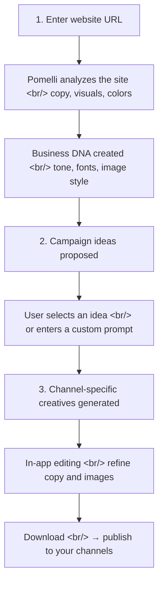

## Overview

For small teams, the biggest bottleneck in marketing isn't creativity — it's producing consistent, on-brand assets across multiple channels quickly. [Pomelli](https://pomelli.withgoogle.com/), released by Google Labs, addresses this directly: paste in a website URL and it extracts your brand DNA, then generates campaign creatives tailored to that brand.

<!--more-->

## The Three-Step Workflow

### Step 1: Business DNA

Enter your website URL and Pomelli analyzes the copy and visual elements to build a brand profile — your Business DNA. This profile captures brand tone, font style, image aesthetic, and color palette.

One important caveat: Pomelli follows **the brand as it exists on your site**, not the brand you aspire to. If your site is outdated or has inconsistent tone across pages, the extracted DNA will reflect that inconsistency. It's worth cleaning up your key pages before you start.

### Step 2: Campaign Ideas

Once your Business DNA is ready, Pomelli suggests campaign themes aligned with your brand. You can also write your own prompt. Short, specific prompts work best — structure them as **"target audience + value proposition + desired action"**. Example: "First-time visitors, 10% off, drive booking link clicks."

### Step 3: Creative Generation & Editing

Pomelli generates assets for social, web, and ads. You can edit copy and images directly in the app, then download. It stops short of auto-publishing — the workflow is **AI drafts, human approves**.

## Use Cases

| Scenario | Example | Pomelli's Role |
|----------|---------|----------------|
| Seasonal campaign | Spring limited menu launch | Instagram feed images + caption variations in café brand tone |
| Product launch | "Sugar-free, 7-day trial" | Launch announcement → review request → return-visit post set |
| Booking / consultation | Salon, fitness studio | Multiple headline + CTA variations for A/B testing |
| Employer branding | Team values, work culture | Recruitment creatives that stay on-brand |
| Re-engagement | Lapsed customer win-back | Discount codes + return messages from multiple angles |

The standout strength is rapid variation. Take one campaign theme and quickly spin out multiple versions with different tones — casual vs. premium, for example.

## Caveats

- Verify Business DNA matches your current brand before using it (an outdated site produces outdated tone)
- Factual details — product names, prices, discount terms — must be human-verified before publishing
- Health, finance, and education sectors: check for compliance with advertising regulations and required disclosures
- Google Labs public beta — quality may vary, and availability by region and language may be limited
- Despite the name sounding like "Pomodoro," this is a marketing tool, not a time-management app

## Insight

The core problem Pomelli solves is **eliminating the need to re-explain your brand every time you open an AI tool**. Instead of starting each session with "our brand tone is casual but professional, our colors are...," Pomelli auto-extracts a persistent profile from your website and applies it consistently. This is the same pattern as Claude's CLAUDE.md or Cursor's .cursorrules — set context once, reuse it forever. Seeing Google apply this pattern to an SMB marketing tool is an interesting signal about where AI tooling is heading.
