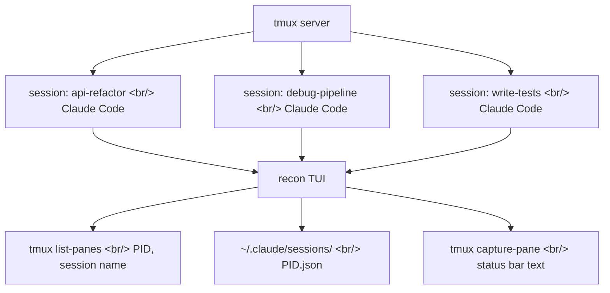

## Overview

Once you start using Claude Code seriously, sessions accumulate fast. api-refactor, debug-pipeline, write-tests — each running in its own tmux session. Telling at a glance which agents are waiting for input and which are still working becomes a real problem. [recon](https://github.com/gavraz/recon) is a tmux-native dashboard built to solve exactly that.

<!--more-->

## Architecture: A TUI on Top of tmux



recon is written in Rust (98K lines) and assumes each Claude Code instance runs in its own tmux session. Status detection works by reading the status bar text at the bottom of each pane:

| Status bar text | State | Meaning |
|----------------|-------|---------|
| `esc to interrupt` | **Working** | Streaming a response or executing a tool |
| `Esc to cancel` | **Input** | Waiting for permission approval — needs your attention |
| other | **Idle** | Waiting for the next prompt |
| *(0 tokens)* | **New** | No interaction yet |

Session matching uses `~/.claude/sessions/{PID}.json` — the file Claude Code itself writes — rather than parsing `ps` output or relying on CWD heuristics, which makes it accurate.

## Two Views

### Table View (default)

```
┌─ recon — Claude Code Sessions ─────────────────────────────────────┐
│  #  Session          Git(Branch)    Status  Model      Context     │
│  1  api-refactor     feat/auth      ● Input Opus 4.6   45k/1M     │
│  2  debug-pipeline   main           ● Work  Sonnet 4.6 12k/200k   │
│  3  write-tests      feat/auth      ● Work  Haiku 4.5  8k/200k    │
│  4  code-review      pr-452         ● Idle  Sonnet 4.6 90k/200k   │
└────────────────────────────────────────────────────────────────────┘
```

Git repo name and branch, model name, and context usage (e.g., 45k/1M) are visible at a glance. Rows in Input state are highlighted so they immediately draw your eye.

### Tamagotchi View

Each agent is represented as a pixel art character. Working is a green blob with legs, Input is an angry orange blob (blinking), Idle is a blue blob with a Zzz, and New is an egg. Agents are grouped into "rooms" by working directory and paginated in a 2×2 grid.

It's designed to be thrown on a side monitor — one glance tells you which agents are working, sleeping, or need attention.

## Key Features

- **Live status**: Polls every 2 seconds with incremental JSONL parsing
- **Git-aware**: Shows repo name and branch per session
- **Context tracking**: Token usage displayed as used/available (e.g., 45k/1M)
- **Model display**: Shows Claude model name and effort level
- **Resume picker**: `recon resume` scans past sessions, press Enter to resume
- **JSON mode**: `recon --json` for scripting and automation
- **`recon next`**: Jump directly to the next agent in Input state

## tmux Integration

```bash
# Add to ~/.tmux.conf
bind g display-popup -E -w 80% -h 60% "recon"        # prefix + g → dashboard
bind n display-popup -E -w 80% -h 60% "recon new"    # prefix + n → new session
bind r display-popup -E -w 80% -h 60% "recon resume" # prefix + r → resume picker
bind i run-shell "recon next"                         # prefix + i → jump to Input agent
```

It opens as a popup overlay, so you can switch sessions without interrupting your current work.

## Installation

```bash
cargo install --path .
```

Requires tmux and Claude Code to be installed. Interestingly, recon's own commit history includes `Co-Authored-By: Claude Opus 4.6` — a meta structure where Claude Code was used to build a tool for managing Claude Code.

## Insight

recon solves the "session management" problem of AI coding agents by building on top of tmux — proven, reliable infrastructure. Compared to alternatives like agentsview (a web dashboard) or agf (fzf-based search), being tmux-native is the key differentiator: you never leave the terminal to manage your agents. The Tamagotchi view is both functional and fun, but more importantly it represents a meaningful UX experiment in making agent state *intuitively perceptible*. If you regularly run three or more Claude Code sessions simultaneously, recon is worth trying.
